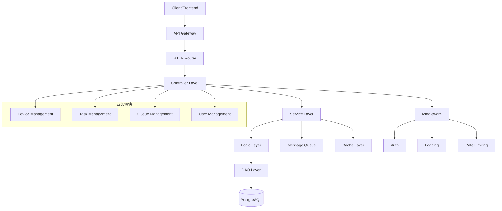
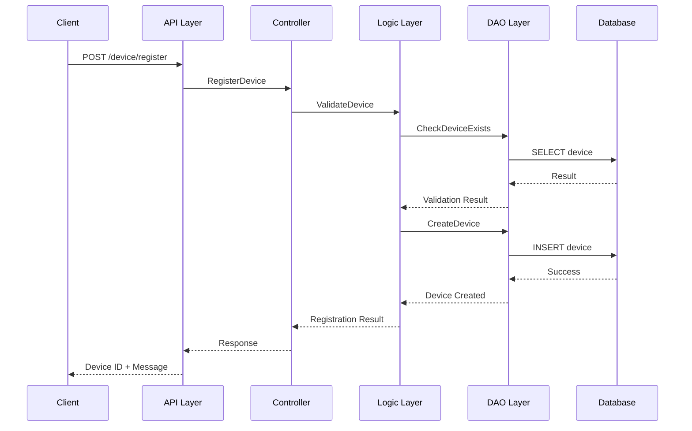
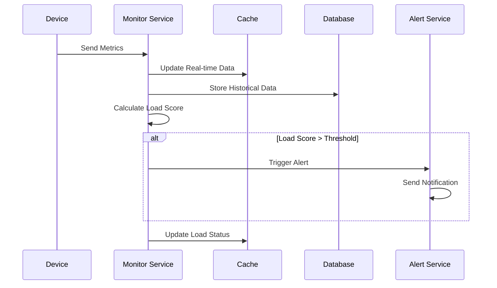
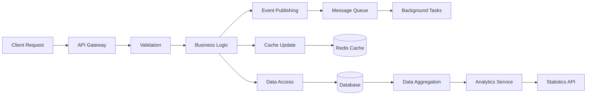
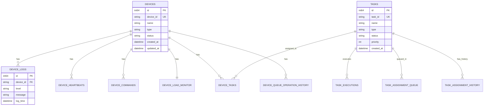
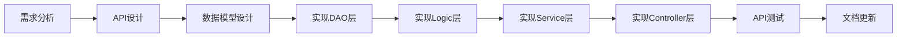

# OneGoServer 开发指导文档

[](https://golang.org/)
[](https://github.com/gogf/gf)
[](https://www.postgresql.org/)
[](LICENSE)

## 📋 项目概述

OneGoServer 是一个基于 GoFrame v2 框架开发的企业级设备管理系统，采用领域驱动设计（DDD）架构模式，提供完整的设备生命周期管理、任务调度、负载监控和统计分析等功能。

### 🎯 核心功能
- **设备管理**: 设备注册、状态监控、配置管理、批量操作
- **任务调度**: 分布式任务分配、执行监控、智能调度
- **负载监控**: 实时性能监控、历史数据分析、预警机制
- **统计分析**: 多维度数据统计、趋势分析、性能报告

### 📊 项目规模
- **API接口数量**: 32个（设备管理完整覆盖）
- **数据实体**: 12个核心业务实体
- **代码规模**: 933行API定义 + 完整业务逻辑
- **功能覆盖度**: 设备管理100%，任务管理开发中

## 🏗️ 系统架构

### 架构设计图


### 技术栈
- **后端框架**: GoFrame v2.9.0
- **数据库**: PostgreSQL
- **消息队列**: 待集成（Redis/RabbitMQ）
- **缓存**: 待集成（Redis）
- **日志**: GoFrame内置日志系统
- **文档**: 自动生成OpenAPI文档

## 📁 项目结构

```
OneGoServer/
├── api/                    # API定义层
│   ├── device/v1/         # 设备管理API
│   ├── task/v1/           # 任务管理API
│   ├── queue/v1/          # 队列管理API
│   └── user/v1/           # 用户管理API
├── internal/              # 内部实现
│   ├── cmd/               # 命令行入口
│   ├── controller/        # 控制器层
│   ├── service/           # 服务层
│   ├── logic/             # 业务逻辑层
│   ├── dao/               # 数据访问层
│   ├── model/             # 数据模型
│   │   ├── entity/        # 数据库实体
│   │   └── do/            # 数据传输对象
│   ├── consts/            # 常量定义
│   └── packed/            # 资源打包
├── docs/                  # 文档目录
├── manifest/              # 部署配置
├── resource/              # 静态资源
├── utility/               # 工具函数
├── main.go               # 程序入口
├── go.mod                # 依赖管理
└── Makefile              # 构建脚本
```

## 💼 业务需求描述

### 1. 设备管理需求

#### 基础设备管理
- **设备注册**: 支持多种设备类型（sensor, camera, actuator, gateway）
- **设备列表**: 支持分页、过滤、搜索
- **设备详情**: 完整的设备信息查看和编辑
- **设备删除**: 安全的设备移除机制
- **白名单管理**: 设备访问控制

#### 设备状态管理
- **状态监控**: 实时设备状态（online, offline, maintenance, error）
- **健康评分**: 基于多指标的设备健康度评估
- **状态更新**: 手动或自动状态变更

#### 设备控制操作
- **命令发送**: 远程设备控制命令
- **心跳管理**: 设备活跃度监控
- **响应追踪**: 命令执行结果追踪

#### 高级功能需求
- **日志管理**: 设备日志收集、查询、清理
- **负载监控**: CPU、内存、磁盘、网络监控
- **批量操作**: 多设备批量管理
- **配置管理**: 设备配置版本控制
- **统计分析**: 性能报告、趋势分析

### 2. 任务管理需求（规划中）

#### 任务生命周期
- **任务创建**: 支持多种任务类型（backup, sync, monitor, custom）
- **任务调度**: 智能任务分配算法
- **执行监控**: 实时任务执行状态
- **结果处理**: 任务结果收集和分析

#### 队列管理
- **优先级队列**: 基于优先级的任务调度
- **负载均衡**: 设备负载感知的任务分配
- **失败重试**: 智能重试机制
- **依赖管理**: 任务依赖关系处理

## 🔄 模块交互设计

### 核心交互流程

#### 设备注册流程


#### 设备负载监控流程


### 数据流向图


## 🚀 实现情况

### ✅ 已完成功能

#### 设备管理模块（100%完成）
| 功能分类 | API数量 | 实现状态 | 完成度 |
|----------|---------|----------|--------|
| 基础设备管理 | 4个 | ✅ 完成 | 100% |
| 设备状态管理 | 2个 | ✅ 完成 | 100% |
| 设备控制操作 | 3个 | ✅ 完成 | 100% |
| 设备信息查询 | 2个 | ✅ 完成 | 100% |
| 设备任务管理 | 3个 | ✅ 完成 | 100% |
| 设备告警管理 | 3个 | ✅ 完成 | 100% |
| **设备日志管理** | **3个** | **✅ 完成** | **100%** |
| **设备负载监控** | **3个** | **✅ 完成** | **100%** |
| **设备队列历史** | **1个** | **✅ 完成** | **100%** |
| **设备命令历史** | **2个** | **✅ 完成** | **100%** |
| **设备批量操作** | **2个** | **✅ 完成** | **100%** |
| **设备配置管理** | **3个** | **✅ 完成** | **100%** |
| **设备统计分析** | **2个** | **✅ 完成** | **100%** |

#### 基础设施（部分完成）
- ✅ **数据库连接**: PostgreSQL连接和健康检查
- ✅ **API路由**: RESTful路由结构
- ✅ **数据模型**: 完整的实体定义
- ✅ **常量管理**: 统一的常量定义
- ✅ **项目结构**: DDD架构实现

### 🔄 开发中功能

#### 任务管理模块（0%完成）
- ⏳ 基础任务管理API
- ⏳ 任务执行控制API
- ⏳ 任务分配管理API
- ⏳ 任务监控管理API
- ⏳ 任务调度管理API
- ⏳ 任务模板管理API

#### 其他模块
- ⏳ **用户管理模块**: 用户认证、权限管理
- ⏳ **队列管理模块**: 消息队列、任务队列
- ⏳ **监控告警**: 系统监控、告警机制

### 📋 待开发功能

#### 系统功能
- 🔘 **认证授权**: JWT认证、RBAC权限控制
- 🔘 **缓存机制**: Redis缓存集成
- 🔘 **消息队列**: 异步任务处理
- 🔘 **API文档**: 自动生成Swagger文档
- 🔘 **健康检查**: 系统健康监控端点
- 🔘 **配置管理**: 动态配置加载

#### 高级功能
- 🔘 **分布式锁**: 并发控制机制
- 🔘 **数据备份**: 自动数据备份
- 🔘 **性能监控**: APM集成
- 🔘 **日志聚合**: 集中日志管理
- 🔘 **容器化**: Docker部署支持
- 🔘 **CI/CD**: 自动化部署流水线

## 🛠️ 实现细节

### API设计规范

#### RESTful设计原则
- **资源路径**: `/module/{id}/subresource`
- **HTTP方法**: GET（查询）、POST（创建）、PUT（更新）、DELETE（删除）
- **状态码**: 2xx成功、4xx客户端错误、5xx服务端错误
- **请求格式**: JSON
- **响应格式**: 统一的响应结构

#### API示例
```go
// 设备注册API
type RegisterDeviceReq struct {
    g.Meta        `path:"/device/register" method:"post" tags:"设备管理" summary:"注册设备"`
    DeviceName    string `json:"device_name" v:"required|length:1,100#设备名称不能为空|设备名称长度为1-100字符"`
    DeviceType    string `json:"device_type" v:"required|in:sensor,camera,actuator,gateway#设备类型不能为空"`
    IpAddress     string `json:"ip_address" v:"required|ip#IP地址不能为空|IP地址格式不正确"`
    // ... 更多字段
}

type RegisterDeviceRes struct {
    DeviceId string `json:"device_id"`
    Message  string `json:"message"`
}
```

### 数据模型设计

#### 实体关系图


### 核心算法实现

#### 负载评分算法
```go
func CalculateLoadScore(metrics DeviceMetrics) float64 {
    // 权重配置
    weights := map[string]float64{
        "cpu":     0.3,
        "memory":  0.25,
        "disk":    0.2,
        "network": 0.15,
        "tasks":   0.1,
    }
    
    // 标准化指标 (0-1)
    cpuScore := normalizeMetric(metrics.CpuUsage, 100)
    memoryScore := normalizeMetric(metrics.MemoryUsage, 100)
    diskScore := normalizeMetric(metrics.DiskUsage, 100)
    networkScore := normalizeLatency(metrics.NetworkLatency)
    taskScore := normalizeTaskLoad(metrics.CurrentTasks, metrics.MaxTasks)
    
    // 加权求和
    score := weights["cpu"]*cpuScore +
             weights["memory"]*memoryScore +
             weights["disk"]*diskScore +
             weights["network"]*networkScore +
             weights["tasks"]*taskScore
    
    return score * 100 // 转换为0-100分制
}
```

#### 任务分配算法（设计中）
```go
func AssignTaskToDevice(task Task, availableDevices []Device) (Device, error) {
    // 过滤可用设备
    candidates := filterCompatibleDevices(task, availableDevices)
    
    // 负载评分排序
    sort.Slice(candidates, func(i, j int) bool {
        return candidates[i].LoadScore < candidates[j].LoadScore
    })
    
    // 选择最优设备
    if len(candidates) > 0 {
        return candidates[0], nil
    }
    
    return Device{}, errors.New("no suitable device available")
}
```

## 🚀 快速开始

### 环境要求
- Go 1.22+
- PostgreSQL 12+
- Git

### 安装步骤

#### 1. 克隆项目
```bash
git clone <repository-url>
cd OneGoServer
```

#### 2. 安装依赖
```bash
go mod download
```

#### 3. 配置数据库
```bash
# 创建数据库
createdb onegodb

# 导入数据表结构（需要准备SQL文件）
psql -d onegodb -f scripts/migrations/init.sql
```

#### 4. 配置环境
```bash
# 复制配置文件
cp config/config.example.yaml config/config.yaml

# 编辑配置文件
vim config/config.yaml
```

#### 5. 启动服务
```bash
# 开发模式
go run main.go

# 或使用Makefile
make run
```

### 配置说明

#### 数据库配置示例
```yaml
database:
  default:
    host: "127.0.0.1"
    port: "5432"
    user: "postgres"
    pass: "password"
    name: "onegodb"
    type: "pgsql"
    role: "master"
    debug: true
```

#### 服务器配置示例
```yaml
server:
  address: ":8080"
  openapiPath: "/api.json"
  swaggerPath: "/swagger"
```

## 📋 开发规范

### 代码规范

#### 目录结构规范
- `api/`: 仅包含API定义，不包含业务逻辑
- `internal/controller/`: 处理HTTP请求，调用service
- `internal/service/`: 业务服务层，不直接操作数据库
- `internal/logic/`: 核心业务逻辑
- `internal/dao/`: 数据访问层，封装数据库操作
- `internal/model/`: 数据模型定义

#### 命名规范
- **文件名**: 使用下划线命名法（snake_case）
- **结构体**: 使用大驼峰命名法（PascalCase）
- **方法名**: 使用大驼峰命名法（公开）或小驼峰（私有）
- **变量名**: 使用小驼峰命名法（camelCase）
- **常量**: 使用全大写下划线命名法（UPPER_SNAKE_CASE）

#### API设计规范
```go
// 请求结构体命名: {Action}{Resource}Req
type GetDeviceListReq struct {
    g.Meta `path:"/device/list" method:"get" tags:"设备管理" summary:"获取设备列表"`
    Page   int    `json:"page" d:"1" v:"min:1#页码最小为1"`
    Size   int    `json:"size" d:"10" v:"between:1,100#每页数量为1-100"`
}

// 响应结构体命名: {Action}{Resource}Res
type GetDeviceListRes struct {
    List  []DeviceInfo `json:"list"`
    Total int64        `json:"total"`
    Page  int          `json:"page"`
    Size  int          `json:"size"`
}
```

### 开发工作流

#### 1. 功能开发流程


#### 2. Git工作流
```bash
# 1. 创建功能分支
git checkout -b feature/task-management

# 2. 开发并提交
git add .
git commit -m "feat: add task management APIs"

# 3. 推送分支
git push origin feature/task-management

# 4. 创建Pull Request
# 5. 代码审查
# 6. 合并到主分支
```

#### 3. 提交信息规范
```bash
# 格式: <type>(<scope>): <description>
feat(device): add device batch operation API
fix(database): fix connection pool configuration
docs(readme): update development guide
refactor(api): reorganize device API structure
test(device): add device registration tests
```

### 测试规范

#### 单元测试
```go
func TestRegisterDevice(t *testing.T) {
    // 准备测试数据
    req := &v1.RegisterDeviceReq{
        DeviceName: "test-device",
        DeviceType: "sensor",
        IpAddress:  "192.168.1.100",
    }
    
    // 执行测试
    res, err := deviceController.RegisterDevice(ctx, req)
    
    // 断言结果
    assert.NoError(t, err)
    assert.NotEmpty(t, res.DeviceId)
}
```

#### 集成测试
```bash
# 启动测试环境
docker-compose -f docker-compose.test.yml up -d

# 运行集成测试
go test -tags=integration ./test/...

# 清理测试环境
docker-compose -f docker-compose.test.yml down
```

## 📊 性能优化

### 数据库优化

#### 索引策略
```sql
-- 设备表索引
CREATE INDEX idx_devices_type_status ON devices(type, status);
CREATE INDEX idx_devices_created_at ON devices(created_at);

-- 设备日志表索引
CREATE INDEX idx_device_logs_device_time ON device_logs(device_id, log_time DESC);
CREATE INDEX idx_device_logs_level ON device_logs(level);

-- 任务表索引
CREATE INDEX idx_tasks_status_priority ON tasks(status, priority DESC);
CREATE INDEX idx_tasks_device_id ON tasks(device_id);
```

#### 查询优化
```go
// 使用分页查询
func GetDeviceList(ctx context.Context, req *GetDeviceListReq) (*GetDeviceListRes, error) {
    query := dao.Devices.Ctx(ctx).
        Where(dao.Devices.Columns().Status, req.Status).
        Order(dao.Devices.Columns().CreatedAt, "DESC").
        Limit(req.Size).
        Offset((req.Page - 1) * req.Size)
    
    return query.All()
}
```

### 缓存策略

#### 应用级缓存
```go
// 设备状态缓存
func GetDeviceStatus(deviceId string) (*DeviceStatus, error) {
    // 先检查缓存
    cacheKey := fmt.Sprintf("device:status:%s", deviceId)
    if cached := cache.Get(cacheKey); cached != nil {
        return cached.(*DeviceStatus), nil
    }
    
    // 从数据库查询
    status, err := dao.GetDeviceStatus(deviceId)
    if err != nil {
        return nil, err
    }
    
    // 写入缓存
    cache.Set(cacheKey, status, time.Minute*5)
    return status, nil
}
```

## 🔧 部署指南

### Docker部署

#### Dockerfile
```dockerfile
FROM golang:1.22-alpine AS builder

WORKDIR /app
COPY go.mod go.sum ./
RUN go mod download

COPY . .
RUN CGO_ENABLED=0 GOOS=linux go build -o main .

FROM alpine:latest
RUN apk --no-cache add ca-certificates
WORKDIR /root/
COPY --from=builder /app/main .
COPY --from=builder /app/config ./config
COPY --from=builder /app/resource ./resource

EXPOSE 8080
CMD ["./main"]
```

#### Docker Compose
```yaml
version: '3.8'

services:
  app:
    build: .
    ports:
      - "8080:8080"
    environment:
      - DB_HOST=postgres
      - DB_PORT=5432
      - DB_NAME=onegodb
      - DB_USER=postgres
      - DB_PASS=password
    depends_on:
      - postgres
    volumes:
      - ./config:/root/config
      - ./logs:/root/logs

  postgres:
    image: postgres:13
    environment:
      POSTGRES_DB: onegodb
      POSTGRES_USER: postgres
      POSTGRES_PASSWORD: password
    volumes:
      - postgres_data:/var/lib/postgresql/data
      - ./scripts/migrations:/docker-entrypoint-initdb.d
    ports:
      - "5432:5432"

volumes:
  postgres_data:
```

### Kubernetes部署

#### Deployment
```yaml
apiVersion: apps/v1
kind: Deployment
metadata:
  name: onegoserver
spec:
  replicas: 3
  selector:
    matchLabels:
      app: onegoserver
  template:
    metadata:
      labels:
        app: onegoserver
    spec:
      containers:
      - name: app
        image: onegoserver:latest
        ports:
        - containerPort: 8080
        env:
        - name: DB_HOST
          value: "postgres-service"
        resources:
          requests:
            memory: "64Mi"
            cpu: "250m"
          limits:
            memory: "128Mi"
            cpu: "500m"
```

## 📈 监控与运维

### 健康检查
```go
// 健康检查端点
func HealthCheck(ctx context.Context, req *HealthCheckReq) (*HealthCheckRes, error) {
    status := &HealthCheckRes{
        Status: "ok",
        Timestamp: time.Now(),
        Checks: make(map[string]interface{}),
    }
    
    // 数据库连接检查
    if err := g.DB().PingMaster(); err != nil {
        status.Status = "error"
        status.Checks["database"] = "failed: " + err.Error()
    } else {
        status.Checks["database"] = "ok"
    }
    
    // 其他检查...
    
    return status, nil
}
```

### 日志规范
```go
// 结构化日志
g.Log().Info(ctx, "device registered", g.Map{
    "device_id": deviceId,
    "device_type": deviceType,
    "ip_address": ipAddress,
    "user_id": userId,
})

// 错误日志
g.Log().Error(ctx, "failed to register device", g.Map{
    "error": err.Error(),
    "request": req,
    "trace_id": traceId,
})
```

### 性能监控
```go
// 接口性能监控
func (c *DeviceController) RegisterDevice(ctx context.Context, req *v1.RegisterDeviceReq) (res *v1.RegisterDeviceRes, err error) {
    start := time.Now()
    defer func() {
        duration := time.Since(start)
        metrics.RecordAPILatency("device.register", duration)
        if err != nil {
            metrics.IncrementAPIError("device.register")
        }
    }()
    
    // 业务逻辑...
    
    return res, nil
}
```

## 🔮 未来规划

### 短期目标（1-3个月）
- ✅ 完成设备管理模块
- 🔄 实现任务管理模块
- 🔘 添加用户认证授权
- 🔘 集成Redis缓存
- 🔘 完善API文档

### 中期目标（3-6个月）
- 🔘 实现分布式任务调度
- 🔘 添加实时监控面板
- 🔘 集成消息队列
- 🔘 实现数据备份恢复
- 🔘 性能优化和压测

### 长期目标（6-12个月）
- 🔘 微服务架构改造
- 🔘 多租户支持
- 🔘 AI智能调度
- 🔘 边缘计算支持
- 🔘 国际化支持

## 🤝 贡献指南

### 参与贡献
1. Fork 项目
2. 创建功能分支 (`git checkout -b feature/amazing-feature`)
3. 提交变更 (`git commit -m 'Add amazing feature'`)
4. 推送分支 (`git push origin feature/amazing-feature`)
5. 创建 Pull Request

### 代码审查标准
- 代码风格符合Go规范
- 单元测试覆盖率 > 80%
- 性能测试通过
- 文档更新完整
- 无安全漏洞

### 问题反馈
- 使用 GitHub Issues 报告问题
- 提供详细的错误信息和复现步骤
- 标明环境信息（Go版本、操作系统等）

## 📄 许可证

本项目采用 MIT 许可证 - 查看 [LICENSE](LICENSE) 文件了解详情。

## 📞 联系我们

- 项目维护者: [维护者姓名]
- 邮箱: [邮箱地址]
- 项目地址: [GitHub仓库地址]

---

**最后更新时间**: 2024年12月19日  
**文档版本**: v1.0.0  
**项目状态**: 开发中
