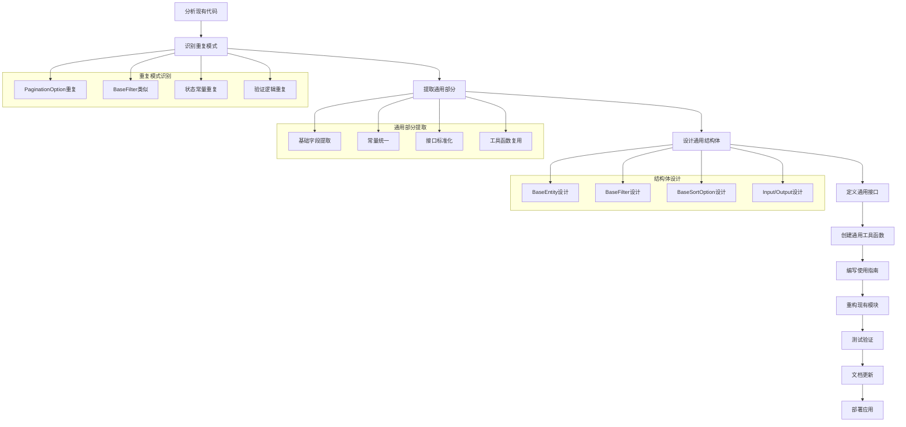
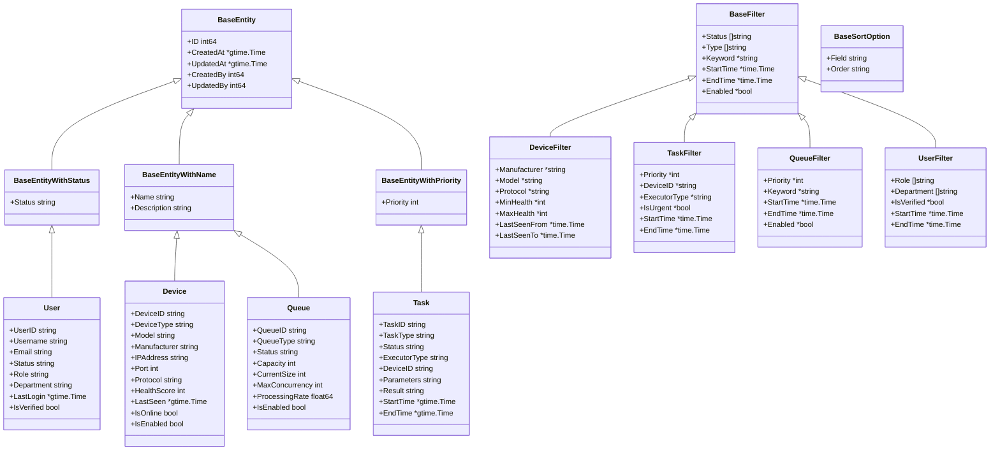
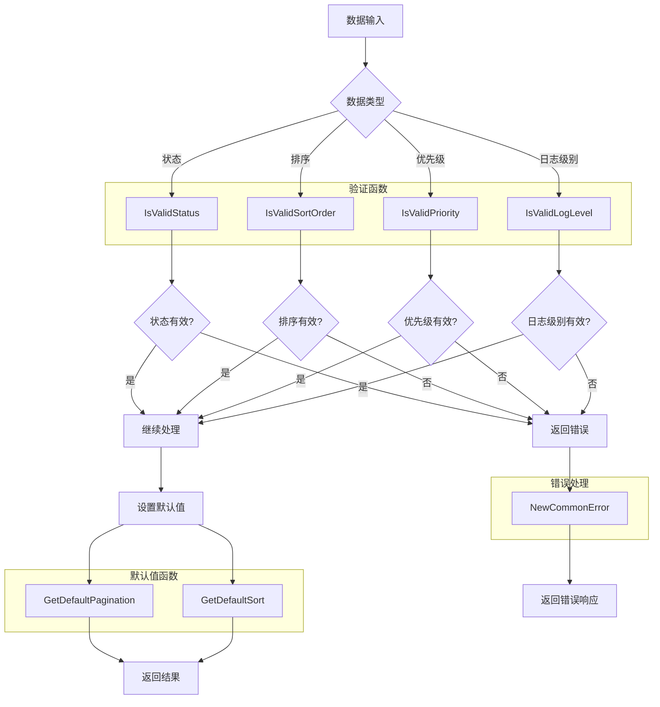
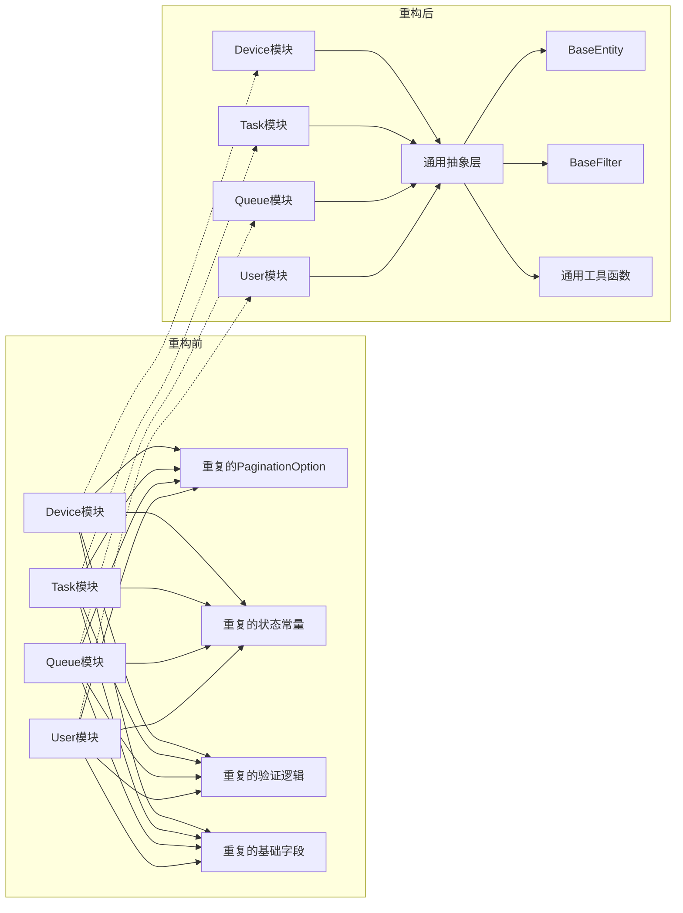
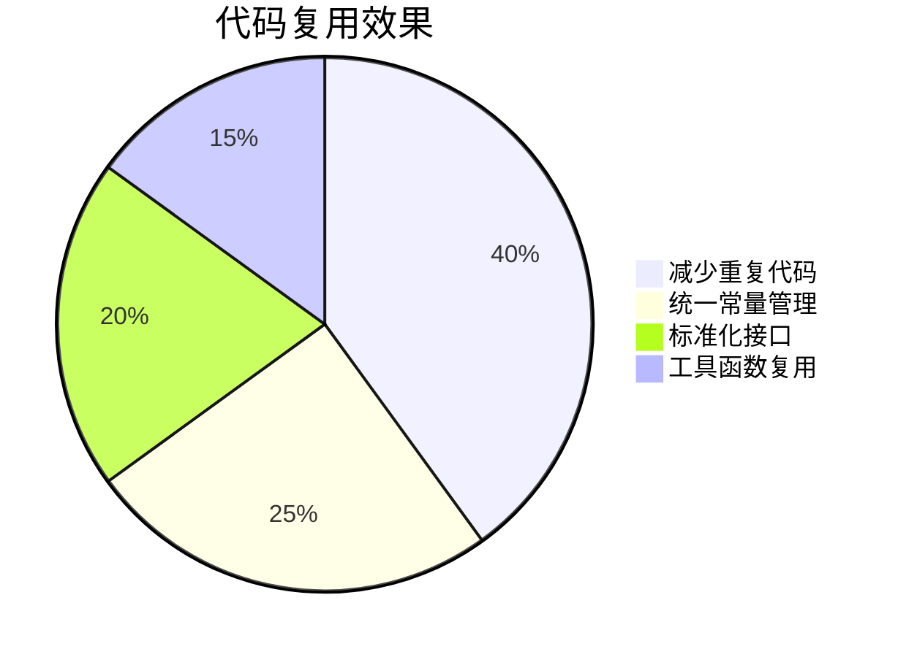
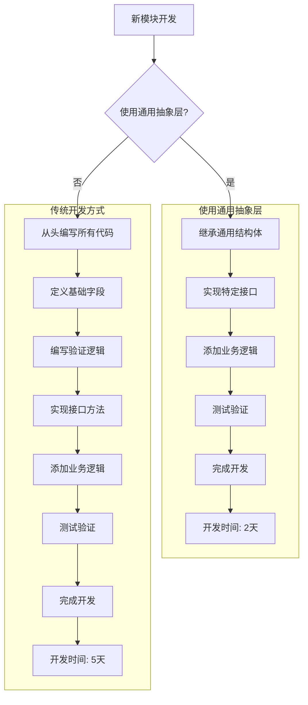
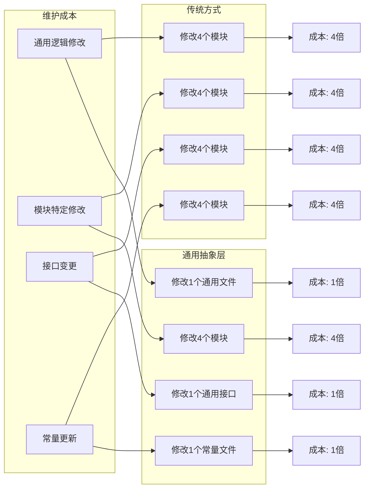

# 通用抽象层设计流程图

## 1. 通用抽象层架构图

```mermaid
graph TB
    subgraph "通用抽象层 (internal/model/common)"
        A[通用常量] --> A1[状态常量]
        A --> A2[排序常量]
        A --> A3[操作类型常量]
        A --> A4[优先级常量]
        
        B[通用基础结构体] --> B1[BaseEntity]
        B --> B2[BaseEntityWithStatus]
        B --> B3[BaseEntityWithName]
        B --> B4[BaseEntityWithPriority]
        
        C[通用Input/Output] --> C1[BaseCreateInput/Output]
        C --> C2[BaseGetByIDInput/Output]
        C --> C3[BaseListInput/Output]
        C --> C4[BaseActionInput/Output]
        
        D[通用过滤排序] --> D1[PaginationOption]
        D --> D2[BaseFilter]
        D --> D3[BaseSortOption]
        
        E[通用接口] --> E1[Entity接口]
        E --> E2[Filter接口]
        E --> E3[Sort接口]
        
        F[通用工具函数] --> F1[验证函数]
        F --> F2[默认值函数]
        F --> F3[错误处理]
    end
    
    subgraph "业务模块层"
        G[Device模块] --> G1[Device结构体]
        G --> G2[DeviceFilter]
        G --> G3[DeviceInput/Output]
        
        H[Task模块] --> H1[Task结构体]
        H --> H2[TaskFilter]
        H --> H3[TaskInput/Output]
        
        I[Queue模块] --> I1[Queue结构体]
        I --> I2[QueueFilter]
        I --> I3[QueueInput/Output]
        
        J[User模块] --> J1[User结构体]
        J --> J2[UserFilter]
        J --> J3[UserInput/Output]
    end
    
    subgraph "继承关系"
        G1 -.-> B2
        G2 -.-> D2
        G3 -.-> C1
        
        H1 -.-> B4
        H2 -.-> D2
        H3 -.-> C1
        
        I1 -.-> B3
        I2 -.-> D2
        I3 -.-> C1
        
        J1 -.-> B2
        J2 -.-> D2
        J3 -.-> C1
    end
    
    subgraph "接口实现"
        G1 -.-> E1
        G2 -.-> E2
        H1 -.-> E1
        H2 -.-> E2
        I1 -.-> E1
        I2 -.-> E2
        J1 -.-> E1
        J2 -.-> E2
    end
```



## 2. 通用抽象层设计流程



## 3. 模块继承关系图



## 4. Input/Output结构体继承关系

```mermaid
classDiagram
    class BaseCreateInput {
        +Entity interface{}
    }
    
    class BaseCreateOutput {
        +ID string
        +Message string
    }
    
    class BaseGetByIDInput {
        +ID int64
    }
    
    class BaseGetByIDOutput {
        +Entity interface{}
    }
    
    class BaseListInput {
        +Filter interface{}
        +Sort interface{}
        +Pagination *PaginationOption
    }
    
    class BaseListOutput {
        +List interface{}
        +Total int64
    }
    
    class BaseActionInput {
        +ID string
        +Action string
        +Reason string
        +Force bool
    }
    
    class BaseActionOutput {
        +Message string
    }
    
    class CreateDeviceInput {
        +Device *Device
    }
    
    class CreateDeviceOutput {
        +DeviceID string
    }
    
    class GetDeviceByIDInput {
        +ID int64
    }
    
    class GetDeviceByIDOutput {
        +Device *Device
    }
    
    class GetDeviceListInput {
        +Filter *DeviceFilter
        +Sort *DeviceSortOption
        +Pagination *PaginationOption
    }
    
    class GetDeviceListOutput {
        +List []Device
        +Total int64
    }
    
    class UpdateDeviceStatusInput {
        +DeviceID string
        +Status string
        +Reason string
    }
    
    BaseCreateInput <|-- CreateDeviceInput
    BaseCreateOutput <|-- CreateDeviceOutput
    BaseGetByIDInput <|-- GetDeviceByIDInput
    BaseGetByIDOutput <|-- GetDeviceByIDOutput
    BaseListInput <|-- GetDeviceListInput
    BaseListOutput <|-- GetDeviceListOutput
    BaseActionInput <|-- UpdateDeviceStatusInput
    BaseActionOutput <|-- UpdateDeviceStatusOutput
```

## 5. 接口实现关系图

```mermaid
classDiagram
    class Entity {
        <<interface>>
        +GetID() int64
        +GetCreatedAt() *gtime.Time
        +GetUpdatedAt() *gtime.Time
    }
    
    class Filter {
        <<interface>>
        +GetStatus() []string
        +GetType() []string
        +GetKeyword() *string
        +GetStartTime() *time.Time
        +GetEndTime() *time.Time
    }
    
    class Sort {
        <<interface>>
        +GetField() string
        +GetOrder() string
    }
    
    class Statistics {
        <<interface>>
        +GetTotal() int64
        +GetByStatus() map[string]int64
        +GetByType() map[string]int64
    }
    
    class Device {
        +GetID() int64
        +GetCreatedAt() *gtime.Time
        +GetUpdatedAt() *gtime.Time
    }
    
    class Task {
        +GetID() int64
        +GetCreatedAt() *gtime.Time
        +GetUpdatedAt() *gtime.Time
    }
    
    class Queue {
        +GetID() int64
        +GetCreatedAt() *gtime.Time
        +GetUpdatedAt() *gtime.Time
    }
    
    class User {
        +GetID() int64
        +GetCreatedAt() *gtime.Time
        +GetUpdatedAt() *gtime.Time
    }
    
    class DeviceFilter {
        +GetStatus() []string
        +GetType() []string
        +GetKeyword() *string
        +GetStartTime() *time.Time
        +GetEndTime() *time.Time
    }
    
    class TaskFilter {
        +GetStatus() []string
        +GetType() []string
        +GetKeyword() *string
        +GetStartTime() *time.Time
        +GetEndTime() *time.Time
    }
    
    class DeviceSortOption {
        +GetField() string
        +GetOrder() string
    }
    
    class TaskSortOption {
        +GetField() string
        +GetOrder() string
    }
    
    class DeviceStatistics {
        +GetTotal() int64
        +GetByStatus() map[string]int64
        +GetByType() map[string]int64
    }
    
    class TaskStatistics {
        +GetTotal() int64
        +GetByStatus() map[string]int64
        +GetByType() map[string]int64
    }
    
    Entity <|.. Device
    Entity <|.. Task
    Entity <|.. Queue
    Entity <|.. User
    
    Filter <|.. DeviceFilter
    Filter <|.. TaskFilter
    
    Sort <|.. DeviceSortOption
    Sort <|.. TaskSortOption
    
    Statistics <|.. DeviceStatistics
    Statistics <|.. TaskStatistics
```



## 6. 工具函数使用流程



## 7. 重构前后对比图



## 8. 代码复用效果图



## 9. 开发效率提升图



## 10. 维护成本对比图



## 总结

通过以上流程图，我们可以清楚地看到通用抽象层的设计优势：

1. **代码复用**：通过继承通用结构体，大幅减少重复代码
2. **一致性维护**：统一的接口和常量定义，保证代码一致性
3. **开发效率**：新模块可以快速继承通用功能，提高开发速度
4. **维护成本**：通用逻辑的修改只需要在一个地方进行，降低维护成本
5. **扩展性**：新增模块可以轻松继承通用功能，增强系统扩展性

通用抽象层的设计为OneGoServer项目提供了强大的代码复用和一致性维护能力，是提高代码质量和开发效率的重要工具。 