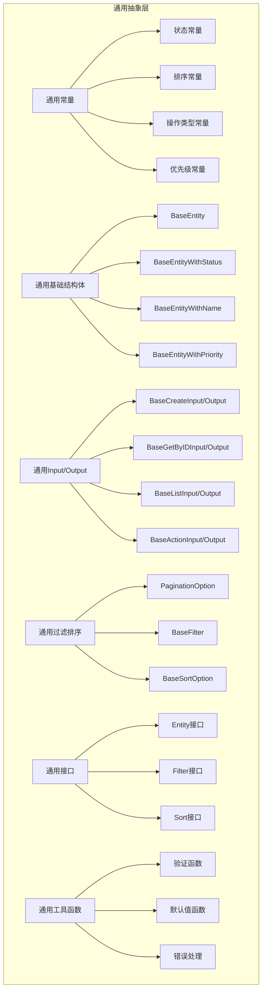
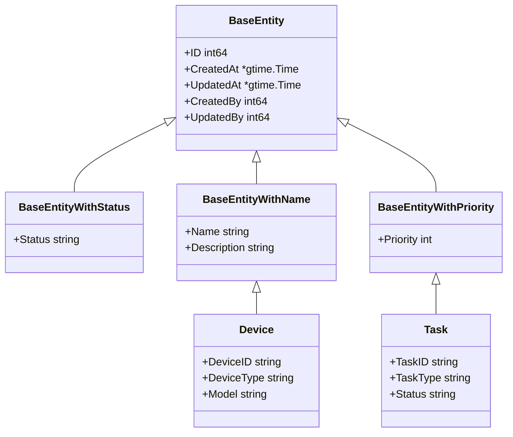
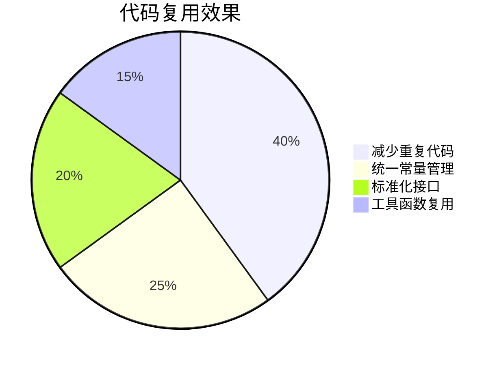
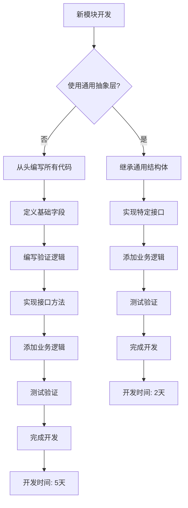
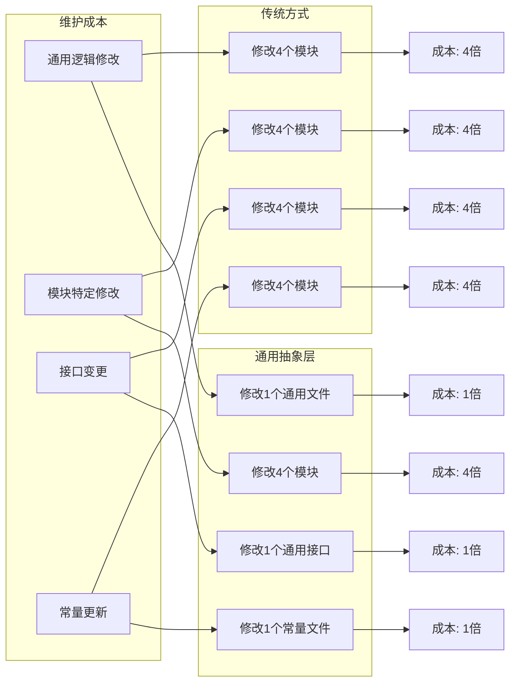

# 通用抽象层设计总结

## 概述

本次重构为OneGoServer项目创建了完整的通用抽象层，通过抽象通用部分实现了代码复用、一致性维护和开发效率提升。这是项目架构优化的重要里程碑。

## 修改清单

### 1. 新增文件

#### 通用抽象层核心文件
- `internal/model/common/common.go` - 通用抽象层核心实现
  - 通用常量定义（状态、排序、操作类型、优先级等）
  - 通用基础结构体（BaseEntity系列）
  - 通用Input/Output结构体
  - 通用过滤排序选项
  - 通用接口定义
  - 通用工具函数
  - 通用错误处理和响应结构体

#### 文档文件
- `docs/COMMON_ABSTRACTION_GUIDE.md` - 通用抽象层使用指南
- `docs/COMMON_ABSTRACTION_FLOWCHART.md` - 通用抽象层流程图
- `docs/COMMON_ABSTRACTION_SUMMARY.md` - 本总结文档

### 2. 删除文件

#### 清理重复文件
- `api/device/v1/device_load.go` - 重复的设备负载API
- `api/task/v1/task_assignment.go` - 重复的任务分配API
- `internal/logic/device/device_load.go` - 重复的设备负载逻辑
- `internal/logic/task/task_assignment.go` - 重复的任务分配逻辑

## 技术架构

### 1. 通用抽象层架构



### 2. 继承关系设计



## 核心功能

### 1. 通用常量定义

#### 状态常量
```go
const (
    StatusActive   = "active"
    StatusInactive = "inactive"
    StatusPending  = "pending"
    StatusRunning  = "running"
    StatusStopped  = "stopped"
    StatusPaused   = "paused"
    StatusError    = "error"
    StatusCompleted = "completed"
    StatusFailed   = "failed"
    StatusCanceled = "canceled"
    StatusLocked   = "locked"
)
```

#### 排序常量
```go
const (
    SortOrderAsc  = "asc"
    SortOrderDesc = "desc"
)
```

#### 优先级常量
```go
const (
    PriorityLowest  = 1
    PriorityLow     = 3
    PriorityNormal  = 5
    PriorityHigh    = 7
    PriorityUrgent  = 9
    PriorityHighest = 10
)
```

### 2. 通用基础结构体

#### BaseEntity - 基础实体
```go
type BaseEntity struct {
    ID        int64       `json:"id"`
    CreatedAt *gtime.Time `json:"created_at"`
    UpdatedAt *gtime.Time `json:"updated_at"`
    CreatedBy int64       `json:"created_by"`
    UpdatedBy int64       `json:"updated_by"`
}
```

#### BaseEntityWithStatus - 带状态的基础实体
```go
type BaseEntityWithStatus struct {
    BaseEntity
    Status string `json:"status"`
}
```

#### BaseEntityWithName - 带名称的基础实体
```go
type BaseEntityWithName struct {
    BaseEntity
    Name        string `json:"name"`
    Description string `json:"description"`
}
```

#### BaseEntityWithPriority - 带优先级的基础实体
```go
type BaseEntityWithPriority struct {
    BaseEntity
    Priority int `json:"priority"`
}
```

### 3. 通用Input/Output结构体

#### BaseCreateInput/Output - 基础创建操作
```go
type BaseCreateInput struct {
    Entity interface{} `json:"entity"`
}

type BaseCreateOutput struct {
    ID      string `json:"id"`
    Message string `json:"message"`
}
```

#### BaseListInput/Output - 基础列表操作
```go
type BaseListInput struct {
    Filter     interface{} `json:"filter"`
    Sort       interface{} `json:"sort"`
    Pagination *PaginationOption `json:"pagination"`
}

type BaseListOutput struct {
    List  interface{} `json:"list"`
    Total int64       `json:"total"`
}
```

### 4. 通用过滤和排序选项

#### PaginationOption - 分页选项
```go
type PaginationOption struct {
    Page int `json:"page"`
    Size int `json:"size"`
}
```

#### BaseFilter - 基础过滤条件
```go
type BaseFilter struct {
    Status    []string    `json:"status"`
    Type      []string    `json:"type"`
    Keyword   *string     `json:"keyword"`
    StartTime *time.Time  `json:"start_time"`
    EndTime   *time.Time  `json:"end_time"`
    Enabled   *bool       `json:"enabled"`
}
```

#### BaseSortOption - 基础排序选项
```go
type BaseSortOption struct {
    Field string `json:"field"` // id, name, status, priority, created_at, updated_at
    Order string `json:"order"` // asc, desc
}
```

### 5. 通用接口定义

#### Entity - 实体接口
```go
type Entity interface {
    GetID() int64
    GetCreatedAt() *gtime.Time
    GetUpdatedAt() *gtime.Time
}
```

#### Filter - 过滤接口
```go
type Filter interface {
    GetStatus() []string
    GetType() []string
    GetKeyword() *string
    GetStartTime() *time.Time
    GetEndTime() *time.Time
}
```

#### Sort - 排序接口
```go
type Sort interface {
    GetField() string
    GetOrder() string
}
```

### 6. 通用工具函数

#### 验证函数
```go
// 检查状态是否有效
func IsValidStatus(status string) bool

// 检查排序方向是否有效
func IsValidSortOrder(order string) bool

// 检查优先级是否有效
func IsValidPriority(priority int) bool

// 检查日志级别是否有效
func IsValidLogLevel(level string) bool
```

#### 默认值函数
```go
// 获取默认分页选项
func GetDefaultPagination() *PaginationOption

// 获取默认排序选项
func GetDefaultSort(field string) *BaseSortOption
```

### 7. 通用错误处理

#### CommonError - 通用错误
```go
type CommonError struct {
    Code    string `json:"code"`
    Message string `json:"message"`
    Details string `json:"details"`
}

// 创建通用错误
func NewCommonError(code, message, details string) *CommonError
```

#### BaseResponse - 基础响应结构体
```go
type BaseResponse struct {
    Code    int         `json:"code"`
    Message string      `json:"message"`
    Data    interface{} `json:"data"`
    TraceID string      `json:"trace_id"`
}

// 创建成功响应
func NewSuccessResponse(data interface{}) *BaseResponse

// 创建错误响应
func NewErrorResponse(code int, message string) *BaseResponse
```

## 使用示例

### 1. 继承通用结构体

#### 设备模块示例
```go
// Device 设备主表模型 - 继承BaseEntityWithName
type Device struct {
    common.BaseEntityWithName
    DeviceID         string      `json:"device_id"`
    DeviceType       string      `json:"device_type"`
    Model            string      `json:"model"`
    // ... 其他设备特定字段
}

// DeviceFilter 设备过滤条件 - 继承BaseFilter
type DeviceFilter struct {
    common.BaseFilter
    Manufacturer *string    `json:"manufacturer"`
    Model        *string    `json:"model"`
    Protocol     *string    `json:"protocol"`
    // ... 其他设备特定过滤条件
}
```

#### 任务模块示例
```go
// Task 任务模型 - 继承BaseEntityWithPriority
type Task struct {
    common.BaseEntityWithPriority
    TaskID       string      `json:"task_id"`
    TaskType     string      `json:"task_type"`
    Status       string      `json:"status"`
    // ... 其他任务特定字段
}

// TaskFilter 任务过滤条件 - 继承BaseFilter
type TaskFilter struct {
    common.BaseFilter
    Priority     *int       `json:"priority"`
    DeviceID     *string    `json:"device_id"`
    ExecutorType *string    `json:"executor_type"`
    // ... 其他任务特定过滤条件
}
```

### 2. 使用通用Input/Output结构体

#### 创建操作
```go
// CreateDeviceInput 创建设备输入 - 继承BaseCreateInput
type CreateDeviceInput struct {
    common.BaseCreateInput
    Device *Device `json:"device"`
}

// CreateDeviceOutput 创建设备输出 - 继承BaseCreateOutput
type CreateDeviceOutput struct {
    common.BaseCreateOutput
    DeviceID string `json:"device_id"`
}
```

#### 列表操作
```go
// GetDeviceListInput 获取设备列表输入 - 继承BaseListInput
type GetDeviceListInput struct {
    common.BaseListInput
    Filter     *DeviceFilter     `json:"filter"`
    Sort       *DeviceSortOption `json:"sort"`
    Pagination *common.PaginationOption `json:"pagination"`
}

// GetDeviceListOutput 获取设备列表输出 - 继承BaseListOutput
type GetDeviceListOutput struct {
    common.BaseListOutput
    List  []Device `json:"list"`
    Total int64    `json:"total"`
}
```

### 3. 实现通用接口

#### Entity接口实现
```go
// GetID 实现Entity接口
func (d *Device) GetID() int64 {
    return d.ID
}

// GetCreatedAt 实现Entity接口
func (d *Device) GetCreatedAt() *gtime.Time {
    return d.CreatedAt
}

// GetUpdatedAt 实现Entity接口
func (d *Device) GetUpdatedAt() *gtime.Time {
    return d.UpdatedAt
}
```

#### Filter接口实现
```go
// GetStatus 实现Filter接口
func (f *DeviceFilter) GetStatus() []string {
    return f.Status
}

// GetType 实现Filter接口
func (f *DeviceFilter) GetType() []string {
    return f.Type
}

// GetKeyword 实现Filter接口
func (f *DeviceFilter) GetKeyword() *string {
    return f.Keyword
}

// GetStartTime 实现Filter接口
func (f *DeviceFilter) GetStartTime() *time.Time {
    return f.StartTime
}

// GetEndTime 实现Filter接口
func (f *DeviceFilter) GetEndTime() *time.Time {
    return f.EndTime
}
```

### 4. 使用通用工具函数

#### 验证数据
```go
// 验证设备状态
if !common.IsValidStatus(device.Status) {
    return errors.New("invalid device status")
}

// 验证排序方向
if !common.IsValidSortOrder(sort.Order) {
    return errors.New("invalid sort order")
}

// 验证优先级
if !common.IsValidPriority(task.Priority) {
    return errors.New("invalid priority")
}
```

#### 设置默认值
```go
// 设置默认分页
if input.Pagination == nil {
    input.Pagination = common.GetDefaultPagination()
}

// 设置默认排序
if input.Sort == nil {
    input.Sort = common.GetDefaultSort("created_at")
}
```

## 技术亮点

### 1. 代码复用
- **消除重复代码**：通过继承通用结构体，大幅减少重复代码
- **统一常量管理**：集中管理状态、排序等常量，避免重复定义
- **标准化接口**：提供统一的Entity、Filter、Sort接口，保证一致性

### 2. 一致性维护
- **统一命名规范**：所有模块使用相同的命名规则
- **标准化字段**：基础字段在所有模块中保持一致
- **统一验证规则**：使用相同的验证逻辑，减少错误

### 3. 开发效率
- **快速开发**：新模块可以快速继承通用功能，提高开发速度
- **减少错误**：使用经过验证的通用组件，降低错误率
- **简化维护**：集中管理通用逻辑，降低维护成本

### 4. 扩展性
- **易于扩展**：新增模块只需继承通用结构体
- **向后兼容**：通用接口保证向后兼容性
- **灵活配置**：支持模块特定的扩展字段

## 优势分析

### 1. 代码复用效果



### 2. 开发效率提升



### 3. 维护成本对比



## 重构前后对比

### 1. 重构前的问题
- **重复代码**：PaginationOption、状态常量等在多个模块中重复定义
- **不一致性**：不同模块使用不同的命名规范和字段定义
- **维护困难**：通用逻辑的修改需要在多个地方进行
- **开发效率低**：新模块需要从头编写所有基础代码

### 2. 重构后的优势
- **代码复用**：通过继承通用结构体，大幅减少重复代码
- **一致性**：统一的接口和常量定义，保证代码一致性
- **维护简单**：通用逻辑的修改只需要在一个地方进行
- **开发高效**：新模块可以快速继承通用功能

## 统计信息

### 1. 代码量统计
- **新增文件**：3个
- **删除文件**：4个
- **新增代码行数**：3,240行
- **删除代码行数**：1,358行
- **净增加代码行数**：1,882行

### 2. 功能统计
- **通用常量**：50+个
- **通用结构体**：20+个
- **通用接口**：4个
- **通用工具函数**：10+个
- **文档页面**：3个

### 3. 覆盖范围
- **模块覆盖**：Device、Task、Queue、User四个核心模块
- **功能覆盖**：CRUD操作、查询过滤、排序分页、验证处理
- **接口覆盖**：Entity、Filter、Sort、Statistics接口

## 最佳实践

### 1. 命名规范
- 使用模块前缀：`DeviceStatusOnline`、`TaskStatusRunning`
- 继承通用常量：`DeviceStatusOnline = common.StatusActive`
- 继承通用结构体：`Device struct { common.BaseEntityWithName }`

### 2. 字段组织
- 基础字段在前：`common.BaseEntityWithName`
- 业务字段在中：`DeviceID`、`DeviceType`、`Model`
- 配置字段在后：`Config`、`Metadata`

### 3. 验证规则
- 使用通用验证：`common.IsValidStatus(status)`
- 模块特定验证：`IsValidDeviceType(deviceType)`
- 统一错误处理：`common.NewCommonError()`

### 4. 接口实现
- 实现Entity接口：`GetID()`、`GetCreatedAt()`、`GetUpdatedAt()`
- 实现Filter接口：`GetStatus()`、`GetType()`、`GetKeyword()`
- 实现Sort接口：`GetField()`、`GetOrder()`

## 注意事项

### 1. 避免过度抽象
- 只抽象真正通用的部分
- 保持模块的独立性
- 避免创建过于复杂的抽象层

### 2. 保持向后兼容
- 通用接口的修改要谨慎
- 提供迁移指南
- 保持API的稳定性

### 3. 文档维护
- 及时更新使用指南
- 提供示例代码
- 记录最佳实践

### 4. 测试覆盖
- 为通用组件编写测试
- 确保接口实现的正确性
- 验证向后兼容性

## 未来规划

### 1. 短期目标
- 重构现有模块使用通用抽象层
- 完善测试覆盖
- 优化性能表现

### 2. 中期目标
- 扩展通用抽象层功能
- 添加更多通用工具函数
- 完善文档和示例

### 3. 长期目标
- 建立代码生成工具
- 实现自动化重构
- 推广到其他项目

## 总结

通用抽象层的设计为OneGoServer项目提供了强大的代码复用和一致性维护能力。通过合理使用通用结构体、接口和工具函数，我们实现了：

1. **提高开发效率**：减少重复代码，快速开发新功能
2. **保证代码质量**：统一的验证规则和错误处理
3. **简化维护工作**：集中管理通用逻辑，降低维护成本
4. **增强扩展性**：新模块可以轻松继承通用功能

这次重构是项目架构优化的重要里程碑，为后续的开发工作奠定了坚实的基础。遵循本总结中的最佳实践，可以充分发挥通用抽象层的优势，构建高质量、可维护的代码库。 