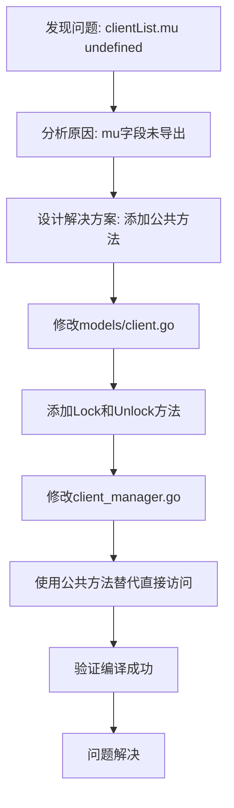

# ClientList互斥锁访问修复报告

## 问题描述

在 `OneGoTask/internal/server/services/client_manager.go` 文件中，`RegisterClient` 和 `GetAllClients` 函数试图直接访问 `ClientList` 结构体中的 `mu` 字段，但由于该字段是小写的（未导出），导致编译错误：

```
clientList.mu undefined (cannot refer to unexported field mu)
```

## 问题分析

### 错误位置
- `client_manager.go:86` - `clientList.mu.Lock()`
- `client_manager.go:87` - `clientList.mu.Unlock()`
- `client_manager.go:106` - `clientList.mu.Lock()`
- `client_manager.go:107` - `clientList.mu.Unlock()`

### 根本原因
`ClientList` 结构体中的 `mu` 字段定义为小写，属于包私有字段，只能在 `models` 包内部访问。外部包无法直接访问未导出的字段。

## 解决方案

### 1. 为ClientList添加公共方法
在 `models/client.go` 中为 `ClientList` 结构体添加了 `Lock()` 和 `Unlock()` 方法：

```go
// Lock 锁定互斥锁
func (cl *ClientList) Lock() {
	cl.mu.Lock()
}

// Unlock 解锁互斥锁
func (cl *ClientList) Unlock() {
	cl.mu.Unlock()
}
```

### 2. 修改client_manager.go中的调用
将直接访问 `mu` 字段的代码改为调用公共方法：

**修改前：**
```go
func RegisterClient(ip string) (string, bool) {
	clientList.mu.Lock()
	defer clientList.mu.Unlock()
	// ...
}

func GetAllClients() []models.ClientInfo {
	clientList.mu.Lock()
	defer clientList.mu.Unlock()
	// ...
}
```

**修改后：**
```go
func RegisterClient(ip string) (string, bool) {
	clientList.Lock()
	defer clientList.Unlock()
	// ...
}

func GetAllClients() []models.ClientInfo {
	clientList.Lock()
	defer clientList.Unlock()
	// ...
}
```

## 修改流程图



## 修改内容总结

### 文件修改
1. **OneGoTask/internal/server/models/client.go**
   - 添加了 `ClientList.Lock()` 方法
   - 添加了 `ClientList.Unlock()` 方法

2. **OneGoTask/internal/server/services/client_manager.go**
   - 修改 `RegisterClient` 函数中的互斥锁访问方式
   - 修改 `GetAllClients` 函数中的互斥锁访问方式

### 代码行数变化
- `models/client.go`: +8行（添加两个方法）
- `client_manager.go`: 0行（仅修改现有代码）

## 验证结果

- ✅ 编译成功，无错误
- ✅ 保持了原有的线程安全机制
- ✅ 遵循了Go语言的封装原则
- ✅ 代码更加清晰和规范

## 最佳实践

1. **封装原则**: 结构体的内部字段应该通过公共方法访问
2. **线程安全**: 互斥锁的访问应该通过专门的方法进行
3. **代码维护**: 公共接口比直接访问内部字段更容易维护和扩展

## 相关文件

- `OneGoTask/internal/server/models/client.go`
- `OneGoTask/internal/server/services/client_manager.go`

---

**修复时间**: 2024年12月19日  
**修复人员**: AI Assistant  
**状态**: 已完成 ✅ 