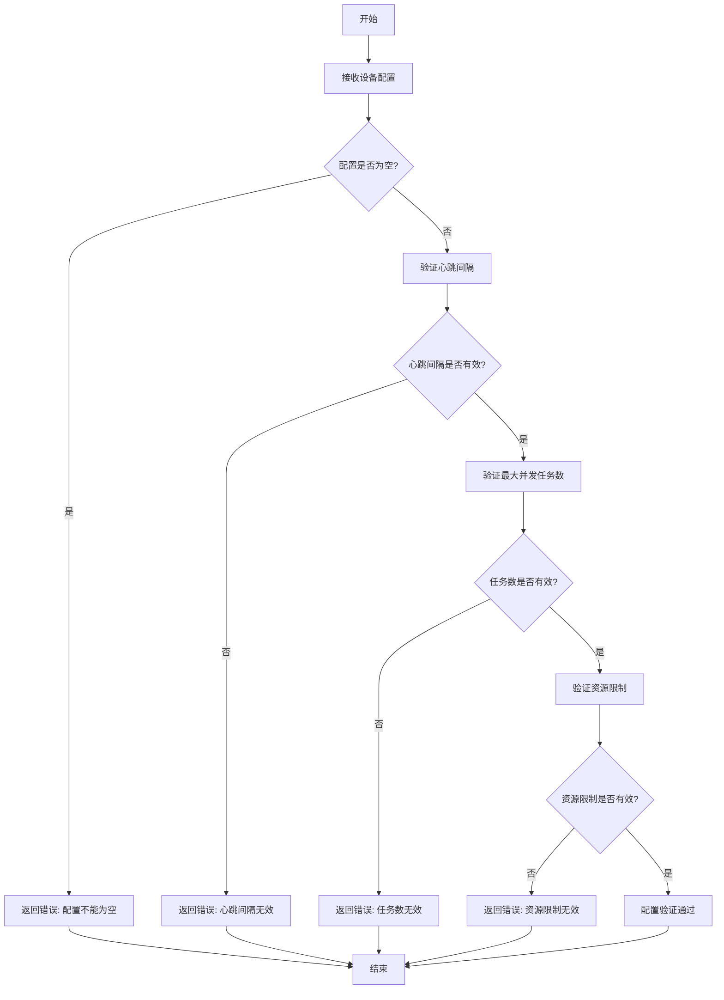
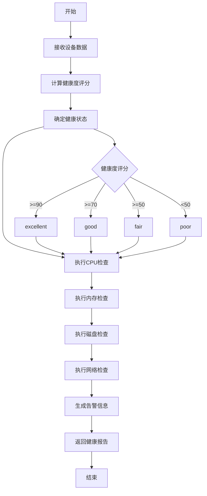
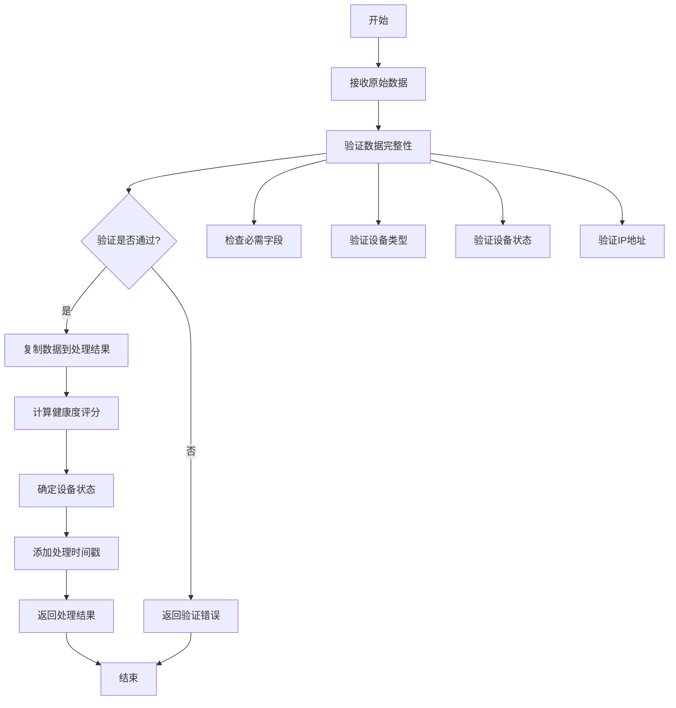
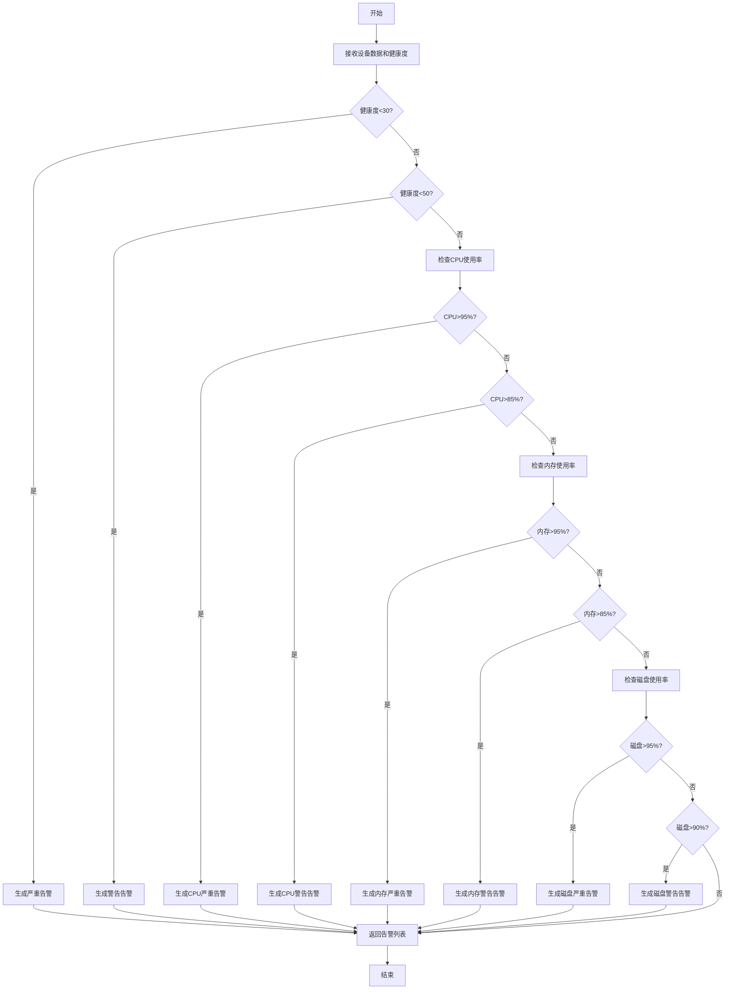
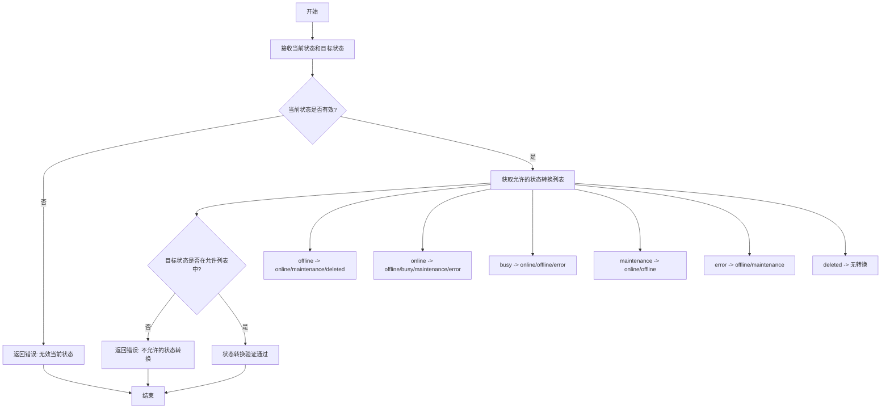
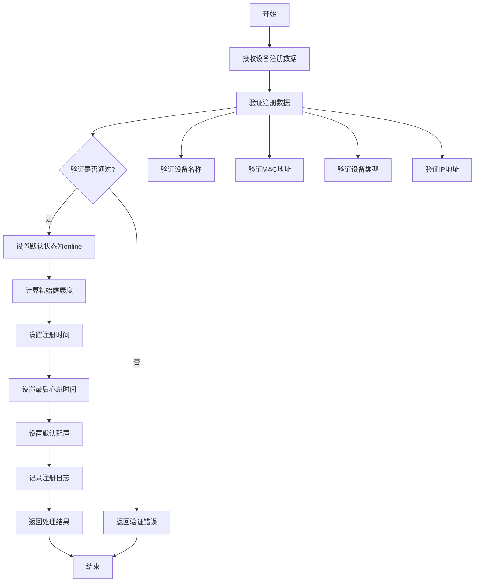
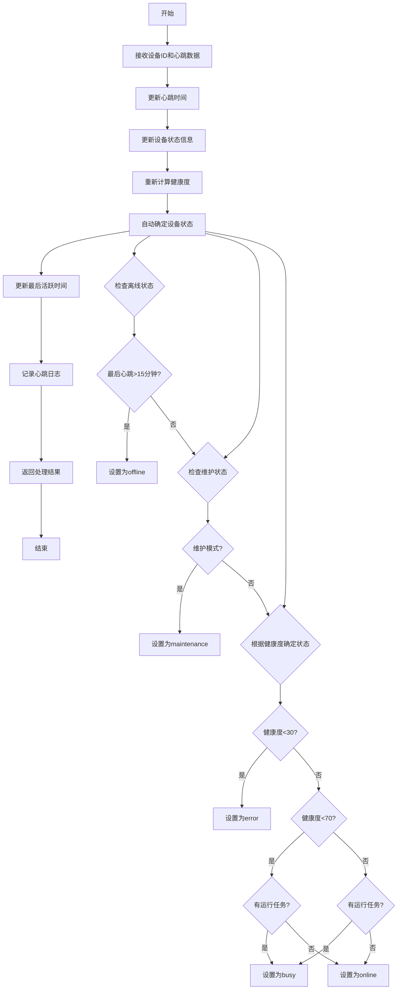

# 设备Logic层流程图

## 概述

本文档描述了OneGoServer项目中设备Logic层的主要业务流程和数据处理流程。

## 1. 设备配置管理流程



## 2. 设备健康检查流程



## 3. 设备数据处理流程



## 4. 告警生成流程



## 5. 设备状态转换流程



## 6. 设备注册处理流程



## 7. 设备心跳处理流程



## 8. 任务分配评分计算流程

```mermaid
flowchart TD
    A[开始] --> B[接收设备数据和任务数据]
    B --> C[计算基础健康度评分]
    C --> D[计算任务负载评分]
    D --> E[计算设备类型匹配度]
    E --> F[计算地理位置因素]
    F --> G[加权计算总分]
    G --> H[返回评分结果]
    H --> I[结束]
    
    C --> C1[健康度 * 40%]
    D --> D1[负载评分 * 30%]
    E --> E1[类型匹配 * 20%]
    F --> F1[地理位置 * 10%]
    
    D1 --> D1A{当前任务数/最大任务数}
    D1A --> D1B[负载评分 = (1-负载比) * 100]
    
    E1 --> E1A{设备类型匹配?}
    E1A -->|是| E1B[100分]
    E1A -->|否| E1C[50分]
    
    F1 --> F1A{地理位置匹配?}
    F1A -->|是| F1B[100分]
    F1A -->|否| F1C[30分]
```

## 总结

以上流程图展示了设备Logic层的主要业务处理流程，包括：

1. **配置管理**：设备配置的验证和生成
2. **健康检查**：综合健康状态评估
3. **数据处理**：设备数据的验证和处理
4. **告警生成**：智能告警系统
5. **状态管理**：设备状态转换验证
6. **注册处理**：设备注册业务逻辑
7. **心跳处理**：设备心跳响应处理
8. **任务分配**：任务分配评分计算

这些流程确保了设备管理的完整性和可靠性，为上层服务提供了强大的业务逻辑支持。 