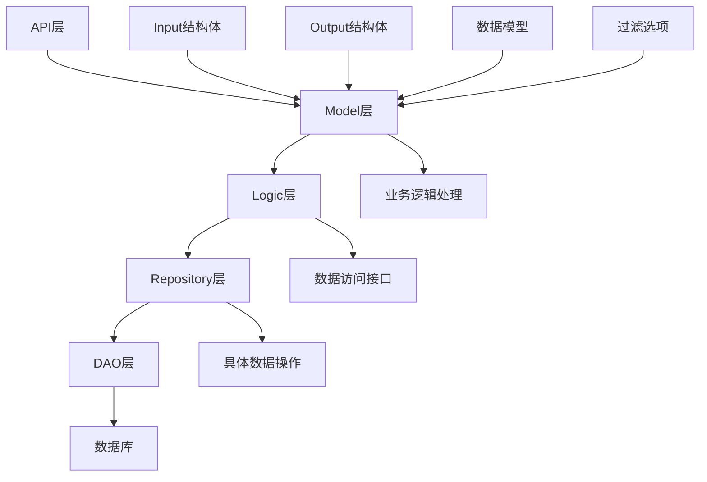
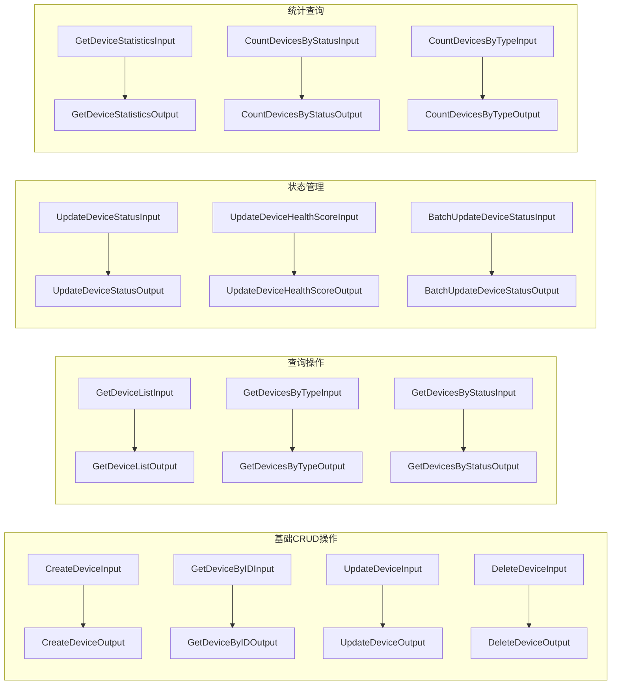
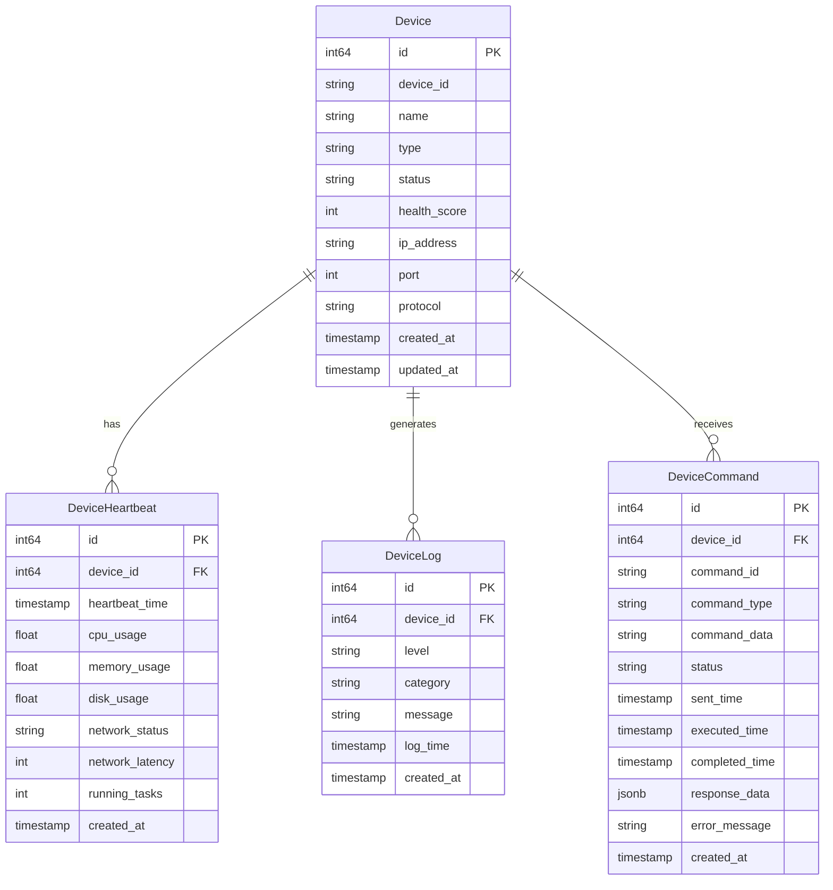
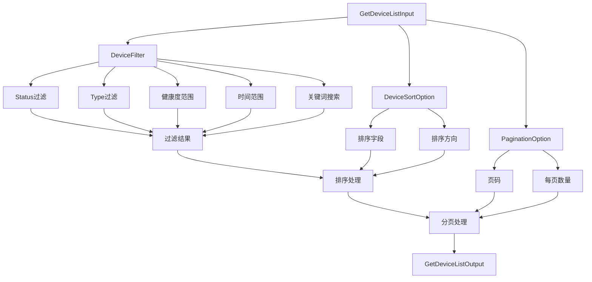
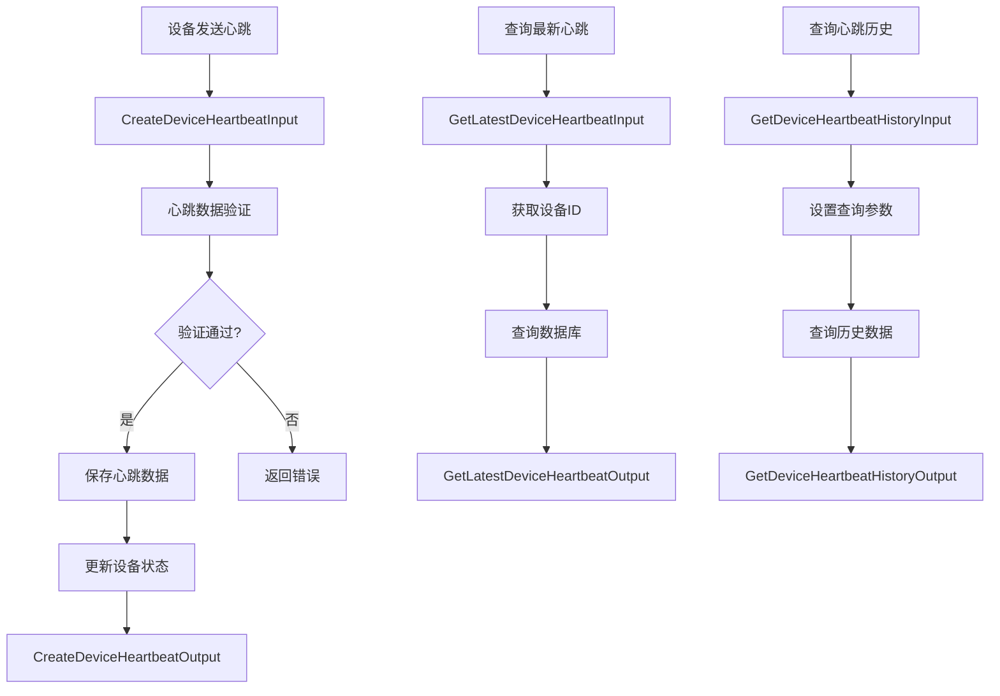
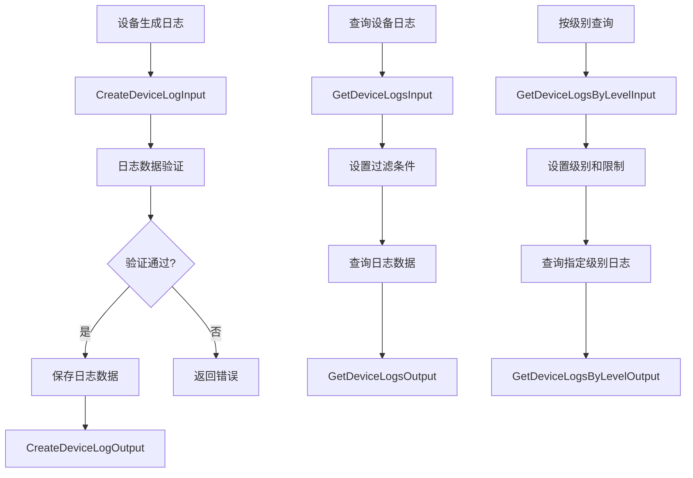
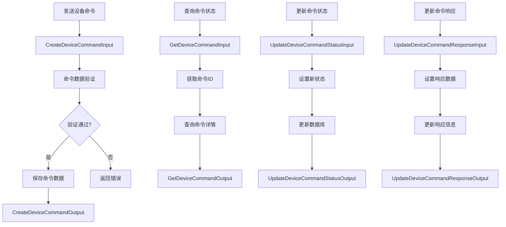
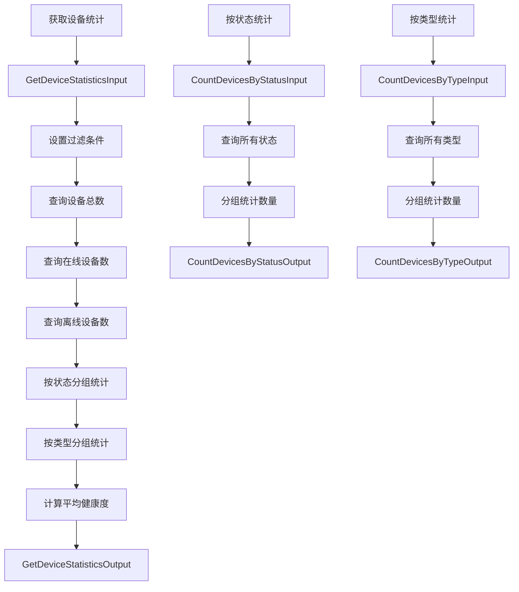
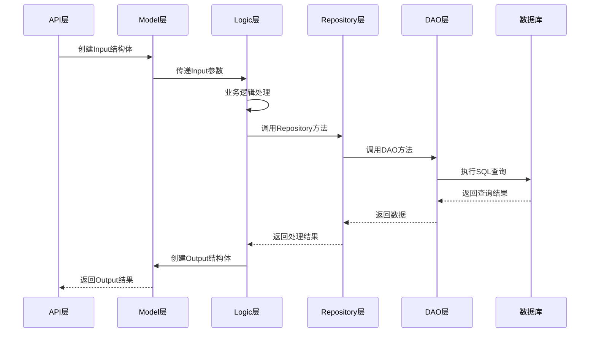
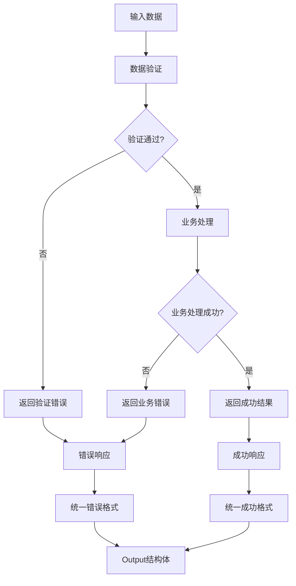

# 设备Model层流程图

## 概述

本文档描述了OneGoServer项目中设备Model层的数据流转和结构体关系图。

## 1. 整体架构流程图

## 2. Input/Output结构体关系图

## 3. 数据模型关系图

## 4. 过滤和排序选项流程图

## 5. 心跳管理流程图

## 6. 日志管理流程图

## 7. 命令管理流程图

## 8. 统计查询流程图

## 9. 数据流转时序图

## 10. 错误处理流程图

## 总结

这些流程图展示了设备Model层的完整数据流转过程：

1. **清晰的层次结构**：从API层到数据库的完整调用链
2. **标准化的Input/Output**：每个操作都有对应的输入输出结构体
3. **灵活的数据过滤**：支持多种过滤条件和排序选项
4. **完整的数据模型**：涵盖设备、心跳、日志、命令等所有相关数据
5. **规范的错误处理**：统一的错误处理和响应格式

这种设计确保了数据流转的清晰性和一致性，为整个设备管理系统提供了可靠的数据基础。 