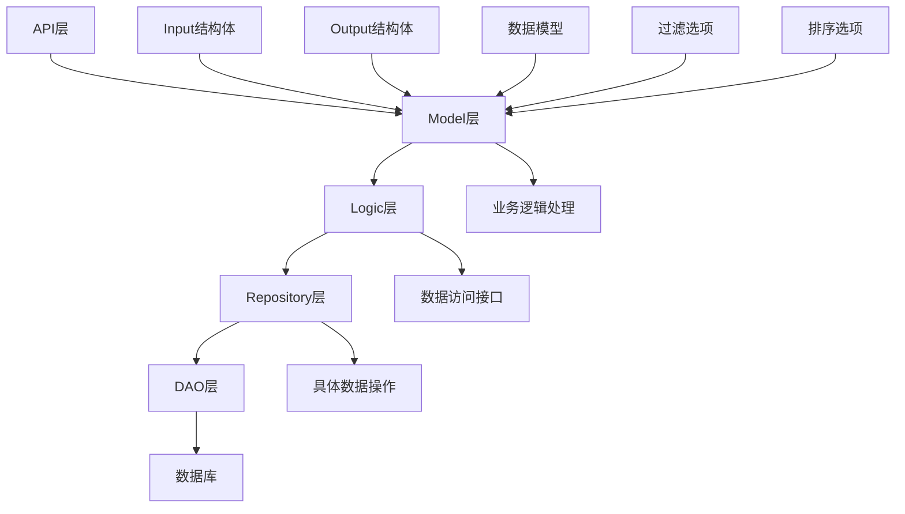
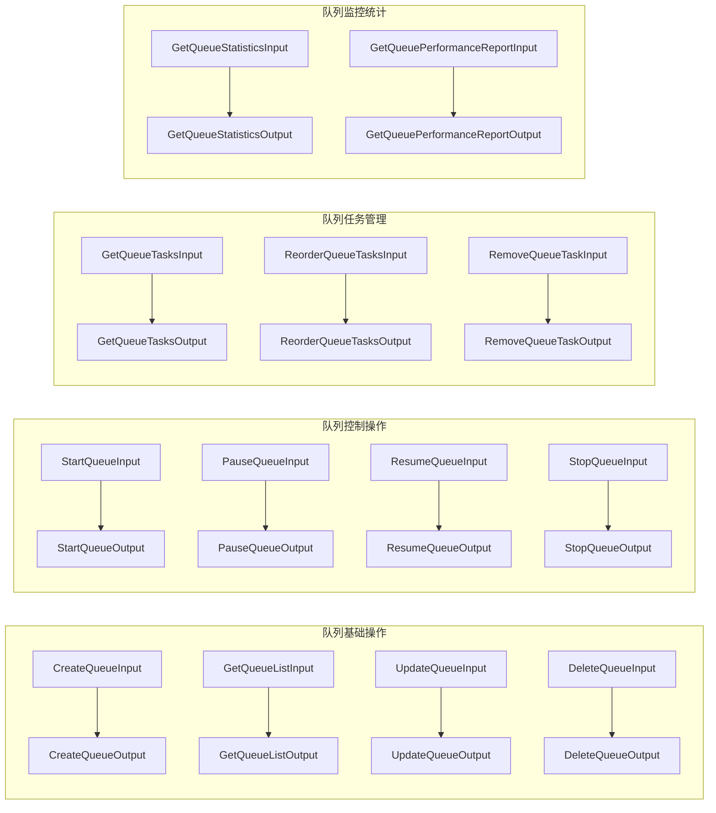
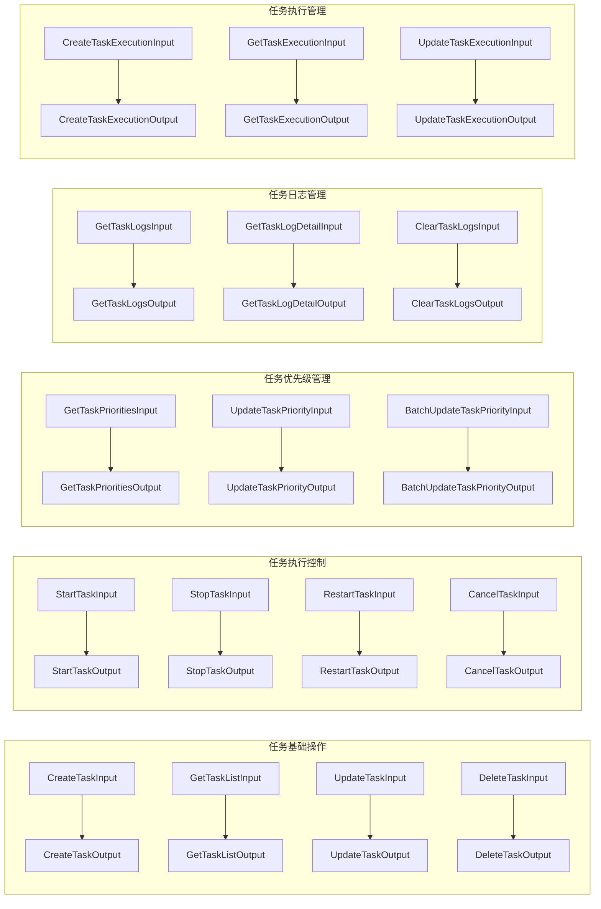
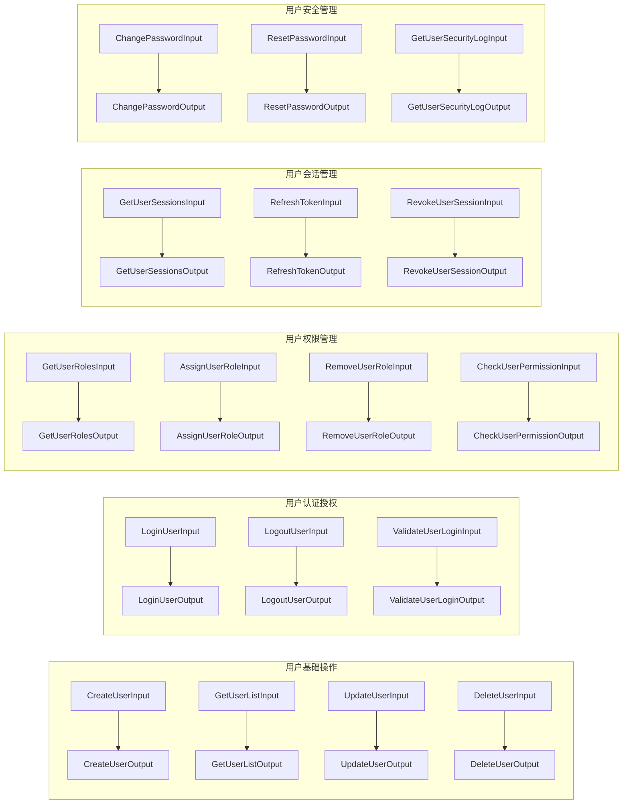
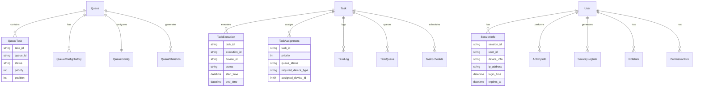
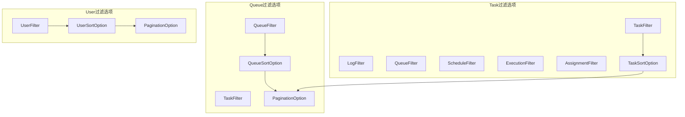
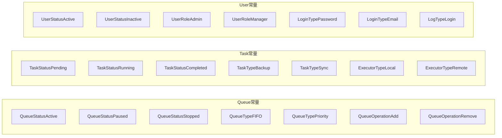
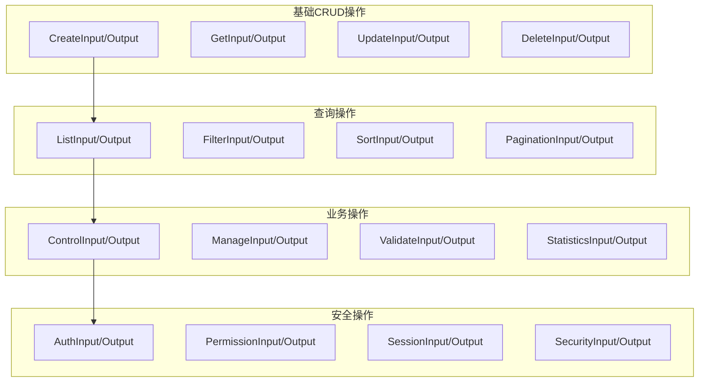
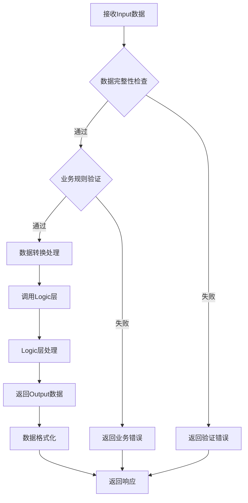
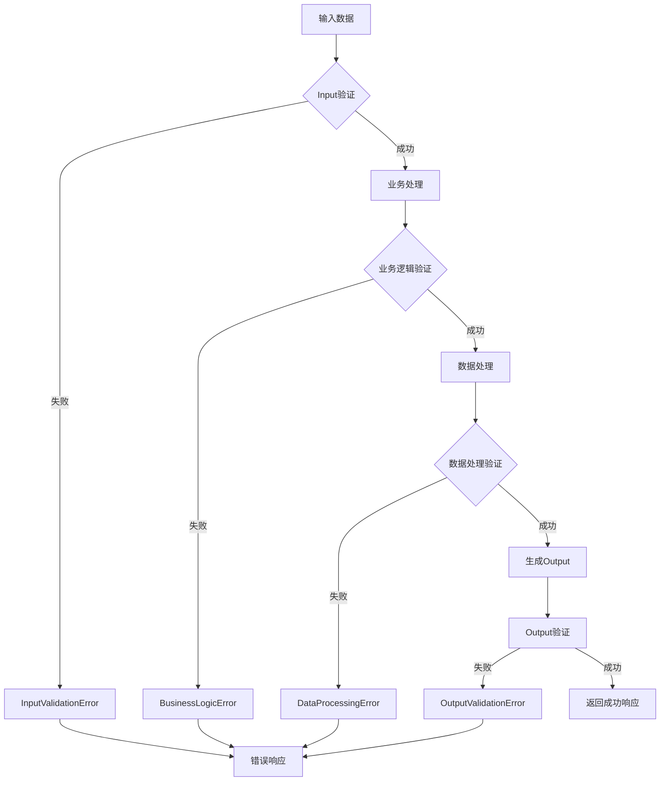

# Model层流程图

## 概述

本文档描述了OneGoServer项目中Queue、Task、User三个模块Model层的数据流转和结构体关系图。

## 1. 整体架构流程图

## 2. Queue模块数据流转图

## 3. Task模块数据流转图

## 4. User模块数据流转图

## 5. 数据模型关系图

## 6. 过滤和排序选项关系图

## 7. 常量定义关系图

## 8. Input/Output结构体分类图

## 9. 数据验证流程

## 10. 错误处理流程

## 总结

这些流程图展示了Queue、Task、User三个模块Model层的完整数据流转过程，包括：

1. **整体架构**：清晰的分层结构和数据流向
2. **模块内部流转**：每个模块的Input/Output结构体关系
3. **数据模型关系**：实体间的关联关系
4. **过滤排序选项**：查询条件的组织方式
5. **常量定义**：状态和类型的统一管理
6. **结构体分类**：按功能分类的组织方式
7. **数据验证**：完整的验证流程
8. **错误处理**：统一的错误处理机制

这些图表为开发团队提供了清晰的架构视图，有助于理解和使用Model层的各种结构体。 