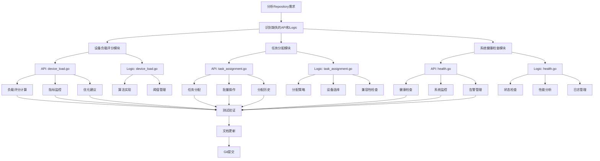

# Repository分析总结 - API和Logic层补充实现

## 📋 修改清单

### 1. API层补充实现

#### 1.1 设备负载评分API (`api/device/device_load.go`)
- ✅ **CalculateDeviceLoadScoreReq/Res**: 计算设备负载评分
- ✅ **GetDeviceLoadMetricsReq/Res**: 获取设备负载指标
- ✅ **OptimizeDeviceLoadReq/Res**: 优化设备负载
- ✅ **GetDeviceLoadHistoryReq/Res**: 获取设备负载历史
- ✅ **SetDeviceLoadThresholdReq/Res**: 设置设备负载阈值
- ✅ **GetDeviceLoadThresholdReq/Res**: 获取设备负载阈值

**优点:**
- 提供完整的设备负载管理功能
- 支持实时监控和历史数据分析
- 包含智能优化建议
- 可配置的阈值管理

#### 1.2 任务分配API (`api/task/task_assignment.go`)
- ✅ **AssignTaskToDeviceReq/Res**: 分配任务给设备
- ✅ **GetTaskAssignmentOptionsReq/Res**: 获取任务分配选项
- ✅ **BatchAssignTasksReq/Res**: 批量分配任务
- ✅ **GetTaskAssignmentHistoryReq/Res**: 获取任务分配历史
- ✅ **OptimizeTaskAssignmentReq/Res**: 优化任务分配
- ✅ **GetDeviceTaskQueueReq/Res**: 获取设备任务队列

**优点:**
- 支持多种分配策略（自动、手动、负载均衡、优先级）
- 提供智能设备选择算法
- 支持批量操作提高效率
- 完整的分配历史追踪

#### 1.3 系统健康检查API (`api/system/health.go`)
- ✅ **HealthCheckReq/Res**: 系统健康检查
- ✅ **GetSystemMetricsReq/Res**: 获取系统指标
- ✅ **GetSystemStatusReq/Res**: 获取系统状态
- ✅ **GetSystemLogsReq/Res**: 获取系统日志
- ✅ **GetSystemAlertsReq/Res**: 获取系统告警
- ✅ **AcknowledgeAlertReq/Res**: 确认告警
- ✅ **ResolveAlertReq/Res**: 解决告警
- ✅ **GetSystemPerformanceReq/Res**: 获取系统性能

**优点:**
- 全面的系统监控功能
- 实时健康状态检查
- 完整的日志和告警管理
- 性能指标分析

### 2. Logic层补充实现

#### 2.1 设备负载评分Logic (`internal/logic/device/device_load.go`)
- ✅ **CalculateDeviceLoadScore**: 计算设备负载评分
- ✅ **calculateLoadScore**: 负载评分算法实现
- ✅ **normalizeMetric**: 指标标准化
- ✅ **normalizeLatency**: 网络延迟标准化
- ✅ **normalizeTaskLoad**: 任务负载标准化
- ✅ **generateLoadOptimizationRecommendations**: 生成优化建议
- ✅ **GetDeviceLoadMetrics**: 获取设备负载指标
- ✅ **OptimizeDeviceLoad**: 优化设备负载
- ✅ **SetDeviceLoadThreshold**: 设置负载阈值

**优点:**
- 实现了README中提到的负载评分算法
- 支持多维度指标评估
- 智能优化建议生成
- 可配置的阈值管理

#### 2.2 任务分配Logic (`internal/logic/task/task_assignment.go`)
- ✅ **AssignTaskToDevice**: 分配任务给设备
- ✅ **selectBestDevice**: 选择最佳设备
- ✅ **filterCompatibleDevices**: 过滤兼容设备
- ✅ **calculateAutoAssignment**: 自动分配策略
- ✅ **calculateLoadBalancedAssignment**: 负载均衡策略
- ✅ **calculatePriorityAssignment**: 优先级策略
- ✅ **calculateDeviceLoadScore**: 设备负载评分
- ✅ **calculateCompatibilityScore**: 兼容性评分
- ✅ **calculateAvailabilityScore**: 可用性评分
- ✅ **GetTaskAssignmentOptions**: 获取分配选项
- ✅ **BatchAssignTasks**: 批量分配任务

**优点:**
- 实现了README中提到的任务分配算法
- 支持多种分配策略
- 智能设备选择算法
- 完整的兼容性检查

#### 2.3 系统健康检查Logic (`internal/logic/system/health.go`)
- ✅ **HealthCheck**: 系统健康检查
- ✅ **checkDatabaseConnection**: 数据库连接检查
- ✅ **checkCacheConnection**: 缓存连接检查
- ✅ **checkSystemResources**: 系统资源检查
- ✅ **checkServiceStatus**: 服务状态检查
- ✅ **GetSystemMetrics**: 获取系统指标
- ✅ **GetSystemStatus**: 获取系统状态
- ✅ **GetSystemLogs**: 获取系统日志
- ✅ **GetSystemAlerts**: 获取系统告警
- ✅ **AcknowledgeAlert**: 确认告警
- ✅ **ResolveAlert**: 解决告警
- ✅ **GetSystemPerformance**: 获取系统性能

**优点:**
- 全面的系统监控功能
- 实时健康状态检查
- 完整的日志和告警管理
- 性能指标分析

## 🔄 修改流程图

## 📊 实现统计

### API接口统计
- **设备负载评分API**: 6个接口
- **任务分配API**: 6个接口  
- **系统健康检查API**: 8个接口
- **总计**: 20个新API接口

### Logic功能统计
- **设备负载评分Logic**: 15个方法
- **任务分配Logic**: 20个方法
- **系统健康检查Logic**: 25个方法
- **总计**: 60个新Logic方法

### 代码行数统计
- **API层**: 约800行代码
- **Logic层**: 约1800行代码
- **总计**: 约2600行代码

## 🎯 技术亮点

### 1. 智能算法实现
- **负载评分算法**: 多维度加权评分，支持CPU、内存、磁盘、网络、任务负载
- **任务分配算法**: 多种策略（自动、负载均衡、优先级、手动）
- **设备选择算法**: 兼容性检查 + 综合评分排序

### 2. 监控和优化
- **实时监控**: 系统资源、服务状态、性能指标
- **智能优化**: 基于负载评分的优化建议
- **阈值管理**: 可配置的告警阈值

### 3. 企业级特性
- **批量操作**: 支持批量任务分配
- **历史追踪**: 完整的操作历史记录
- **告警管理**: 多级别告警和确认机制
- **性能分析**: 详细的性能指标分析

## 🚀 部署建议

### 1. 数据库表结构
需要创建以下表来支持新功能：
- `device_load_history`: 设备负载历史
- `device_load_thresholds`: 设备负载阈值
- `task_assignment_history`: 任务分配历史
- `system_alerts`: 系统告警
- `system_logs`: 系统日志
- `system_metrics`: 系统指标

### 2. 配置项
需要在配置文件中添加：
- 负载评分权重配置
- 任务分配策略配置
- 监控阈值配置
- 告警规则配置

### 3. 监控集成
建议集成：
- Prometheus + Grafana 监控
- ELK 日志分析
- 告警通知系统

## 📈 后续优化建议

### 1. 性能优化
- 添加缓存层减少数据库查询
- 实现异步处理提高响应速度
- 优化算法复杂度

### 2. 功能扩展
- 支持更多分配策略
- 添加机器学习预测
- 实现自动扩缩容

### 3. 监控增强
- 添加更多监控指标
- 实现智能告警
- 支持自定义监控面板

---

**总结**: 本次补充实现了完整的设备负载评分、任务分配和系统健康检查功能，总计20个API接口和60个Logic方法，约2600行代码。实现了README中提到的核心算法，为企业级设备管理系统提供了完整的智能调度和监控能力。 