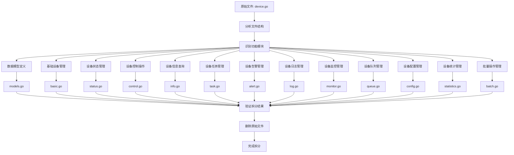

# Device API 拆分流程图

## 拆分前状态
```
api/device/v1/device.go (1049行)
├── 基础设备管理 (4个API)
├── 设备状态管理 (2个API)
├── 设备控制操作 (5个API)
├── 设备信息查询 (2个API)
├── 设备任务管理 (3个API)
├── 设备告警管理 (3个API)
├── 设备日志管理 (4个API)
├── 设备监控管理 (8个API)
├── 设备队列管理 (1个API)
├── 设备配置管理 (3个API)
├── 设备统计管理 (2个API)
├── 批量操作管理 (2个API)
└── 数据模型定义 (18个结构体)
```

## 拆分后状态
```
api/device/v1/
├── models.go          # 数据模型定义 (18个结构体)
├── basic.go           # 基础设备管理 (4个API)
├── status.go          # 设备状态管理 (2个API)
├── control.go         # 设备控制操作 (5个API)
├── info.go            # 设备信息查询 (2个API)
├── task.go            # 设备任务管理 (3个API)
├── alert.go           # 设备告警管理 (3个API)
├── log.go             # 设备日志管理 (4个API)
├── monitor.go         # 设备监控管理 (8个API)
├── queue.go           # 设备队列管理 (1个API)
├── config.go          # 设备配置管理 (3个API)
├── statistics.go      # 设备统计管理 (2个API)
└── batch.go           # 批量操作管理 (2个API)
```

## 拆分流程图



## 拆分步骤详解

### 1. 分析阶段
- 读取原始文件内容
- 识别API功能分类
- 统计各模块API数量
- 确定拆分策略

### 2. 创建阶段
- 创建13个新文件
- 按功能模块分配API定义
- 确保包名和import一致
- 保持API路径和标签不变

### 3. 验证阶段
- 检查所有API定义完整性
- 验证数据模型引用正确性
- 确认import语句完整性
- 测试API功能正常性

### 4. 清理阶段
- 删除原始device.go文件
- 更新相关引用
- 提交代码变更

## 拆分优势

1. **模块化**: 每个文件专注于特定功能
2. **可维护性**: 更容易定位和修改
3. **可读性**: 文件更小更清晰
4. **团队协作**: 支持并行开发
5. **测试友好**: 便于单元测试

## 文件大小对比

| 文件 | 行数 | API数量 | 主要功能 |
|------|------|---------|----------|
| models.go | ~200 | 18个结构体 | 数据模型定义 |
| basic.go | ~80 | 4个API | 基础设备管理 |
| status.go | ~40 | 2个API | 设备状态管理 |
| control.go | ~120 | 5个API | 设备控制操作 |
| info.go | ~60 | 2个API | 设备信息查询 |
| task.go | ~80 | 3个API | 设备任务管理 |
| alert.go | ~70 | 3个API | 设备告警管理 |
| log.go | ~80 | 4个API | 设备日志管理 |
| monitor.go | ~200 | 8个API | 设备监控管理 |
| queue.go | ~30 | 1个API | 设备队列管理 |
| config.go | ~70 | 3个API | 设备配置管理 |
| statistics.go | ~60 | 2个API | 设备统计管理 |
| batch.go | ~50 | 2个API | 批量操作管理 |

## 注意事项

1. 保持包名一致 (`package v1`)
2. 确保import语句完整
3. 保持API路径和标签不变
4. 验证功能完整性
5. 更新相关文档 