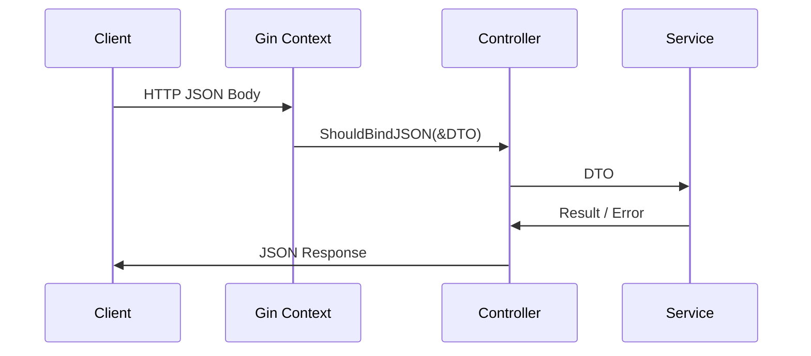

# API DTO 结构体设计方案

> 目的：统一并显式化 **外部请求 / 响应** 数据结构，降低 Controller 与业务层耦合，便于版本演进与文档生成。

## 1. 目录结构建议

```
api/
  └── v1/
      ├── device_dto.go  # 设备相关请求/响应 DTO
      ├── task_dto.go    # 任务相关请求/响应 DTO
      └── queue_dto.go   # 队列相关请求/响应 DTO
```

- **只放置定义**（struct + tag + 注释），不包含逻辑。  
- **版本维度拆分**：后续 v2 即可复制一份并增删字段。

## 2. 典型示例

```go
// api/v1/device_dto.go
package v1

type RegisterDeviceRequest struct {
    DeviceID   string `json:"device_id" binding:"required,uuid4"`
    Name       string `json:"name"      binding:"required,min=3,max=32"`
    Model      string `json:"model"     binding:"required"`
    Firmware   string `json:"firmware"  binding:"omitempty"`
}

type RegisterDeviceResponse struct {
    DeviceID string `json:"device_id"`
    Status   string `json:"status"`
}
```

- 使用 `binding` tag 与 Gin Validator 实现参数校验。  
- **Controller** 只负责 `c.ShouldBindJSON(&req)` 并将 DTO 传给 Service，不涉及内部 Model。

## 3. Controller 解析流程



## 4. 优势

1. **解耦**：内部 `models.Device` 变化不影响外部 API。  
2. **安全**：避免数据库字段全部暴露。  
3. **校验集中**：通过 tag 自动校验请求，减少重复代码。  
4. **易维护**：DTO 随版本迭代，可并存多版本。  
5. **自动化**：Swagger / OpenAPI 可直接生成文档。

## 5. 后续改动清单

| # | 文件 | 操作 | 说明 |
|---|------|------|------|
| 1 | `api/v1/device_dto.go` 等 | 新增 | 定义各模块请求/响应结构体 |
| 2 | `controller/*.go` | 修改 | 将 `struct {...}` 内嵌定义替换为 DTO 引用 |
| 3 | `docs/api-dto-structs-design.md` | 新增 | 当前说明文档 |

提交示例：

```bash
git add api/v1/*.go docs/api-dto-structs-design.md
git commit -m "feat(api): add v1 DTO definitions & doc"
```

---

如需继续落地代码，请回复，我将生成具体 DTO 文件及 Controller 修改补丁。 