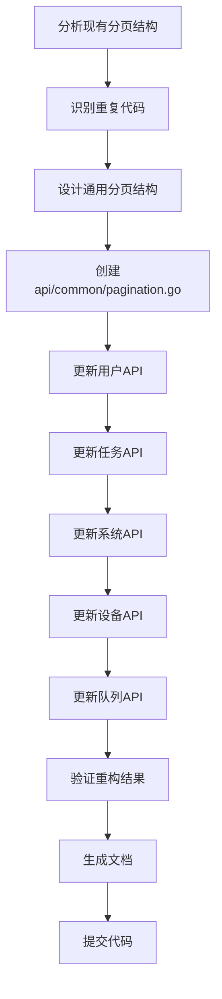
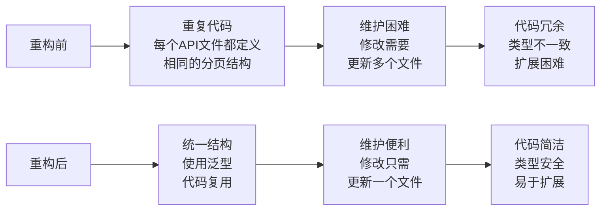
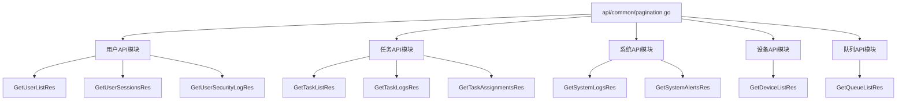
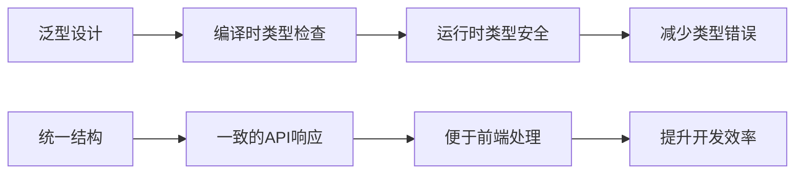
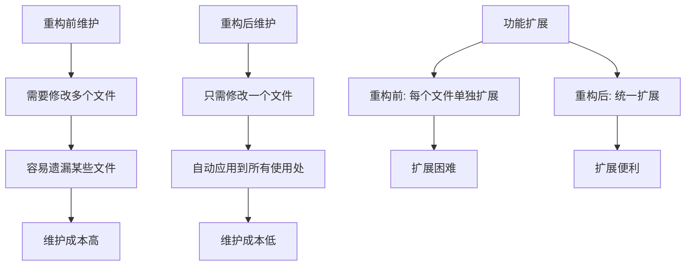
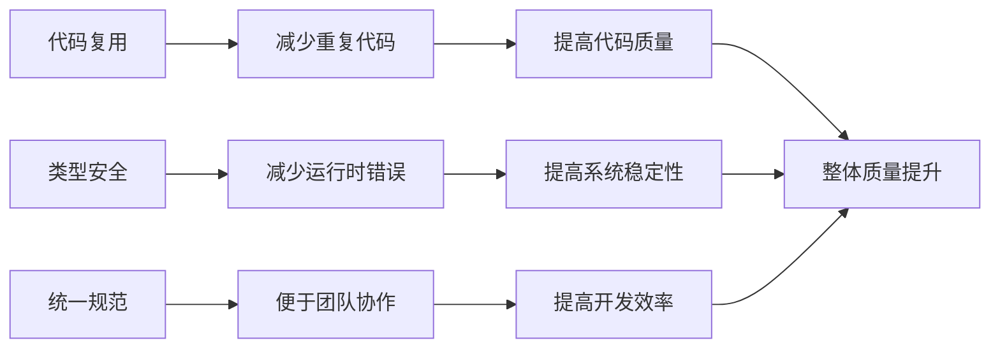
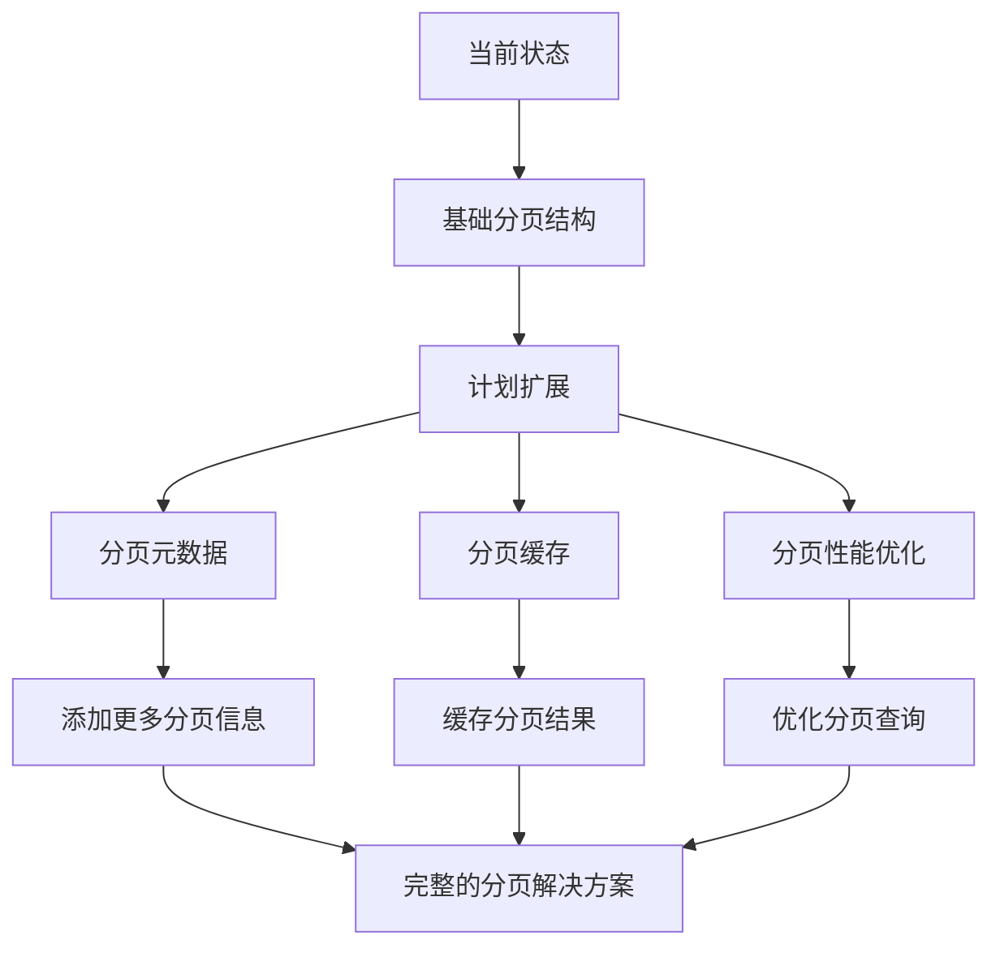

# API分页响应重构流程图

## 重构前结构
```mermaid
graph TD
    A[用户API] --> A1[GetUserListRes<br/>List []UserInfo<br/>Total int64<br/>Page int<br/>Size int]
    A --> A2[GetUserSessionsRes<br/>List []SessionInfo<br/>Total int64<br/>Page int<br/>Size int]
    A --> A3[GetUserSecurityLogRes<br/>List []SecurityLogInfo<br/>Total int64<br/>Page int<br/>Size int]
    
    B[任务API] --> B1[GetTaskListRes<br/>List []TaskInfo<br/>Total int64<br/>Page int<br/>Size int]
    B --> B2[GetTaskLogsRes<br/>List []TaskLogInfo<br/>Total int64<br/>Page int<br/>Size int]
    B --> B3[GetTaskAssignmentsRes<br/>List []TaskAssignmentInfo<br/>Total int64<br/>Page int<br/>Size int]
    
    C[系统API] --> C1[GetSystemLogsRes<br/>List []SystemLog<br/>Total int64<br/>Page int<br/>Size int]
    C --> C2[GetSystemAlertsRes<br/>List []SystemAlert<br/>Total int64<br/>Page int<br/>Size int]
    
    D[设备API] --> D1[GetDeviceListRes<br/>List []DeviceInfo<br/>Total int64<br/>Page int<br/>Size int]
    
    E[队列API] --> E1[GetQueueListRes<br/>List []QueueInfo<br/>Total int64<br/>Page int<br/>Size int]
```

## 重构后结构
```mermaid
graph TD
    A[通用分页结构] --> A1[PaginationResponse[T]<br/>List []T<br/>Total int64<br/>Page int<br/>Size int]
    A --> A2[PaginationRequest<br/>Page int<br/>Size int<br/>SortBy string<br/>SortOrder string]
    A --> A3[PaginationInfo<br/>CurrentPage int<br/>PageSize int<br/>TotalPages int<br/>TotalRecords int64<br/>HasNext bool<br/>HasPrev bool]
    
    B[用户API] --> B1[GetUserListRes<br/>common.PaginationResponse[UserInfo]]
    B --> B2[GetUserSessionsRes<br/>common.PaginationResponse[SessionInfo]]
    B --> B3[GetUserSecurityLogRes<br/>common.PaginationResponse[SecurityLogInfo]]
    
    C[任务API] --> C1[GetTaskListRes<br/>common.PaginationResponse[TaskInfo]]
    C --> C2[GetTaskLogsRes<br/>common.PaginationResponse[TaskLogInfo]]
    C --> C3[GetTaskAssignmentsRes<br/>common.PaginationResponse[TaskAssignmentInfo]]
    
    D[系统API] --> D1[GetSystemLogsRes<br/>common.PaginationResponse[SystemLog]]
    D --> D2[GetSystemAlertsRes<br/>common.PaginationResponse[SystemAlert]]
    
    E[设备API] --> E1[GetDeviceListRes<br/>common.PaginationResponse[DeviceInfo]]
    
    F[队列API] --> F1[GetQueueListRes<br/>common.PaginationResponse[QueueInfo]]
    
    A1 -.-> B1
    A1 -.-> B2
    A1 -.-> B3
    A1 -.-> C1
    A1 -.-> C2
    A1 -.-> C3
    A1 -.-> D1
    A1 -.-> D2
    A1 -.-> E1
    A1 -.-> F1
```

## 重构流程


## 代码变化对比


## 模块依赖关系


## 类型安全提升


## 维护性对比


## 代码质量提升


## 后续扩展计划
