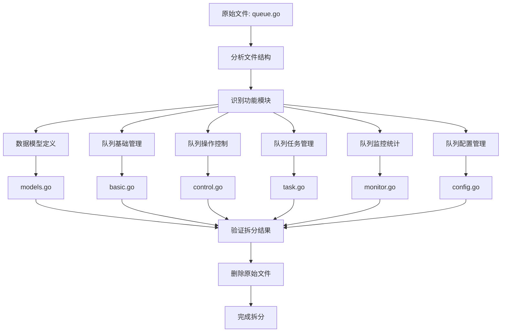

# Queue API 拆分流程图

## 拆分前状态
```
api/queue/v1/queue.go (611行)
├── 队列基础管理 (5个API)
├── 队列操作控制 (6个API)
├── 队列任务管理 (6个API)
├── 队列监控统计 (4个API)
├── 队列配置管理 (3个API)
└── 数据模型定义 (20个结构体)
```

## 拆分后状态
```
api/queue/v1/
├── models.go          # 数据模型定义 (20个结构体)
├── basic.go           # 队列基础管理 (5个API)
├── control.go         # 队列操作控制 (6个API)
├── task.go            # 队列任务管理 (6个API)
├── monitor.go         # 队列监控统计 (4个API)
└── config.go          # 队列配置管理 (3个API)
```

## 拆分流程图



## 拆分步骤详解

### 1. 分析阶段
- 读取原始文件内容
- 识别API功能分类
- 统计各模块API数量
- 确定拆分策略

### 2. 创建阶段
- 创建6个新文件
- 按功能模块分配API定义
- 确保包名和import一致
- 保持API路径和标签不变

### 3. 验证阶段
- 检查所有API定义完整性
- 验证数据模型引用正确性
- 确认import语句完整性
- 测试API功能正常性

### 4. 清理阶段
- 删除原始queue.go文件
- 更新相关引用
- 提交代码变更

## 拆分优势

1. **模块化**: 每个文件专注于特定功能
2. **可维护性**: 更容易定位和修改
3. **可读性**: 文件更小更清晰
4. **团队协作**: 支持并行开发
5. **测试友好**: 便于单元测试

## 文件大小对比

| 文件 | 行数 | API数量 | 主要功能 |
|------|------|---------|----------|
| models.go | ~300 | 20个结构体 | 数据模型定义 |
| basic.go | ~120 | 5个API | 队列基础管理 |
| control.go | ~100 | 6个API | 队列操作控制 |
| task.go | ~120 | 6个API | 队列任务管理 |
| monitor.go | ~80 | 4个API | 队列监控统计 |
| config.go | ~80 | 3个API | 队列配置管理 |

## 功能模块详解

### 1. 队列基础管理 (basic.go)
- 创建队列 - 支持多种队列类型和配置
- 获取队列列表 - 支持分页、过滤、排序
- 获取队列详情 - 包含完整状态和性能信息
- 更新队列 - 支持部分字段更新
- 删除队列 - 支持强制删除

### 2. 队列操作控制 (control.go)
- 启动队列 - 支持强制启动
- 暂停队列 - 支持原因记录
- 恢复队列 - 支持原因记录
- 停止队列 - 支持强制停止和原因记录
- 清空队列 - 支持强制清空和原因记录
- 重置队列 - 支持原因记录

### 3. 队列任务管理 (task.go)
- 任务入队 - 支持优先级、延迟、重试配置
- 任务出队 - 支持批量出队和超时设置
- 获取队列任务 - 支持分页和状态过滤
- 重新排序队列任务 - 支持多种排序策略
- 移除队列任务 - 支持原因记录
- 更新任务优先级 - 支持原因记录

### 4. 队列监控统计 (monitor.go)
- 获取队列状态 - 实时状态信息
- 获取队列指标 - 支持时间范围查询
- 获取队列统计 - 全局统计信息
- 获取队列性能报告 - 详细性能分析

### 5. 队列配置管理 (config.go)
- 获取队列配置 - 当前配置信息
- 更新队列配置 - 支持多种配置项
- 获取队列配置历史 - 配置变更记录

### 6. 数据模型定义 (models.go)
- 队列基本信息结构
- 队列详细信息和状态
- 队列任务信息
- 队列配置和历史
- 队列指标和统计
- 性能报告相关结构

## 注意事项

1. 保持包名一致 (`package v1`)
2. 确保import语句完整
3. 保持API路径和标签不变
4. 验证功能完整性
5. 更新相关文档 