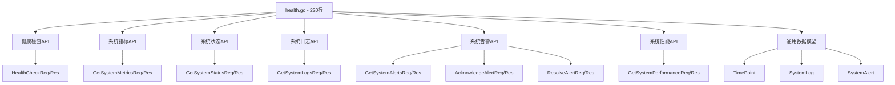
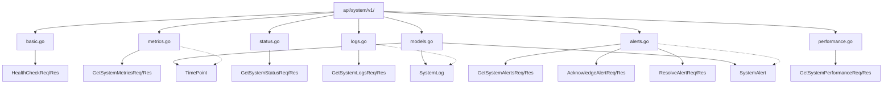
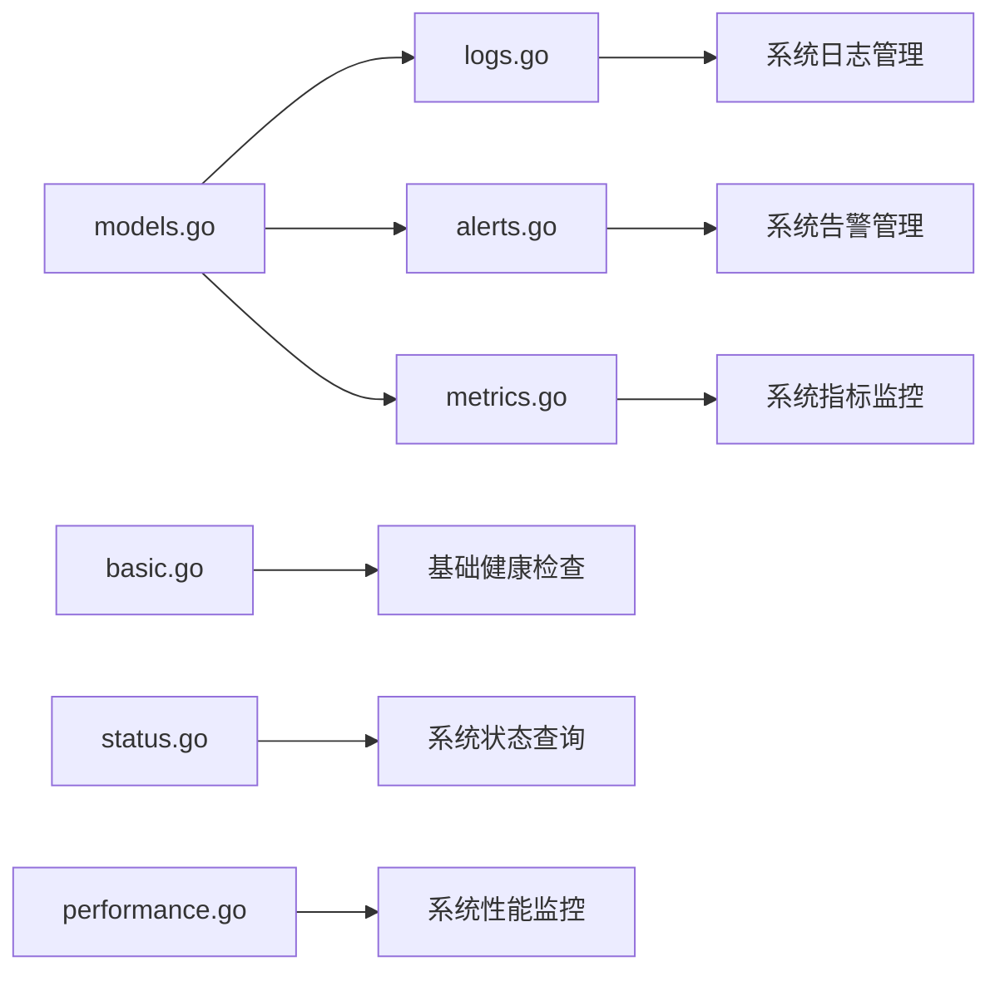
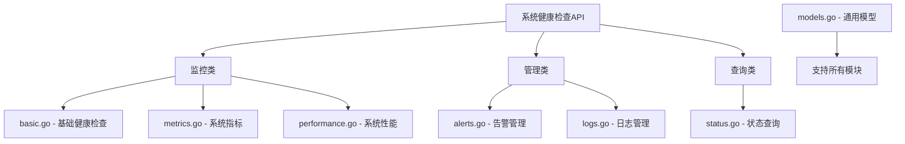
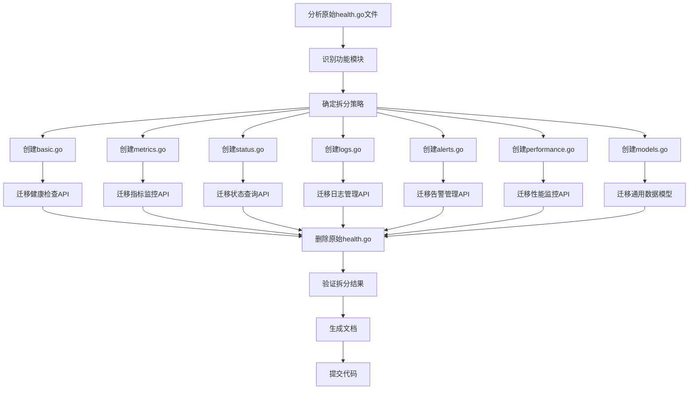
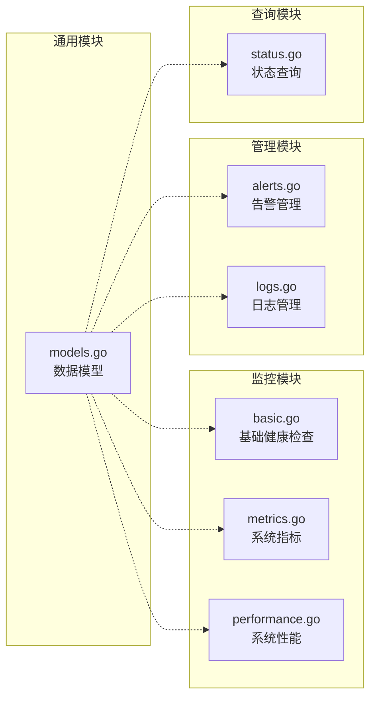
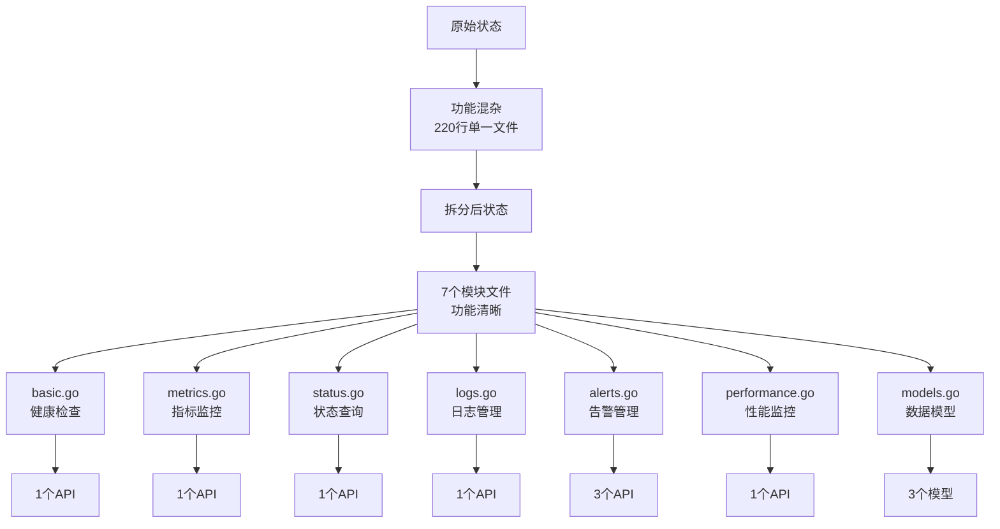
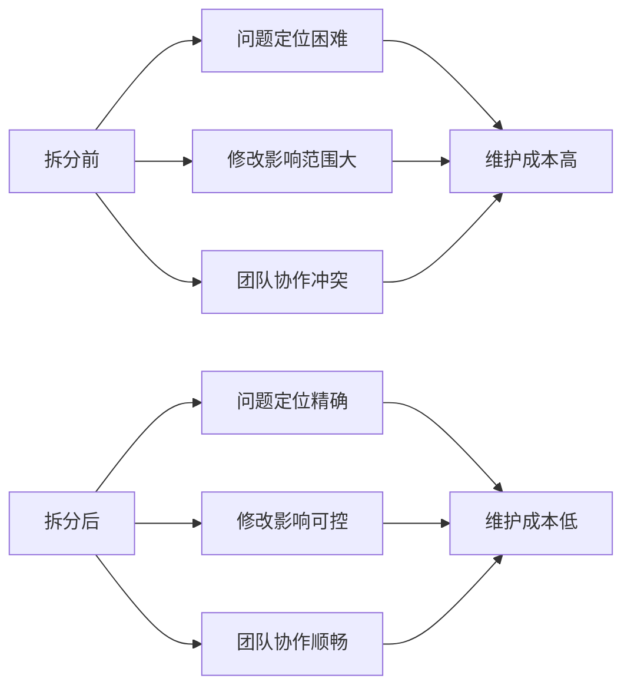

# 系统健康检查API拆分流程图

## 拆分前结构

```mermaid
graph TD
    A[health.go - 220行] --> B[健康检查API]
    A --> C[系统指标API]
    A --> D[系统状态API]
    A --> E[系统日志API]
    A --> F[系统告警API]
    A --> G[系统性能API]
    A --> H[通用数据模型]
    
    B --> B1[HealthCheckReq/Res]
    C --> C1[GetSystemMetricsReq/Res]
    D --> D1[GetSystemStatusReq/Res]
    E --> E1[GetSystemLogsReq/Res]
    F --> F1[GetSystemAlertsReq/Res]
    F --> F2[AcknowledgeAlertReq/Res]
    F --> F3[ResolveAlertReq/Res]
    G --> G1[GetSystemPerformanceReq/Res]
    H --> H1[TimePoint]
    H --> H2[SystemLog]
    H --> H3[SystemAlert]
```

## 拆分后结构

```mermaid
graph TD
    A[api/system/v1/] --> B[basic.go]
    A --> C[metrics.go]
    A --> D[status.go]
    A --> E[logs.go]
    A --> F[alerts.go]
    A --> G[performance.go]
    A --> H[models.go]
    
    B --> B1[HealthCheckReq/Res]
    C --> C1[GetSystemMetricsReq/Res]
    D --> D1[GetSystemStatusReq/Res]
    E --> E1[GetSystemLogsReq/Res]
    F --> F1[GetSystemAlertsReq/Res]
    F --> F2[AcknowledgeAlertReq/Res]
    F --> F3[ResolveAlertReq/Res]
    G --> G1[GetSystemPerformanceReq/Res]
    H --> H1[TimePoint]
    H --> H2[SystemLog]
    H --> H3[SystemAlert]
    
    E -.-> H2
    F -.-> H3
    C -.-> H1
```

## 模块依赖关系

```mermaid
graph LR
    A[models.go] --> B[logs.go]
    A --> C[alerts.go]
    A --> D[metrics.go]
    
    B --> E[系统日志管理]
    C --> F[系统告警管理]
    D --> G[系统指标监控]
    
    H[basic.go] --> I[基础健康检查]
    J[status.go] --> K[系统状态查询]
    L[performance.go] --> M[系统性能监控]
```

## 功能分类图

```mermaid
graph TD
    A[系统健康检查API] --> B[监控类]
    A --> C[管理类]
    A --> D[查询类]
    
    B --> B1[basic.go - 基础健康检查]
    B --> B2[metrics.go - 系统指标]
    B --> B3[performance.go - 系统性能]
    
    C --> C1[alerts.go - 告警管理]
    C --> C2[logs.go - 日志管理]
    
    D --> D1[status.go - 状态查询]
    
    E[models.go - 通用模型] --> F[支持所有模块]
```

## 拆分流程

```mermaid
flowchart TD
    A[分析原始health.go文件] --> B[识别功能模块]
    B --> C[确定拆分策略]
    C --> D[创建basic.go]
    C --> E[创建metrics.go]
    C --> F[创建status.go]
    C --> G[创建logs.go]
    C --> H[创建alerts.go]
    C --> I[创建performance.go]
    C --> J[创建models.go]
    
    D --> K[迁移健康检查API]
    E --> L[迁移指标监控API]
    F --> M[迁移状态查询API]
    G --> N[迁移日志管理API]
    H --> O[迁移告警管理API]
    I --> P[迁移性能监控API]
    J --> Q[迁移通用数据模型]
    
    K --> R[删除原始health.go]
    L --> R
    M --> R
    N --> R
    O --> R
    P --> R
    Q --> R
    
    R --> S[验证拆分结果]
    S --> T[生成文档]
    T --> U[提交代码]
```

## 模块职责分工

```mermaid
graph LR
    subgraph "监控模块"
        A[basic.go<br/>基础健康检查]
        B[metrics.go<br/>系统指标]
        C[performance.go<br/>系统性能]
    end
    
    subgraph "管理模块"
        D[alerts.go<br/>告警管理]
        E[logs.go<br/>日志管理]
    end
    
    subgraph "查询模块"
        F[status.go<br/>状态查询]
    end
    
    subgraph "通用模块"
        G[models.go<br/>数据模型]
    end
    
    G -.-> A
    G -.-> B
    G -.-> C
    G -.-> D
    G -.-> E
    G -.-> F
```

## 代码组织优化

```mermaid
graph TD
    A[原始状态] --> B[功能混杂<br/>220行单一文件]
    B --> C[拆分后状态]
    C --> D[7个模块文件<br/>功能清晰]
    
    D --> E[basic.go<br/>健康检查]
    D --> F[metrics.go<br/>指标监控]
    D --> G[status.go<br/>状态查询]
    D --> H[logs.go<br/>日志管理]
    D --> I[alerts.go<br/>告警管理]
    D --> J[performance.go<br/>性能监控]
    D --> K[models.go<br/>数据模型]
    
    E --> L[1个API]
    F --> M[1个API]
    G --> N[1个API]
    H --> O[1个API]
    I --> P[3个API]
    J --> Q[1个API]
    K --> R[3个模型]
```

## 维护性提升

```mermaid
graph LR
    A[拆分前] --> B[问题定位困难]
    A --> C[修改影响范围大]
    A --> D[团队协作冲突]
    
    E[拆分后] --> F[问题定位精确]
    E --> G[修改影响可控]
    E --> H[团队协作顺畅]
    
    B --> I[维护成本高]
    C --> I
    D --> I
    
    F --> J[维护成本低]
    G --> J
    H --> J
``` 