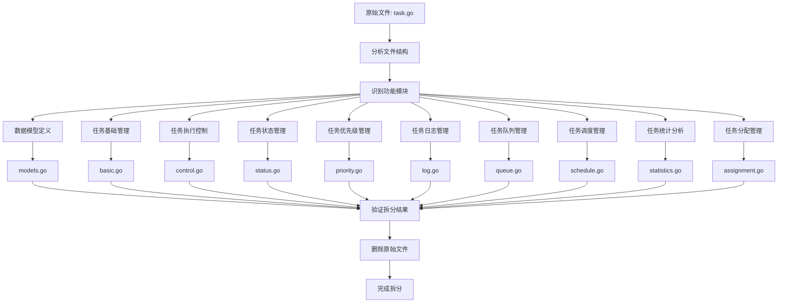

# Task API 拆分流程图

## 拆分前状态
```
api/task/v1/task.go (907行)
├── 任务基础管理 (5个API)
├── 任务执行控制 (5个API)
├── 任务状态管理 (2个API)
├── 任务优先级管理 (3个API)
├── 任务日志管理 (4个API)
├── 任务队列管理 (4个API)
├── 任务调度管理 (4个API)
├── 任务统计分析 (2个API)
├── 任务分配管理 (6个API)
└── 数据模型定义 (25个结构体)
```

## 拆分后状态
```
api/task/v1/
├── models.go          # 数据模型定义 (25个结构体)
├── basic.go           # 任务基础管理 (5个API)
├── control.go         # 任务执行控制 (5个API)
├── status.go          # 任务状态管理 (2个API)
├── priority.go        # 任务优先级管理 (3个API)
├── log.go             # 任务日志管理 (4个API)
├── queue.go           # 任务队列管理 (4个API)
├── schedule.go        # 任务调度管理 (4个API)
├── statistics.go      # 任务统计分析 (2个API)
└── assignment.go      # 任务分配管理 (6个API)
```

## 拆分流程图



## 拆分步骤详解

### 1. 分析阶段
- 读取原始文件内容
- 识别API功能分类
- 统计各模块API数量
- 确定拆分策略

### 2. 创建阶段
- 创建10个新文件
- 按功能模块分配API定义
- 确保包名和import一致
- 保持API路径和标签不变

### 3. 验证阶段
- 检查所有API定义完整性
- 验证数据模型引用正确性
- 确认import语句完整性
- 测试API功能正常性

### 4. 清理阶段
- 删除原始task.go文件
- 更新相关引用
- 提交代码变更

## 拆分优势

1. **模块化**: 每个文件专注于特定功能
2. **可维护性**: 更容易定位和修改
3. **可读性**: 文件更小更清晰
4. **团队协作**: 支持并行开发
5. **测试友好**: 便于单元测试

## 文件大小对比

| 文件 | 行数 | API数量 | 主要功能 |
|------|------|---------|----------|
| models.go | ~400 | 25个结构体 | 数据模型定义 |
| basic.go | ~120 | 5个API | 任务基础管理 |
| control.go | ~100 | 5个API | 任务执行控制 |
| status.go | ~60 | 2个API | 任务状态管理 |
| priority.go | ~80 | 3个API | 任务优先级管理 |
| log.go | ~100 | 4个API | 任务日志管理 |
| queue.go | ~80 | 4个API | 任务队列管理 |
| schedule.go | ~100 | 4个API | 任务调度管理 |
| statistics.go | ~60 | 2个API | 任务统计分析 |
| assignment.go | ~120 | 6个API | 任务分配管理 |

## 功能模块详解

### 1. 任务基础管理 (basic.go)
- 创建任务 - 支持多种任务类型和配置
- 获取任务列表 - 支持分页、过滤、排序
- 获取任务详情 - 包含完整状态和性能信息
- 更新任务 - 支持部分字段更新
- 删除任务 - 支持强制删除

### 2. 任务执行控制 (control.go)
- 启动任务 - 支持强制启动
- 停止任务 - 支持原因记录
- 重启任务 - 支持原因记录
- 取消任务 - 支持原因记录
- 重试任务 - 支持原因记录

### 3. 任务状态管理 (status.go)
- 获取任务状态 - 实时状态信息
- 更新任务状态 - 支持进度和错误信息

### 4. 任务优先级管理 (priority.go)
- 获取任务优先级列表 - 优先级配置信息
- 更新任务优先级 - 支持原因记录
- 批量更新任务优先级 - 批量操作支持

### 5. 任务日志管理 (log.go)
- 获取任务日志列表 - 支持分页和过滤
- 获取任务日志详情 - 详细日志信息
- 清空任务日志 - 支持条件清空
- 导出任务日志 - 支持多种格式

### 6. 任务队列管理 (queue.go)
- 获取任务队列列表 - 队列状态信息
- 获取任务队列详情 - 详细队列信息
- 管理任务队列 - 支持多种操作
- 获取任务队列统计 - 统计信息

### 7. 任务调度管理 (schedule.go)
- 获取任务调度列表 - 调度配置信息
- 创建任务调度 - 支持多种调度类型
- 更新任务调度 - 支持部分更新
- 删除任务调度 - 支持强制删除

### 8. 任务统计分析 (statistics.go)
- 获取任务统计信息 - 全局统计信息
- 获取任务性能报告 - 详细性能分析

### 9. 任务分配管理 (assignment.go)
- 分配任务给设备 - 智能分配策略
- 获取任务分配选项 - 分配建议
- 批量分配任务 - 批量操作支持
- 获取任务分配历史 - 历史记录
- 优化任务分配 - 智能优化
- 获取设备任务队列 - 设备队列状态

### 10. 数据模型定义 (models.go)
- 任务基本信息结构
- 任务详细信息和状态
- 任务执行信息
- 任务优先级信息
- 任务日志信息
- 任务队列信息
- 任务调度信息
- 任务统计和性能报告
- 任务分配相关结构

## 注意事项

1. 保持包名一致 (`package v1`)
2. 确保import语句完整
3. 保持API路径和标签不变
4. 验证功能完整性
5. 更新相关文档 