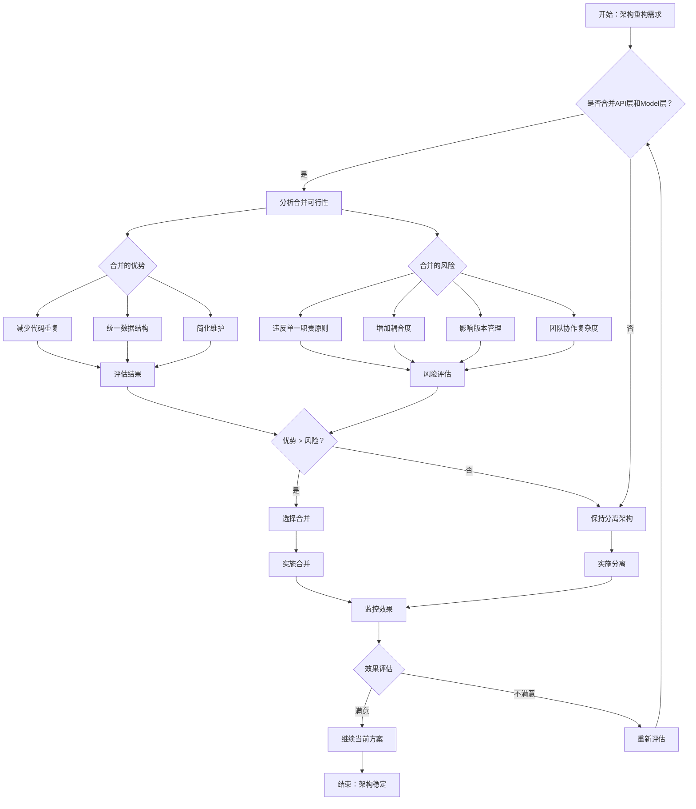
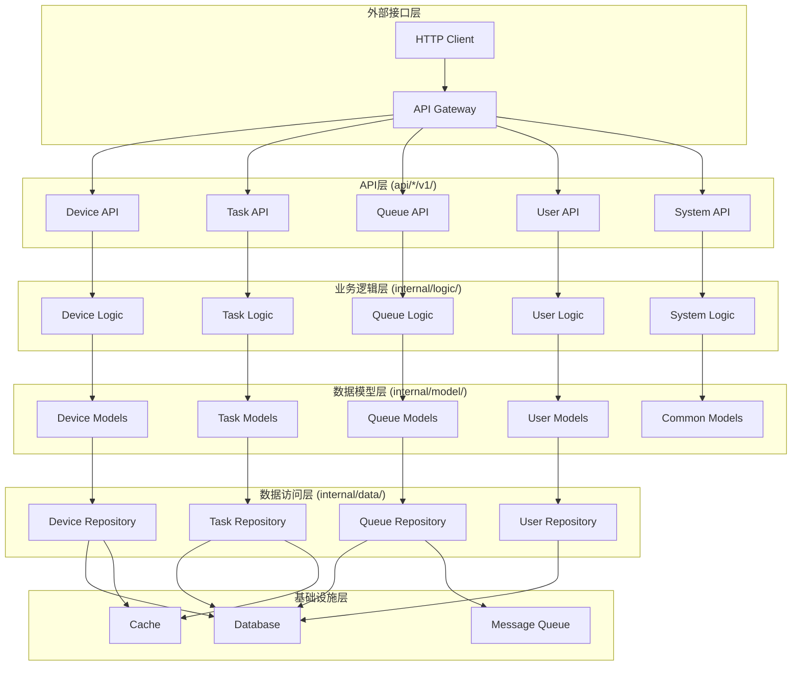
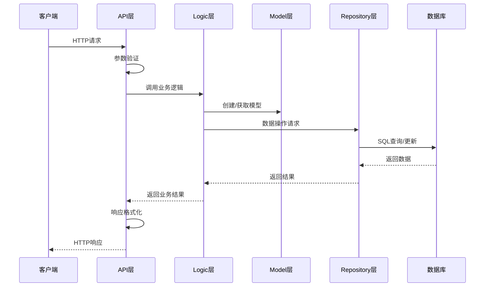

# 架构决策流程图

## 保持API层和internal/model层分离的决策流程

## 当前架构分层设计

## 职责分离矩阵

| 层级 | 主要职责 | 关注点 | 变更影响范围 |
|------|----------|--------|--------------|
| **API层** | 接口定义、参数验证、响应格式化 | HTTP协议、版本管理 | 对外接口 |
| **Logic层** | 业务逻辑、流程控制、规则验证 | 业务规则、流程编排 | 业务逻辑 |
| **Model层** | 数据结构、业务模型、验证规则 | 数据模型、业务实体 | 数据模型 |
| **Repository层** | 数据持久化、查询优化 | 数据访问、性能优化 | 数据存储 |

## 数据流向图

## 决策优势总结

### 1. 架构清晰度
- ✅ 每层职责明确
- ✅ 依赖关系清晰
- ✅ 便于理解和维护

### 2. 开发效率
- ✅ 并行开发无冲突
- ✅ 独立测试和部署
- ✅ 快速定位问题

### 3. 扩展性
- ✅ 支持多版本API
- ✅ 业务逻辑独立演进
- ✅ 数据模型稳定发展

### 4. 团队协作
- ✅ 职责分工明确
- ✅ 减少代码冲突
- ✅ 提高开发效率 