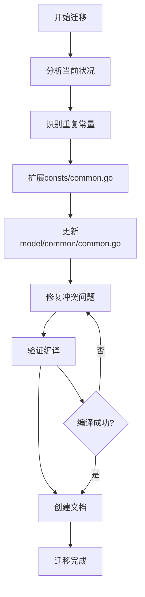
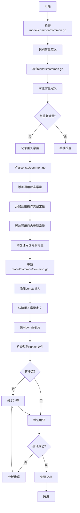
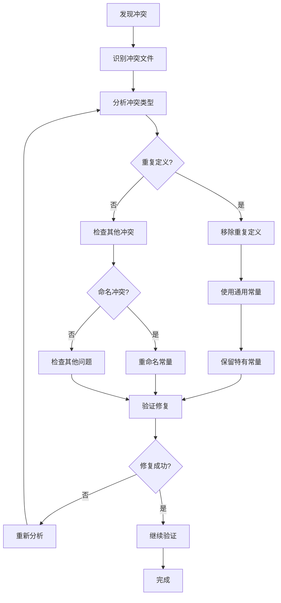
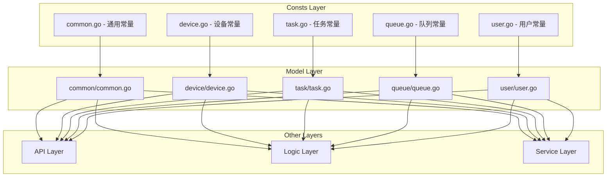
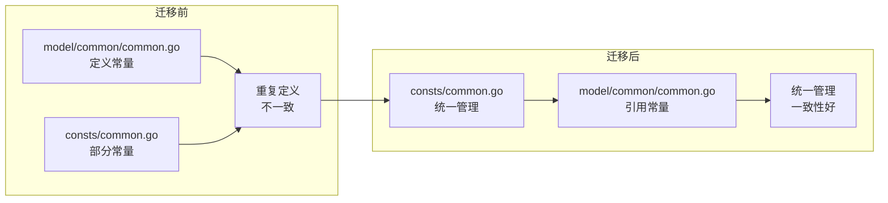
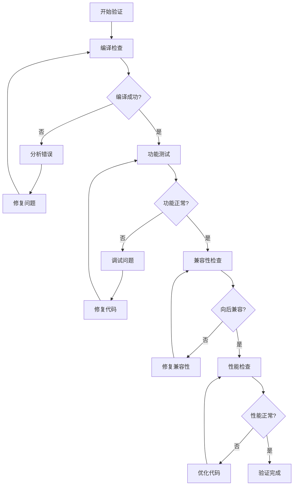
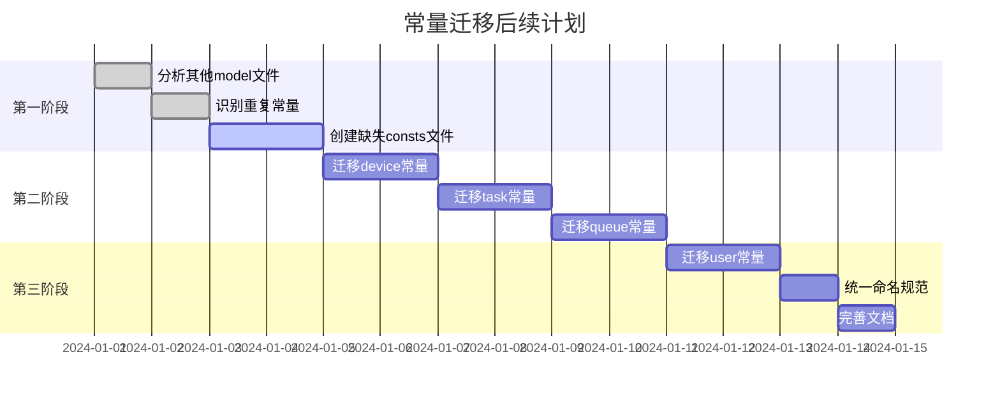

# 常量迁移流程图

## 迁移流程概览

```mermaid
flowchart TD
    A[开始迁移] --> B[分析当前状况]
    B --> C[识别重复常量]
    C --> D[扩展consts/common.go]
    D --> E[更新model/common/common.go]
    E --> F[修复冲突问题]
    F --> G[验证编译]
    G --> H[创建文档]
    H --> I[迁移完成]
    
    G --> G1{编译成功?}
    G1 -->|否| F
    G1 -->|是| H
```

## 详细迁移步骤

```mermaid
flowchart TD
    A[开始] --> B[检查model/common/common.go]
    B --> C[识别常量定义]
    C --> D[检查consts/common.go]
    D --> E[对比常量定义]
    
    E --> F{有重复常量?}
    F -->|是| G[记录重复常量]
    F -->|否| H[继续检查]
    
    G --> I[扩展consts/common.go]
    I --> J[添加通用状态常量]
    J --> K[添加通用操作类型常量]
    K --> L[添加通用日志级别常量]
    L --> M[添加通用优先级常量]
    
    M --> N[更新model/common/common.go]
    N --> O[添加consts导入]
    O --> P[移除重复常量定义]
    P --> Q[使用consts引用]
    
    Q --> R[检查其他consts文件]
    R --> S{有冲突?}
    S -->|是| T[修复冲突]
    S -->|否| U[验证编译]
    
    T --> U
    U --> V{编译成功?}
    V -->|否| W[分析错误]
    W --> T
    V -->|是| X[创建文档]
    X --> Y[完成]
```

## 冲突解决流程

```mermaid
flowchart TD
    A[发现冲突] --> B[识别冲突文件]
    B --> C[分析冲突类型]
    
    C --> D{重复定义?}
    D -->|是| E[移除重复定义]
    D -->|否| F[检查其他冲突]
    
    E --> G[使用通用常量]
    G --> H[保留特有常量]
    H --> I[验证修复]
    
    F --> J{命名冲突?}
    J -->|是| K[重命名常量]
    J -->|否| L[检查其他问题]
    
    K --> I
    L --> I
    
    I --> M{修复成功?}
    M -->|否| N[重新分析]
    M -->|是| O[继续验证]
    
    N --> C
    O --> P[完成]
```

## 常量管理架构

```mermaid
graph TB
    subgraph "Consts Layer"
        A[common.go - 通用常量]
        B[device.go - 设备常量]
        C[task.go - 任务常量]
        D[queue.go - 队列常量]
        E[user.go - 用户常量]
    end
    
    subgraph "Model Layer"
        F[common/common.go]
        G[device/device.go]
        H[task/task.go]
        I[queue/queue.go]
        J[user/user.go]
    end
    
    subgraph "Other Layers"
        K[API Layer]
        L[Logic Layer]
        M[Service Layer]
    end
    
    A --> F
    B --> G
    C --> H
    D --> I
    E --> J
    
    F --> K
    F --> L
    F --> M
    
    G --> K
    G --> L
    G --> M
    
    H --> K
    H --> L
    H --> M
    
    I --> K
    I --> L
    I --> M
    
    J --> K
    J --> L
    J --> M
```

## 迁移前后对比

```mermaid
graph LR
    subgraph "迁移前"
        A1[model/common/common.go<br/>定义常量]
        A2[consts/common.go<br/>部分常量]
        A3[重复定义<br/>不一致]
    end
    
    subgraph "迁移后"
        B1[consts/common.go<br/>统一管理]
        B2[model/common/common.go<br/>引用常量]
        B3[统一管理<br/>一致性好]
    end
    
    A1 --> A3
    A2 --> A3
    A3 --> B1
    B1 --> B2
    B2 --> B3
```

## 验证流程

```mermaid
flowchart TD
    A[开始验证] --> B[编译检查]
    B --> C{编译成功?}
    C -->|否| D[分析错误]
    D --> E[修复问题]
    E --> B
    
    C -->|是| F[功能测试]
    F --> G{功能正常?}
    G -->|否| H[调试问题]
    H --> I[修复代码]
    I --> F
    
    G -->|是| J[兼容性检查]
    J --> K{向后兼容?}
    K -->|否| L[修复兼容性]
    L --> J
    
    K -->|是| M[性能检查]
    M --> N{性能正常?}
    N -->|否| O[优化代码]
    O --> M
    
    N -->|是| P[验证完成]
```

## 后续计划

```mermaid
gantt
    title 常量迁移后续计划
    dateFormat  YYYY-MM-DD
    section 第一阶段
    分析其他model文件    :done, analysis, 2024-01-01, 1d
    识别重复常量        :done, identify, 2024-01-02, 1d
    创建缺失consts文件   :active, create, 2024-01-03, 2d
    
    section 第二阶段
    迁移device常量      :device, 2024-01-05, 2d
    迁移task常量       :task, 2024-01-07, 2d
    迁移queue常量      :queue, 2024-01-09, 2d
    
    section 第三阶段
    迁移user常量       :user, 2024-01-11, 2d
    统一命名规范       :naming, 2024-01-13, 1d
    完善文档          :docs, 2024-01-14, 1d
``` 