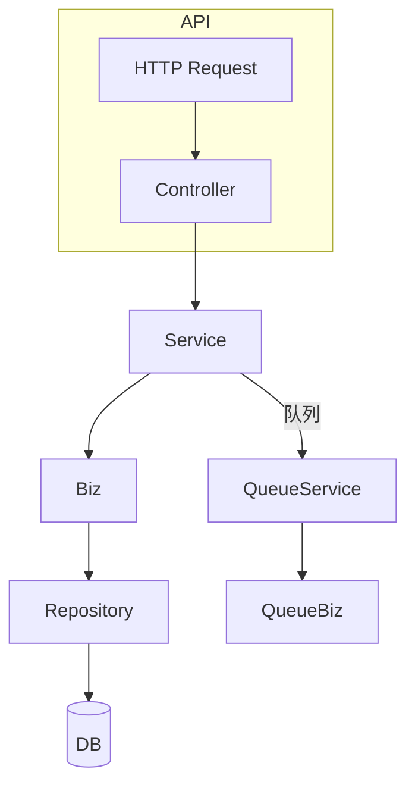

# Controller 层补全分析与实施计划

> 更新时间：{{date}}

## 1. Biz / Service 完整性检查

| 模块 | 结论 | 说明 |
|------|------|------|
| Device Biz | ✅ 完整 | 具备状态/健康度计算、校验等方法 |
| Task Biz   | ✅ 完整 | 含优先级计算、状态流转校验等方法 |
| Queue Biz  | ✅ 基础 | 排序、权重、指标计算齐备，后续可扩充持久化逻辑 |
| Device Service | ✅ 完整 | 已封装 Biz 层、实现全量接口 |
| Task Service   | ✅ 完整 | 已封装 Biz 层、实现全量接口 |
| Queue Service  | ⚠️ 基础 | 提供 Enqueue/Dequeue 等核心接口，持久化待实现 |

> 结论：后续工作集中在 **Controller 层与 Router 注入**，Biz 与 Service 基本满足需求。

## 2. 待补全 Controller 列表

| 文件 | 当前状态 | 待办 |
|------|----------|------|
| `internal/controller/device.go` | 方法占位，未注入 Service | 1) 注入 `DeviceService`；2) 完成核心 CRUD / 状态 / 心跳 / 命令等逻辑；3) 补充参数校验与错误处理 |
| `internal/controller/task.go` | 已接入 `TaskService`，Router 未注入 | 1) 新增无参构造或调整 Router；2) 完善部分返回值结构一致性 |
| `internal/controller/queue.go` | 空文件 | 1) 定义 `QueueController`；2) 注入 `QueueService`；3) 实现排队、出队、重排、指标等端点 |

## 3. 修改优点

1. **对外接口可用**：Controller 调用 Service，使 API 真正工作。
2. **职责明确**：参数解析/校验在 Controller，业务规则在 Service/Biz。
3. **统一响应**：返回统一 JSON 结构，便于前端对接。
4. **易于测试**：Service 已可单测，Controller 层测试聚焦路由与解析。

## 4. 修改清单（第一阶段）

1. internal/controller/device.go  
   - 取消注释 `deviceService` 字段，导入 Service 包  
   - 添加构造函数 `NewDeviceController(service.DeviceService)`  
   - 实现 RegisterDevice、GetDevice、GetDevices、DeviceOnline/Offline 等核心函数  
2. internal/controller/task.go  
   - 添加无参构造 `NewTaskController()` 供 Router 使用，内部创建空 Controller 或注入后续 Service  
   - 调整部分错误返回码一致性  
3. internal/controller/queue.go（新建）  
   - 定义 `QueueController` 结构体与构造  
   - 实现 EnqueueTask、DequeueTask、GetQueueMetrics 端点  
4. internal/router/router.go  
   - 注入真实 Service 实例到 Controller 构造  
   - 注册 Queue 路由 `/device-queues`  

> 第二阶段：根据持久化实现完善 Queue Service，再扩展其他高级接口。

## 5. 影响流程图

---

以上为第一阶段 Controller 补全方案，请确认后开始代码实现。 