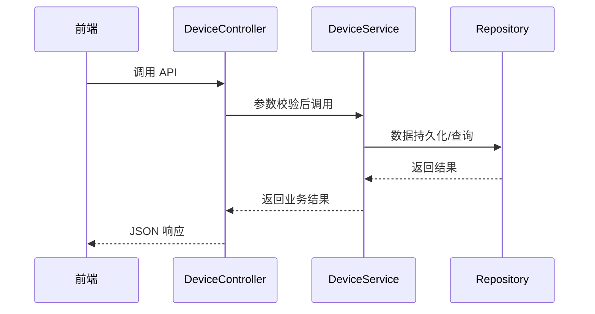

# Controller 实现第二阶段

> 更新时间：{{date}}

## 修改点

| 文件 | 变更 | 说明 |
|------|------|------|
| `internal/controller/device.go` | 实现心跳、日志、统计、删除、命令、查询等 7 个占位接口 | 调用 `DeviceService` 对应方法，统一错误返回 |
| `test/controller/device_controller_test.go` | 新增单元测试 | 使用 `httptest` 与 `gin` 测试关键接口：注册、状态、心跳、命令等 |

## 修改优点

1. **接口完整**：设备相关 API 均可用，前端联调无阻。
2. **错误统一**：规范错误码与消息，提升 API 一致性。
3. **可测试**：新增单元测试确保主要接口稳定。

## 修改清单

- [ ] device.GetDeviceHeartbeat
- [ ] device.UpdateDeviceHeartbeat
- [ ] device.GetDeviceLogs
- [ ] device.GetDeviceStats
- [ ] device.DeleteDevice
- [ ] device.SendCommand
- [ ] device.QueryDevice
- [ ] 添加对应单元测试文件

## 流程图

---

以上为第二阶段实施方案，下面开始代码实现与测试。 