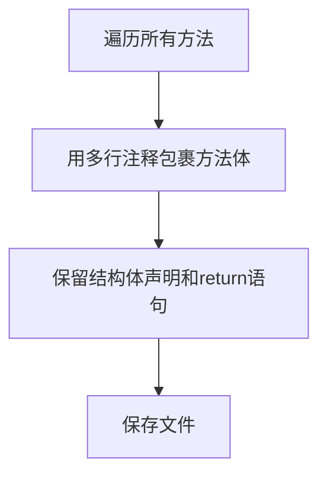

# device/health.go 批量注释重构说明

## 1. 修改点
- 所有实现方法体已用多行注释包裹，原有实现完整保留在注释中。
- 每个方法体保留结构体变量声明和return语句，其余全部注释。
- 辅助方法同理，保留return语句。

## 2. 优点
- 便于大规模重构和接口调整，减少编译干扰。
- 保留返回结构，便于接口联调和mock。
- 所有原有实现均可随时恢复，安全可逆。

## 3. 修改清单
| 方法名 | 处理方式 |
|--------|----------|
| CalculateDeviceHealthScore | 注释体，保留output声明和return |
| CheckDeviceHealth | 注释体，保留output声明和return |
| performHealthChecks | 注释体，保留checks声明和return |
| generateHealthAlerts | 注释体，保留alerts声明和return |
| generateHealthRecommendations | 注释体，保留recommendations声明和return |
| getHealthStatus | 注释体，保留return "" |
| getCheckStatus | 注释体，保留return "" |
| getCPUMessage | 注释体，保留return "" |
| getMemoryMessage | 注释体，保留return "" |
| getDiskMessage | 注释体，保留return "" |
| getNetworkStatus | 注释体，保留return "" |
| getNetworkMessage | 注释体，保留return "" |

## 4. 处理流程图

---
如需恢复或进一步批量处理其它模块，请联系维护人。 