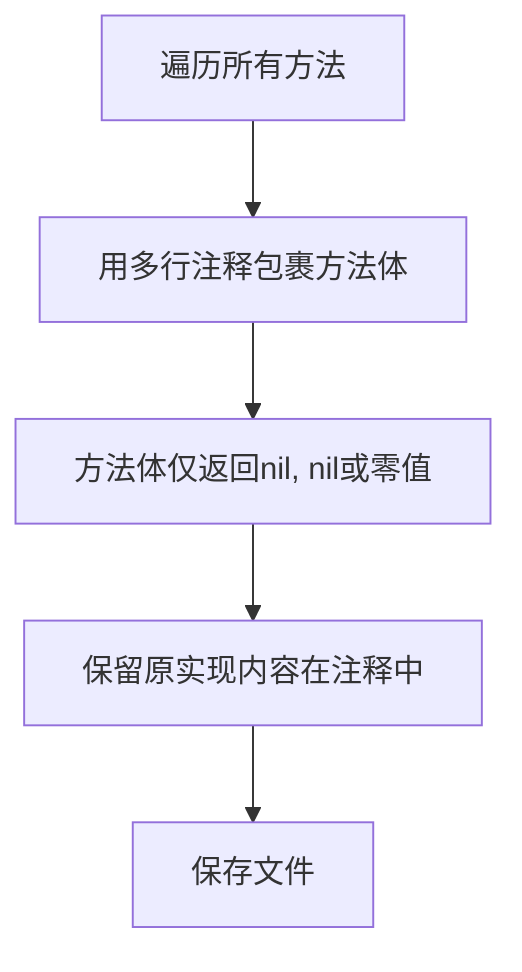

# device/basic.go 批量注释重构说明

## 1. 修改点
- 所有实现方法体已用多行注释包裹，原有实现完整保留在注释中。
- 每个方法体仅返回nil, nil或类型零值。
- 辅助方法也一并处理，返回零值。

## 2. 优点
- 便于大规模重构和接口调整，减少编译干扰。
- 所有原有实现均可随时恢复，安全可逆。
- 结构清晰，便于团队协作和后续逐步恢复。

## 3. 修改清单
| 方法名 | 处理方式 |
|--------|----------|
| HandleDeviceRegistration | 注释体，返回nil,nil |
| HandleDeviceHeartbeat | 注释体，返回nil,nil |
| HandleDeviceDeactivation | 注释体，返回nil,nil |
| CalculateTaskAssignmentScore | 注释体，返回nil,nil |
| calculateDeviceLoadScore | 注释体，返回0 |
| calculateCapabilityMatchScore | 注释体，返回0 |
| calculateAvailabilityScore | 注释体，返回0 |
| calculatePerformanceScore | 注释体，返回0 |
| isTypeCompatible | 注释体，返回false |
| checkResourceCompatibility | 注释体，返回false |
| generateDeviceId | 注释体，返回空字符串 |
| getStringValue | 注释体，返回空字符串 |
| getIntValue | 注释体，返回0 |
| getFloatValue | 注释体，返回0 |

## 4. 处理流程图

---
如需恢复或进一步批量处理其它模块，请联系维护人。 