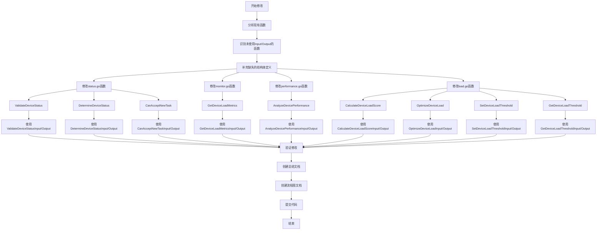
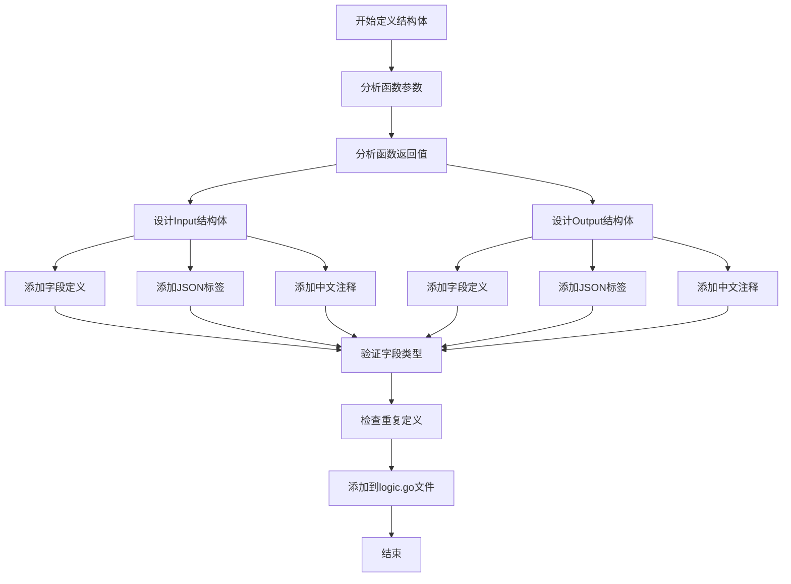
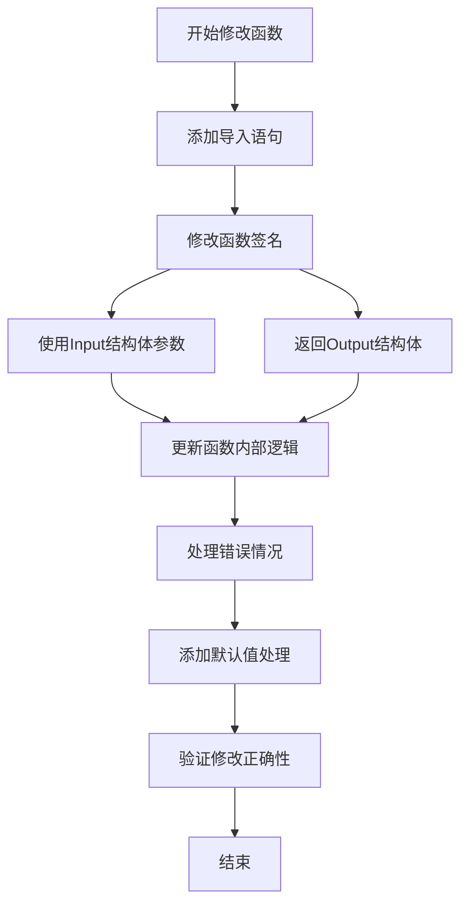
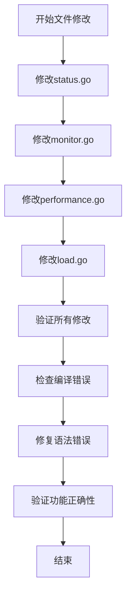
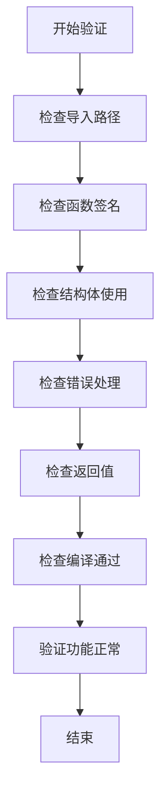

# 设备Logic层Input/Output结构体完善流程图

## 修改流程图



## 结构体定义流程图



## 函数修改流程图



## 文件修改流程图



## 验证流程图



## 修改前后对比

### 修改前
```go
func (s *sDevice) ValidateDeviceStatus(ctx context.Context, currentStatus, targetStatus string) error
func (s *sDevice) GetDeviceLoadMetrics(ctx context.Context, deviceId, period string) (map[string]interface{}, error)
func (s *sDevice) AnalyzeDevicePerformance(ctx context.Context, performanceData []map[string]interface{}) map[string]interface{}
```

### 修改后
```go
func (s *sDevice) ValidateDeviceStatus(ctx context.Context, input *deviceModel.ValidateDeviceStatusInput) (*deviceModel.ValidateDeviceStatusOutput, error)
func (s *sDevice) GetDeviceLoadMetrics(ctx context.Context, input *deviceModel.GetDeviceLoadMetricsInput) (*deviceModel.GetDeviceLoadMetricsOutput, error)
func (s *sDevice) AnalyzeDevicePerformance(ctx context.Context, input *deviceModel.AnalyzeDevicePerformanceInput) (*deviceModel.AnalyzeDevicePerformanceOutput, error)
```

## 关键节点说明

### 1. 结构体定义节点
- 确保所有字段都有明确的类型定义
- 添加完整的JSON标签
- 提供详细的中文注释

### 2. 函数修改节点
- 统一使用Input/Output结构体
- 保持函数逻辑不变
- 优化错误处理

### 3. 验证节点
- 检查编译是否通过
- 验证功能是否正常
- 确保向后兼容性

## 风险控制

### 1. 编译错误风险
- 逐步修改，及时验证
- 修复导入路径问题
- 检查语法正确性

### 2. 功能错误风险
- 保持原有逻辑不变
- 充分测试验证
- 提供回滚方案

### 3. 兼容性风险
- 确保API接口兼容
- 更新相关文档
- 通知相关团队 