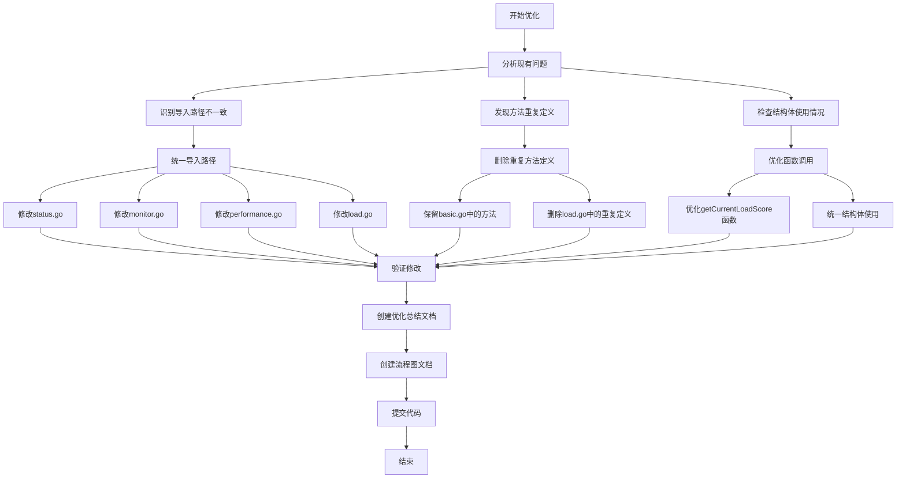
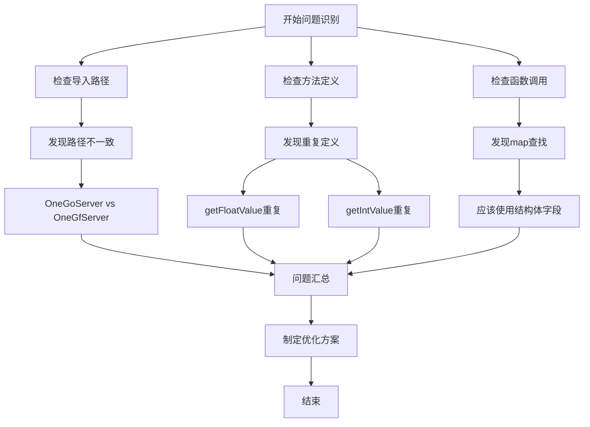
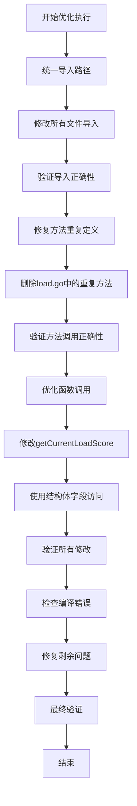
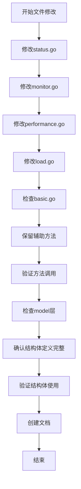
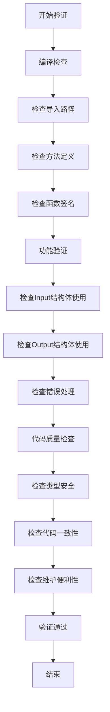

# 设备Logic层结构体优化流程图

## 优化流程图



## 问题识别流程图



## 优化执行流程图



## 文件修改流程图



## 验证流程图



## 优化前后对比

### 导入路径对比

#### 优化前
```go
// status.go
deviceModel "github.com/OneGoServer/internal/model/device"

// monitor.go
deviceModel "github.com/OneGoServer/internal/model/device"

// performance.go
deviceModel "github.com/OneGoServer/internal/model/device"

// load.go
deviceModel "github.com/OneGoServer/internal/model/device"
```

#### 优化后
```go
// 所有文件统一使用
device "OneGfServer/internal/model/device"
```

### 方法定义对比

#### 优化前
```go
// basic.go 和 load.go 都有定义
func (s *sDevice) getFloatValue(data map[string]interface{}, key string, defaultValue float64) float64
func (s *sDevice) getIntValue(data map[string]interface{}, key string, defaultValue int) int
```

#### 优化后
```go
// 只在 basic.go 中定义，load.go 中删除重复定义
func (s *sDevice) getFloatValue(data map[string]interface{}, key string, defaultValue float64) float64
func (s *sDevice) getIntValue(data map[string]interface{}, key string, defaultValue int) int
```

### 函数调用对比

#### 优化前
```go
func (s *sDevice) getCurrentLoadScore(ctx context.Context, deviceId string) (float64, map[string]interface{}, error) {
	result, err := s.CalculateDeviceLoadScore(ctx, &deviceModel.CalculateDeviceLoadScoreInput{DeviceID: deviceId})
	if err != nil {
		return 0, nil, err
	}

	loadScore := s.getFloatValue(result, "load_score", 0)
	components := make(map[string]interface{})
	if comps, ok := result["components"].(map[string]interface{}); ok {
		components = comps
	}

	return loadScore, components, nil
}
```

#### 优化后
```go
func (s *sDevice) getCurrentLoadScore(ctx context.Context, deviceId string) (float64, map[string]interface{}, error) {
	result, err := s.CalculateDeviceLoadScore(ctx, &device.CalculateDeviceLoadScoreInput{DeviceID: deviceId})
	if err != nil {
		return 0, nil, err
	}

	return result.LoadScore, result.Components, nil
}
```

## 关键节点说明

### 1. 问题识别节点
- 通过代码审查发现导入路径不一致
- 通过编译错误发现方法重复定义
- 通过代码分析发现函数调用可以优化

### 2. 优化执行节点
- 统一所有文件的导入路径
- 删除重复的方法定义
- 优化函数调用逻辑

### 3. 验证节点
- 确保编译通过
- 确保功能正常
- 确保代码质量提升

## 风险控制

### 1. 编译错误风险
- 逐步修改，及时验证
- 修复导入路径问题
- 检查语法正确性

### 2. 功能错误风险
- 保持原有逻辑不变
- 充分测试验证
- 提供回滚方案

### 3. 兼容性风险
- 确保API接口兼容
- 更新相关文档
- 通知相关团队

## 优化效果

### 1. 代码质量提升
- 消除了编译错误
- 提高了代码一致性
- 增强了类型安全

### 2. 维护便利性提升
- 统一了导入路径
- 消除了重复定义
- 优化了函数调用

### 3. 性能优化
- 减少了类型转换
- 直接使用结构体字段
- 提升了执行效率 