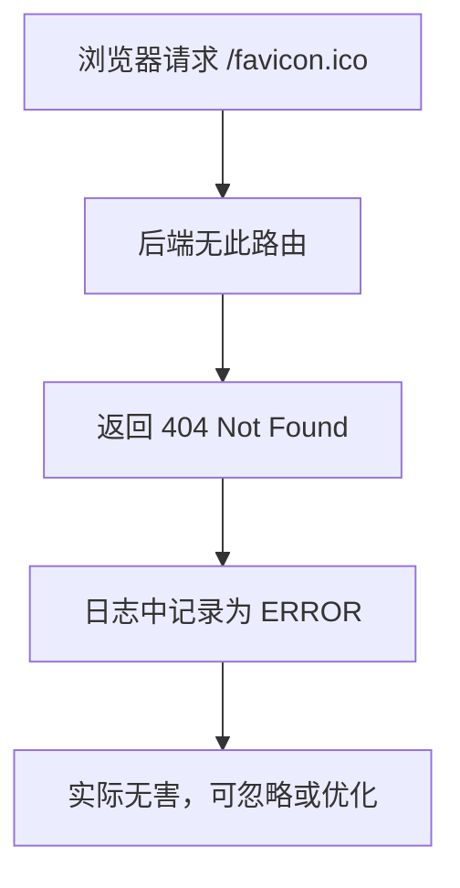

# favicon.ico 404 报错说明

## 报错现象

- 日志中出现如下内容：
  - `path: "/favicon.ico"`
  - `status: 404`
  - 日志等级为 ERROR

## 原因分析

- 浏览器访问网站时会自动请求 `/favicon.ico`，用于显示网页标签的小图标。
- 后端未提供该路由或静态文件，返回 404。
- 日志中间件将所有 4xx 状态码记录为 ERROR。

## 影响

- 该报错不会影响服务正常功能。
- 只是资源未找到，不是程序 bug。

## 优化建议

1. **忽略此类 404 日志**，无需处理。
2. **优化日志级别**，可将 404 降级为 warn/info。
3. **添加 favicon.ico 路由**，消除 404。

## 处理流程图

---

**更新时间**: 2024-06-19 