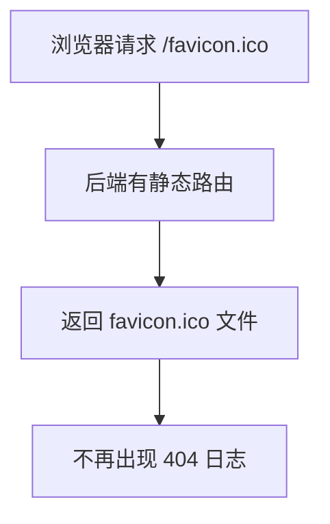

# favicon.ico 支持实现说明

## 需求背景

- 浏览器访问网站时会自动请求 `/favicon.ico`，用于显示网页标签的小图标。
- 若后端无此资源，会产生 404 日志。

## 实现步骤

1. 在项目根目录添加 `favicon.ico` 文件。
2. 在 Gin 路由注册时，增加如下代码：
   ```go
   engine.StaticFile("/favicon.ico", "favicon.ico")
   ```
   这样浏览器请求 `/favicon.ico` 时会直接返回根目录下的 favicon.ico 文件。

## 效果

- 浏览器标签页可正常显示网站图标。
- 日志中不再出现 `/favicon.ico` 404 错误。

## 变更流程图



---

**更新时间**: 2024-06-19 