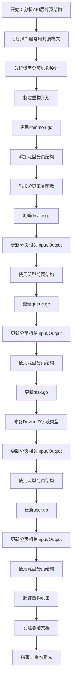
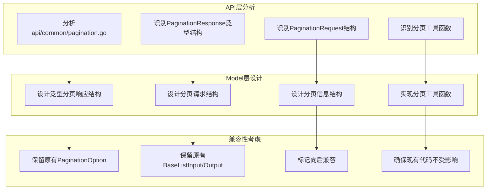
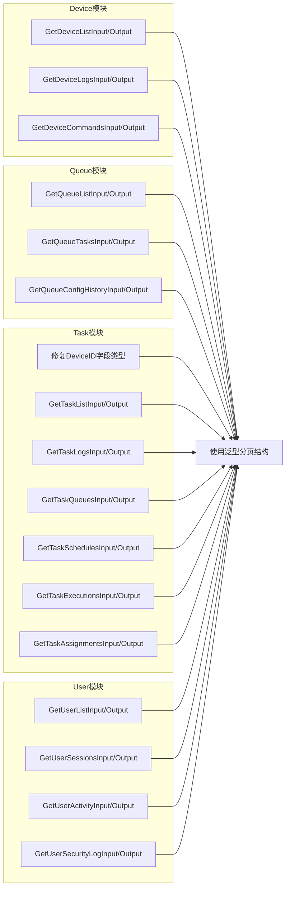
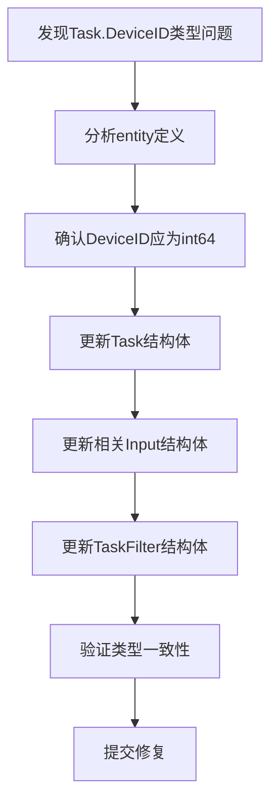
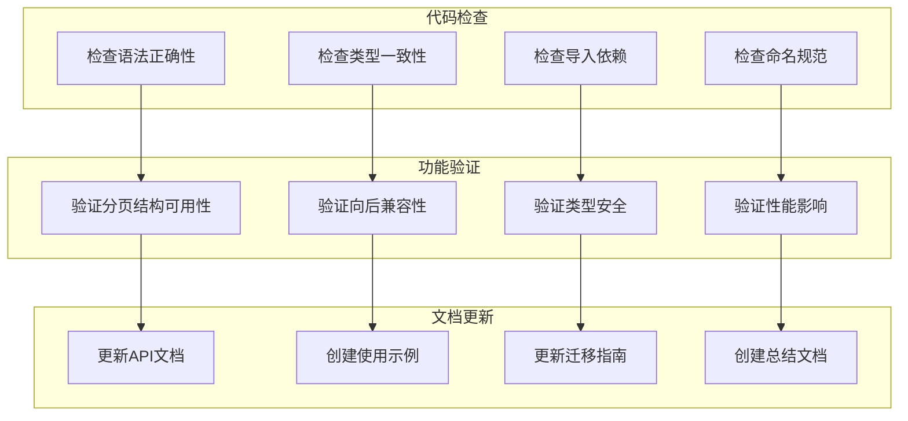
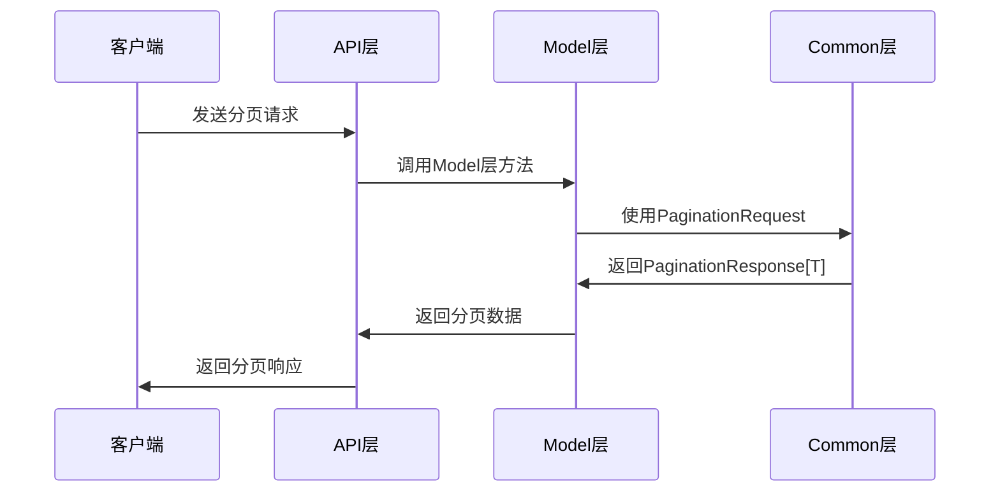
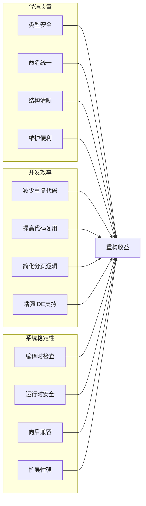

# Internal/Model层重构流程图

## 重构流程概览



## 分页结构设计流程



## 模块更新流程



## 类型修复流程



## 重构验证流程



## 分页结构对比

```mermaid
graph TB
    subgraph "重构前"
        O1[PaginationOption]
        O2[BaseListOutput]
        O3[手动分页计算]
        O4[类型不安全]
    end
    
    subgraph "重构后"
        N1[PaginationResponse[T]]
        N2[PaginationRequest]
        N3[分页工具函数]
        N4[类型安全泛型]
    end
    
    O1 -.->|替换| N1
    O2 -.->|增强| N2
    O3 -.->|优化| N3
    O4 -.->|改进| N4
```

## 使用示例流程



## 重构收益分析

