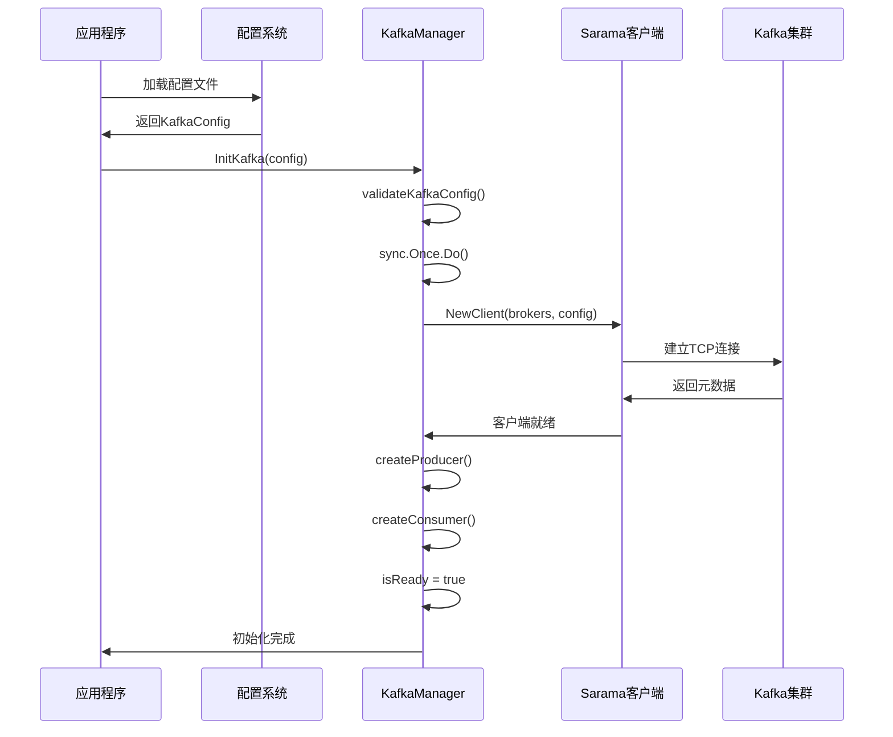

# OneGoServer002 Kafka模块架构分析与运行流程

## 📋 文档概述

本文档详细分析OneGoServer002项目中Kafka模块的整体架构设计、运行逻辑和流程，涵盖从初始化到资源清理的完整生命周期。

## 🏗️ 系统架构设计

### 核心组件架构

```
┌─────────────────────────────────────────────────────────────┐
│                    Kafka模块架构图                           │
├─────────────────────────────────────────────────────────────┤
│  应用层 API                                                 │
│  ┌─────────────┬─────────────┬─────────────┬─────────────┐   │
│  │SendMessage  │ConsumeMsg   │GetTopics    │GetStats     │   │
│  └─────────────┴─────────────┴─────────────┴─────────────┘   │
├─────────────────────────────────────────────────────────────┤
│  管理层                                                     │
│  ┌─────────────────────────────────────────────────────────┐ │
│  │              KafkaManager                               │ │
│  │  ┌─────────────┬─────────────┬─────────────────────────┐ │ │
│  │  │   Config    │   Stats     │      连接状态管理        │ │ │
│  │  └─────────────┴─────────────┴─────────────────────────┘ │ │
│  └─────────────────────────────────────────────────────────┘ │
├─────────────────────────────────────────────────────────────┤
│  连接层                                                     │
│  ┌─────────────┬─────────────┬─────────────┬─────────────┐   │
│  │   Client    │  Producer   │  Consumer   │   Admin     │   │
│  └─────────────┴─────────────┴─────────────┴─────────────┘   │
├─────────────────────────────────────────────────────────────┤
│  传输层 (Sarama)                                            │
│  ┌─────────────────────────────────────────────────────────┐ │
│  │    网络协议    │    认证/TLS    │     序列化/压缩        │ │
│  └─────────────────────────────────────────────────────────┘ │
└─────────────────────────────────────────────────────────────┘
```

### 设计模式

1. **单例模式**: 全局KafkaManager实例，确保资源统一管理
2. **工厂模式**: 统一的初始化接口，支持不同配置
3. **观察者模式**: 消息处理器回调机制
4. **策略模式**: 多种认证和序列化策略

## 🔄 完整运行流程

### 1. 启动阶段



### 2. 配置验证流程

```go
func validateKafkaConfig(cfg *config.KafkaConfig) error {
    // 1. 基础参数验证
    if cfg == nil { return errors.New("kafka config cannot be nil") }
    if len(cfg.Brokers) == 0 { return errors.New("brokers required") }
    if cfg.ClientID == "" { return errors.New("client id required") }
    
    // 2. 版本验证
    if _, err := sarama.ParseKafkaVersion(cfg.Version); err != nil {
        return fmt.Errorf("invalid kafka version: %w", err)
    }
    
    // 3. 默认值设置
    setDefaultValues(cfg)
    
    return nil
}
```

**验证项目清单**:
- ✅ Brokers列表非空
- ✅ ClientID必填
- ✅ Kafka版本格式正确
- ✅ 认证参数完整性
- ✅ 生产者/消费者参数合理性

### 3. 连接建立流程

```go
func (km *KafkaManager) connect() error {
    // 步骤1: 创建Sarama配置
    saramaConfig := sarama.NewConfig()
    saramaConfig.Version = parsedVersion
    saramaConfig.ClientID = km.config.ClientID
    
    // 步骤2: 配置认证
    if km.config.EnableSASL {
        setupSASLAuth(saramaConfig, km.config)
    }
    if km.config.EnableTLS {
        setupTLSConfig(saramaConfig, km.config)
    }
    
    // 步骤3: 按顺序创建组件
    client := sarama.NewClient(brokers, saramaConfig)
    producer := sarama.NewSyncProducerFromClient(client)
    consumer := sarama.NewConsumerFromClient(client)
    
    // 步骤4: 原子性设置状态
    km.mu.Lock()
    km.client, km.producer, km.consumer = client, producer, consumer
    km.isReady = true
    km.lastPing = time.Now()
    km.mu.Unlock()
    
    return nil
}
```

### 4. 重试机制设计

```go
func InitKafkaWithRetry(ctx context.Context, cfg *config.KafkaConfig, 
                       maxRetries int, retryInterval time.Duration) error {
    
    for attempt := 1; attempt <= maxRetries; attempt++ {
        // 重置sync.Once以允许重试
        once = sync.Once{}
        
        if err := InitKafka(ctx, cfg); err != nil {
            if attempt == maxRetries {
                return fmt.Errorf("failed after %d attempts: %w", maxRetries, err)
            }
            
            // 等待重试间隔
            select {
            case <-ctx.Done():
                return ctx.Err()
            case <-time.After(retryInterval):
                continue
            }
        }
        return nil // 成功
    }
}
```

**重试策略特点**:
- 🔄 指数退避: 可配置重试间隔
- ⏰ Context感知: 支持超时和取消
- 📊 失败记录: 详细的重试日志
- 🛡️ 状态重置: 安全的重试状态管理

## 📤 生产者操作流程

### 消息发送完整流程

```go
func SendMessage(ctx context.Context, message *KafkaMessage) error {
    // 1. 前置检查
    if !IsReady() { return errors.New("kafka not ready") }
    
    // 2. 消息序列化
    valueBytes := serializeMessage(message.Value)
    
    // 3. 构建Sarama消息
    producerMessage := &sarama.ProducerMessage{
        Topic: message.Topic,
        Value: sarama.ByteEncoder(valueBytes),
        Key:   sarama.StringEncoder(message.Key),
        Headers: convertHeaders(message.Headers),
    }
    
    // 4. 发送操作
    startTime := time.Now()
    partition, offset, err := producer.SendMessage(producerMessage)
    duration := time.Since(startTime)
    
    // 5. 统计更新
    updateProducerStats(err, len(valueBytes))
    
    // 6. 日志记录
    logOperation("send_message", message.Topic, duration, err)
    
    // 7. 返回结果
    if err == nil {
        message.Partition = partition
        message.Offset = offset
        message.Timestamp = time.Now()
    }
    
    return err
}
```

### 支持的消息类型

| 类型 | 处理方式 | 示例 |
|------|----------|------|
| `string` | 直接转换为字节 | `"Hello Kafka"` |
| `[]byte` | 直接使用 | `[]byte{0x01, 0x02}` |
| `struct/map` | JSON序列化 | `User{Name: "张三"}` |
| `interface{}` | 自动识别类型 | 任意类型 |

## 📥 消费者操作流程

### 消息消费循环

```go
func ConsumeMessages(ctx context.Context, topic string, partition int32, 
                    offset int64, handler MessageHandler) error {
    
    // 1. 创建分区消费者
    partitionConsumer, err := consumer.ConsumePartition(topic, partition, offset)
    if err != nil { return err }
    defer partitionConsumer.Close()
    
    // 2. 消息处理循环
    for {
        select {
        case <-ctx.Done():
            return ctx.Err()
            
        case message := <-partitionConsumer.Messages():
            // 3. 消息转换
            kafkaMsg := convertMessage(message)
            
            // 4. 业务处理
            startTime := time.Now()
            err := handler(ctx, kafkaMsg)
            duration := time.Since(startTime)
            
            // 5. 统计和日志
            updateConsumerStats(err, len(message.Value))
            logProcessing(topic, kafkaMsg.Key, duration, err)
            
        case err := <-partitionConsumer.Errors():
            if err != nil {
                logError("consumer error", err)
                return err
            }
        }
    }
}
```

### 消息处理器设计

```go
type MessageHandler func(ctx context.Context, message *KafkaMessage) error

// 示例: JSON消息处理器
func JSONMessageHandler(ctx context.Context, msg *KafkaMessage) error {
    var data map[string]interface{}
    if err := json.Unmarshal(msg.Value.([]byte), &data); err != nil {
        return fmt.Errorf("json解析失败: %w", err)
    }
    
    // 业务逻辑处理
    return processBusinessLogic(ctx, data)
}
```

## 🗂️ 主题和分区管理

### 主题管理操作

```go
// 获取所有主题
func GetTopics(ctx context.Context) ([]string, error) {
    if !IsReady() { return nil, errors.New("kafka not ready") }
    
    topics, err := kafkaManager.client.Topics()
    if err != nil {
        return nil, fmt.Errorf("获取主题列表失败: %w", err)
    }
    
    return topics, nil
}

// 获取主题分区信息
func GetPartitions(ctx context.Context, topic string) ([]int32, error) {
    if !IsReady() { return nil, errors.New("kafka not ready") }
    
    partitions, err := kafkaManager.client.Partitions(topic)
    if err != nil {
        return nil, fmt.Errorf("获取主题 %s 分区失败: %w", topic, err)
    }
    
    return partitions, nil
}
```

## 📊 监控统计系统

### 统计信息结构

```go
type KafkaStats struct {
    ProducerStats ProducerStats `json:"producer_stats"`
    ConsumerStats ConsumerStats `json:"consumer_stats"`
    IsConnected   bool          `json:"is_connected"`
    LastPing      time.Time     `json:"last_ping"`
}

type ProducerStats struct {
    MessagesSent      int64 `json:"messages_sent"`      // 发送总数
    MessagesSucceeded int64 `json:"messages_succeeded"` // 成功数量
    MessagesFailed    int64 `json:"messages_failed"`    // 失败数量
    BytesSent         int64 `json:"bytes_sent"`         // 发送字节数
}

type ConsumerStats struct {
    MessagesReceived  int64 `json:"messages_received"`  // 接收总数
    MessagesProcessed int64 `json:"messages_processed"` // 处理成功数
    MessagesFailed    int64 `json:"messages_failed"`    // 处理失败数
    BytesReceived     int64 `json:"bytes_received"`     // 接收字节数
}
```

### 健康检查机制

```go
func Ping(ctx context.Context) error {
    if !IsReady() { return errors.New("kafka not ready") }
    
    // 检查客户端状态
    if kafkaManager.client.Closed() {
        return errors.New("kafka client is closed")
    }
    
    // 检查活跃broker
    brokers := kafkaManager.client.Brokers()
    if len(brokers) == 0 {
        return errors.New("no active kafka brokers")
    }
    
    // 更新最后ping时间
    kafkaManager.mu.Lock()
    kafkaManager.lastPing = time.Now()
    kafkaManager.mu.Unlock()
    
    return nil
}
```

## 🔒 并发安全设计

### 锁机制设计

```go
type KafkaManager struct {
    config   *config.KafkaConfig
    producer sarama.SyncProducer
    consumer sarama.Consumer
    client   sarama.Client
    mu       sync.RWMutex  // 读写锁
    isReady  bool          // 就绪状态
    stats    KafkaStats    // 统计信息
    lastPing time.Time     // 最后ping时间
}

// 读操作使用读锁 (允许并发读)
func IsReady() bool {
    kafkaManager.mu.RLock()
    defer kafkaManager.mu.RUnlock()
    return kafkaManager.isReady
}

// 写操作使用写锁 (独占访问)
func updateStats() {
    kafkaManager.mu.Lock()
    defer kafkaManager.mu.Unlock()
    kafkaManager.stats.ProducerStats.MessagesSent++
}
```

### 线程安全保证

1. **状态访问**: 所有状态读写都通过锁保护
2. **统计更新**: 原子性的计数器更新
3. **连接管理**: 安全的连接创建和销毁
4. **资源清理**: 有序的资源释放

## 🛡️ 错误处理策略

### 多层错误处理

```go
// 1. 配置层错误
func validateConfig() error {
    if cfg.Brokers == nil {
        return errors.New("配置错误: brokers不能为空")
    }
}

// 2. 连接层错误
func connect() error {
    if client, err := sarama.NewClient(); err != nil {
        return fmt.Errorf("连接失败: %w", err)
    }
}

// 3. 操作层错误
func SendMessage() error {
    if partition, offset, err := producer.SendMessage(); err != nil {
        return fmt.Errorf("发送失败: %w", err)
    }
}

// 4. 业务层错误
func handler(msg *KafkaMessage) error {
    if err := processMessage(msg); err != nil {
        return fmt.Errorf("处理失败: %w", err)
    }
}
```

### 错误分类和处理

| 错误类型 | 处理策略 | 示例 |
|----------|----------|------|
| 配置错误 | 立即返回，不重试 | 无效的broker地址 |
| 连接错误 | 重试机制 | 网络超时 |
| 认证错误 | 记录日志，返回错误 | SASL认证失败 |
| 业务错误 | 用户处理 | 消息格式错误 |

## 🧹 资源管理

### 清理顺序和原则

```go
func CloseKafka() error {
    if kafkaManager == nil { return nil }
    
    kafkaManager.mu.Lock()
    defer kafkaManager.mu.Unlock()
    
    var errors []error
    
    // 1. 先关闭生产者 (停止发送)
    if km.producer != nil {
        if err := km.producer.Close(); err != nil {
            errors = append(errors, err)
        }
        km.producer = nil
    }
    
    // 2. 再关闭消费者 (停止接收)
    if km.consumer != nil {
        if err := km.consumer.Close(); err != nil {
            errors = append(errors, err)
        }
        km.consumer = nil
    }
    
    // 3. 最后关闭客户端 (断开连接)
    if km.client != nil {
        if err := km.client.Close(); err != nil {
            errors = append(errors, err)
        }
        km.client = nil
    }
    
    // 4. 重置状态
    km.isReady = false
    
    return combineErrors(errors)
}
```

### 资源管理最佳实践

- ✅ **顺序清理**: Producer → Consumer → Client
- ✅ **错误收集**: 收集所有清理错误，统一返回
- ✅ **状态重置**: 确保后续操作安全
- ✅ **防御编程**: 处理nil指针情况

## 🎯 性能优化策略

### 1. 连接池管理
- 单例模式避免重复连接
- 复用底层TCP连接
- 合理的超时配置

### 2. 批量操作
```go
func SendMessages(ctx context.Context, messages []*KafkaMessage) error {
    // 批量发送减少网络往返
    for _, msg := range messages {
        if err := SendMessage(ctx, msg); err != nil {
            return err
        }
    }
}
```

### 3. 异步处理
- 生产者异步发送选项
- 消费者独立goroutine处理
- Context控制超时和取消

### 4. 内存优化
- 及时释放大消息内存
- 统计信息适度收集
- 避免内存泄露

## 📈 扩展性设计

### 支持的扩展点

1. **消息序列化**: 可插拔的序列化器
2. **认证方式**: 多种SASL机制
3. **消息路由**: 自定义分区策略
4. **监控集成**: 可扩展的统计接口

### 配置扩展

```go
type KafkaConfig struct {
    // 基础配置
    Brokers   []string
    ClientID  string
    Version   string
    
    // 认证配置
    EnableSASL    bool
    SASLMechanism string
    Username      string
    Password      string
    EnableTLS     bool
    
    // 生产者配置
    ProducerReturnSuccesses bool
    ProducerReturnErrors    bool
    ProducerRequiredAcks    int
    ProducerRetryMax        int
    ProducerMaxMessageBytes int
    
    // 消费者配置
    ConsumerGroupID           string
    ConsumerOffsetInitial     string
    ConsumerSessionTimeout    int
    ConsumerHeartbeatInterval int
}
```

## 🔍 故障诊断指南

### 常见问题和解决方案

1. **连接超时**
   ```
   症状: dial tcp: lookup kafka: no such host
   原因: DNS解析失败或网络不通
   解决: 检查broker地址、网络连接、DNS配置
   ```

2. **认证失败**
   ```
   症状: SASL authentication failed
   原因: 用户名密码错误或机制不匹配
   解决: 验证认证信息、检查SASL机制配置
   ```

3. **消息发送失败**
   ```
   症状: kafka: Failed to send message
   原因: 主题不存在、权限不足、消息过大
   解决: 检查主题配置、权限设置、消息大小限制
   ```

### 调试工具

```go
// 1. 健康检查
err := Ping(ctx)

// 2. 获取统计信息
stats, _ := GetKafkaStats(ctx)

// 3. 获取主题列表
topics, _ := GetTopics(ctx)

// 4. 检查连接状态
isReady := IsReady()
```

## 📝 总结

OneGoServer002的Kafka模块采用了企业级的设计架构，具备以下核心特性：

### 🌟 主要优势

1. **高可靠性**: 完整的错误处理、重试机制、资源管理
2. **高性能**: 基于Sarama高性能客户端，支持异步和批量操作
3. **易用性**: 简洁统一的API设计，自动序列化支持
4. **可观测性**: 详细的操作日志、统计信息、健康检查
5. **安全性**: 多种认证方式、TLS加密、并发安全
6. **扩展性**: 可配置的参数、可插拔的组件设计

### 🎯 应用场景

- **消息队列**: 异步任务处理、事件驱动架构
- **数据流**: 实时数据传输、ETL管道
- **微服务通信**: 服务间解耦通信
- **日志聚合**: 分布式日志收集和处理
- **事件溯源**: 事件存储和重放

这个设计为OneGoServer002项目提供了稳定、高效、可扩展的消息队列解决方案。

---

**文档版本**: v1.0  
**创建时间**: 2024年12月  
**维护者**: OneGoServer开发团队 