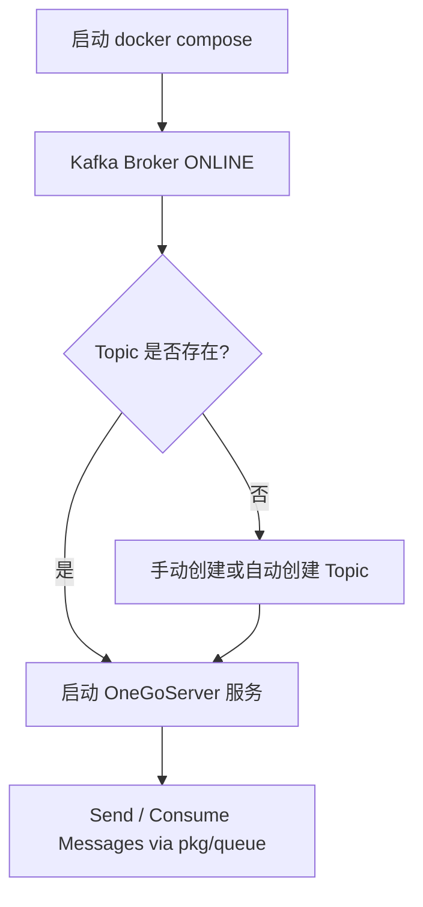

# Kafka 启动与 `device-task-dispatch` Topic 创建指南

> 本文档说明如何在本地开发环境中快速启动 Kafka Broker，并确保创建 `device-task-dispatch` 主题（Topic）。

## 1. 启动 Kafka Broker

1. 确保已安装 Docker 和 Docker Compose。
2. 在项目根目录执行下列命令启动 Kafka（KRaft 单节点模式）与管理界面 Kafka-UI：

```bash
# 后台启动
docker compose -f docker-compose.kafka-ui-final.yml up -d

# 查看启动日志（可选）
docker compose logs -f kafka
```

启动完成后：
- Broker 监听 `PLAINTEXT://kafka:9092`（容器网络）和 `EXTERNAL://localhost:9094`（宿主机）。
- Kafka-UI 监听 <http://localhost:8081>。

## 2. 检查 Broker 状态

### 2.1 使用 Kafka-UI
在浏览器打开 <http://localhost:8081>，若看到集群 `onego-kafka` 状态为 **ONLINE** 即表示 Broker 正常。

### 2.2 使用命令行 (kafka-topics)

```bash
# 进入 Kafka 容器
docker exec -it kafka bash

# 查看集群中的 Topic 列表
kafka-topics.sh --bootstrap-server localhost:9092 --list
```

若命令返回 Topic 列表，说明 Broker 正常工作。

## 3. 创建 `device-task-dispatch` Topic

docker-compose 配置已开启 `KAFKA_CFG_AUTO_CREATE_TOPICS_ENABLE: "true"`，因此 **第一次写入消息时会自动创建** Topic。

若需手动创建，执行：

```bash
kafka-topics.sh \
  --bootstrap-server localhost:9092 \
  --create \
  --topic device-task-dispatch \
  --partitions 1 \
  --replication-factor 1
```

验证：

```bash
kafka-topics.sh --bootstrap-server localhost:9092 --describe --topic device-task-dispatch
```

## 4. 在 `config.yaml` 中配置

```yaml
kafka:
  brokers: ["localhost:9094"]   # 对应 EXTERNAL 监听
  client_id: onego-server
  version: "4.0.0"              # 与镜像版本保持一致
  producer_return_successes: true
  producer_return_errors: true
```

> 详见 `internal/config/config.go` 中 `KafkaConfig` 结构体字段说明。

## 5. 代码侧初始化流程

项目在启动时会执行：

1. 读取配置 (`internal/config.LoadConfig`) 并校验。
2. 调用 `pkg/queue.InitKafkaWithRetry` 建立连接并存入全局 `kafkaManager`。
3. 业务代码通过 `pkg/queue.SendMessage` / `ConsumeMessages` 进行生产、消费。

## 6. 整体流程图 (Mermaid)



---

如有任何问题，可参阅 Kafka-UI 日志或 `docker compose logs` 进行排查。 