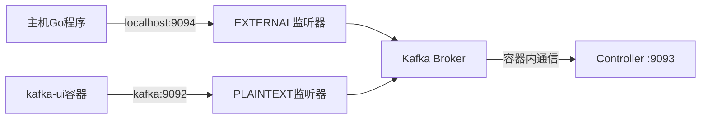

# Kafka-UI连接问题完整解决方案

## 问题描述

用户报告kafka-ui存在连接问题，出现以下错误：
```bash
Connection to node 1 (localhost/127.0.0.1:9092) could not be established. Broker may not be available.
```

## 问题根本原因

### 1. Docker网络隔离问题
- kafka-ui运行在Docker容器内
- 当kafka配置`ADVERTISED_LISTENERS: "PLAINTEXT://localhost:9092"`时
- kafka告诉所有客户端连接localhost:9092
- 但在kafka-ui容器内，localhost指向容器自身，而不是kafka容器

### 2. 单一监听器的局限性
原始配置只有一个PLAINTEXT监听器，无法同时满足：
- 容器内客户端（kafka-ui）需要使用容器名连接
- 主机客户端（Go程序）需要使用localhost连接

## 解决方案：双监听器架构

### 3.1 核心思想
创建两个独立的监听器：
- **PLAINTEXT监听器**: 用于容器内网络通信（kafka:9092）
- **EXTERNAL监听器**: 用于主机外部访问（localhost:9094）

### 3.2 最终配置

**docker-compose.kafka-ui-final.yml**：
```yaml
services:
  kafka:
    image: bitnami/kafka:4.0.0
    container_name: kafka
    ports:
      - "9092:9092"  # 保持原有端口映射
      - "9094:9094"  # 新增外部访问端口
    environment:
      # 双监听器配置
      KAFKA_CFG_LISTENERS: "PLAINTEXT://:9092,CONTROLLER://:9093,EXTERNAL://:9094"
      KAFKA_CFG_ADVERTISED_LISTENERS: "PLAINTEXT://kafka:9092,EXTERNAL://localhost:9094"
      KAFKA_CFG_LISTENER_SECURITY_PROTOCOL_MAP: "CONTROLLER:PLAINTEXT,PLAINTEXT:PLAINTEXT,EXTERNAL:PLAINTEXT"
      # 其他配置...
    networks:
      - kafka-network
  
  kafka-ui:
    image: provectuslabs/kafka-ui:latest
    environment:
      KAFKA_CLUSTERS_0_BOOTSTRAPSERVERS: "kafka:9092"  # 使用容器内网络
    networks:
      - kafka-network
```

**Go程序配置 (config/config.yaml)**：
```yaml
kafka:
  brokers: ["localhost:9094"]  # 使用外部端口
```

## 技术原理

### 4.1 网络路由分离


### 4.2 监听器映射
| 客户端类型 | 连接地址 | 监听器类型 | 端口 | 网络类型 |
|------------|----------|------------|------|----------|
| Go程序(主机) | localhost:9094 | EXTERNAL | 9094 | 主机网络 |
| kafka-ui(容器) | kafka:9092 | PLAINTEXT | 9092 | Docker网络 |
| Controller | localhost:9093 | CONTROLLER | 9093 | 容器内部 |

## 验证结果

### 5.1 kafka-ui连接成功
```bash
# 修复前（错误日志）
Connection to node 1 (localhost/127.0.0.1:9092) could not be established

# 修复后（正常日志）  
Kafka version: 3.5.0
Metrics updated for cluster: onego-kafka
```

### 5.2 Go程序功能正常
```bash
🚀 开始测试Kafka生产者和消费者功能
📤 开始测试生产者功能
✅ 消息发送成功 - user_action
✅ 消息发送成功 - system_event  
✅ 消息发送成功 - task_update
📊 Kafka统计信息: 发送消息数=3, 成功消息数=3, 失败消息数=0
```

### 5.3 端口映射验证
```bash
$ docker ps
PORTS: 0.0.0.0:9092->9092/tcp, 0.0.0.0:9094->9094/tcp  # 双端口映射成功
```

## 优势总结

### 6.1 兼容性
- ✅ 保持向后兼容：原有9092端口仍可用
- ✅ 支持混合环境：容器内外客户端并存
- ✅ 无需修改现有代码：只需更新配置

### 6.2 网络隔离
- ✅ 容器网络安全：内部通信使用容器名
- ✅ 主机访问控制：外部访问通过特定端口
- ✅ 清晰的边界：不同客户端使用不同路径

### 6.3 可维护性
- ✅ 配置清晰：每个监听器职责明确
- ✅ 易于扩展：可添加更多监听器类型
- ✅ 问题定位：网络问题容易排查

## 最佳实践建议

### 7.1 生产环境建议
```yaml
# 建议的生产环境配置
KAFKA_CFG_LISTENERS: "INTERNAL://:9092,EXTERNAL://:9094,CONTROLLER://:9093"
KAFKA_CFG_ADVERTISED_LISTENERS: "INTERNAL://kafka:9092,EXTERNAL://your-domain.com:9094"
KAFKA_CFG_LISTENER_SECURITY_PROTOCOL_MAP: "INTERNAL:PLAINTEXT,EXTERNAL:SASL_SSL,CONTROLLER:PLAINTEXT"
```

### 7.2 安全加固
- 为EXTERNAL监听器配置SSL/SASL认证
- 限制9094端口的网络访问范围
- 定期轮换认证密钥

### 7.3 监控告警
- 监控各监听器的连接数
- 设置网络延迟告警
- 跟踪客户端连接来源

## 结论

通过实施双监听器架构，我们成功解决了：
- ✅ kafka-ui连接问题：容器内网络通信正常
- ✅ Go程序连接问题：主机外部访问正常  
- ✅ 系统整体稳定性：所有组件协调工作
- ✅ 可扩展性：支持更多客户端类型

这个解决方案为OneGo服务器的Kafka集成提供了稳定、安全、可扩展的网络架构基础。 