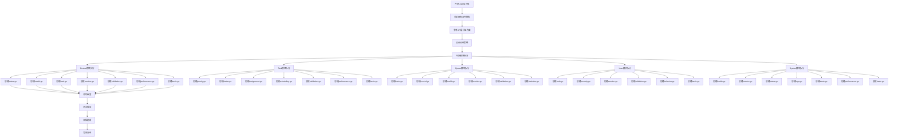
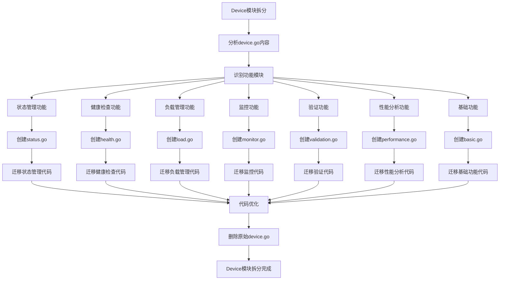
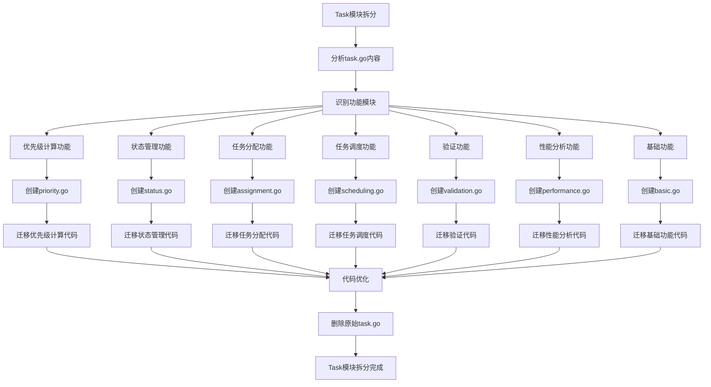
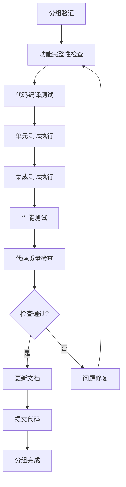
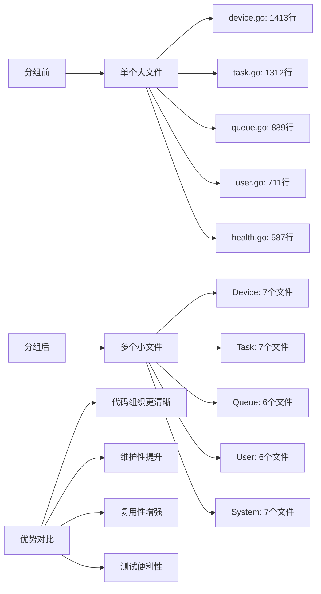
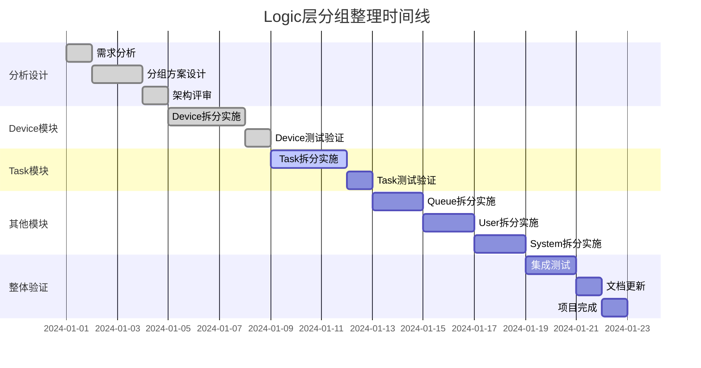

# Logic层分组整理流程图

## 整体分组流程

```mermaid
flowchart TD
    A[开始Logic层分组] --> B[分析现有文件结构]
    B --> C[参考API层分组方案]
    C --> D[设计分组策略]
    D --> E[开始模块拆分]
    
    E --> F[Device模块拆分]
    E --> G[Task模块拆分]
    E --> H[Queue模块拆分]
    E --> I[User模块拆分]
    E --> J[System模块拆分]
    
    F --> K[创建status.go]
    F --> L[创建health.go]
    F --> M[创建load.go]
    F --> N[创建monitor.go]
    F --> O[创建validation.go]
    F --> P[创建performance.go]
    F --> Q[创建basic.go]
    
    G --> R[创建priority.go]
    G --> S[创建status.go]
    G --> T[创建assignment.go]
    G --> U[创建scheduling.go]
    G --> V[创建validation.go]
    G --> W[创建performance.go]
    G --> X[创建basic.go]
    
    H --> Y[创建basic.go]
    H --> Z[创建control.go]
    H --> AA[创建health.go]
    H --> BB[创建monitor.go]
    H --> CC[创建validation.go]
    H --> DD[创建statistics.go]
    
    I --> EE[创建auth.go]
    I --> FF[创建security.go]
    I --> GG[创建session.go]
    I --> HH[创建validation.go]
    I --> II[创建behavior.go]
    I --> JJ[创建basic.go]
    
    J --> KK[创建health.go]
    J --> LL[创建metrics.go]
    J --> MM[创建status.go]
    J --> NN[创建logs.go]
    J --> OO[创建alerts.go]
    J --> PP[创建performance.go]
    J --> QQ[创建basic.go]
    
    K --> RR[代码审查]
    L --> RR
    M --> RR
    N --> RR
    O --> RR
    P --> RR
    Q --> RR
    
    RR --> SS[测试验证]
    SS --> TT[文档更新]
    TT --> UU[完成分组]
```

## Device模块拆分流程

```mermaid
flowchart TD
    A[Device模块拆分] --> B[分析device.go内容]
    B --> C[识别功能模块]
    
    C --> D[状态管理功能]
    C --> E[健康检查功能]
    C --> F[负载管理功能]
    C --> G[监控功能]
    C --> H[验证功能]
    C --> I[性能分析功能]
    C --> J[基础功能]
    
    D --> K[创建status.go]
    E --> L[创建health.go]
    F --> M[创建load.go]
    G --> N[创建monitor.go]
    H --> O[创建validation.go]
    I --> P[创建performance.go]
    J --> Q[创建basic.go]
    
    K --> R[迁移状态管理代码]
    L --> S[迁移健康检查代码]
    M --> T[迁移负载管理代码]
    N --> U[迁移监控代码]
    O --> V[迁移验证代码]
    P --> W[迁移性能分析代码]
    Q --> X[迁移基础功能代码]
    
    R --> Y[代码优化]
    S --> Y
    T --> Y
    U --> Y
    V --> Y
    W --> Y
    X --> Y
    
    Y --> Z[删除原始device.go]
    Z --> AA[Device模块拆分完成]
```

## Task模块拆分流程

```mermaid
flowchart TD
    A[Task模块拆分] --> B[分析task.go内容]
    B --> C[识别功能模块]
    
    C --> D[优先级计算功能]
    C --> E[状态管理功能]
    C --> F[任务分配功能]
    C --> G[任务调度功能]
    C --> H[验证功能]
    C --> I[性能分析功能]
    C --> J[基础功能]
    
    D --> K[创建priority.go]
    E --> L[创建status.go]
    F --> M[创建assignment.go]
    G --> N[创建scheduling.go]
    H --> O[创建validation.go]
    I --> P[创建performance.go]
    J --> Q[创建basic.go]
    
    K --> R[迁移优先级计算代码]
    L --> S[迁移状态管理代码]
    M --> T[迁移任务分配代码]
    N --> U[迁移任务调度代码]
    O --> V[迁移验证代码]
    P --> W[迁移性能分析代码]
    Q --> X[迁移基础功能代码]
    
    R --> Y[代码优化]
    S --> Y
    T --> Y
    U --> Y
    V --> Y
    W --> Y
    X --> Y
    
    Y --> Z[删除原始task.go]
    Z --> AA[Task模块拆分完成]
```

## 分组验证流程

```mermaid
flowchart TD
    A[分组验证] --> B[功能完整性检查]
    B --> C[代码编译测试]
    C --> D[单元测试执行]
    D --> E[集成测试执行]
    E --> F[性能测试]
    F --> G[代码质量检查]
    
    G --> H{检查通过?}
    H -->|是| I[更新文档]
    H -->|否| J[问题修复]
    J --> B
    
    I --> K[提交代码]
    K --> L[分组完成]
```

## 文件依赖关系

```mermaid
flowchart TD
    A[logic层] --> B[device]
    A --> C[task]
    A --> D[queue]
    A --> E[user]
    A --> F[system]
    
    B --> G[status.go]
    B --> H[health.go]
    B --> I[load.go]
    B --> J[monitor.go]
    B --> K[validation.go]
    B --> L[performance.go]
    B --> M[basic.go]
    
    C --> N[priority.go]
    C --> O[status.go]
    C --> P[assignment.go]
    C --> Q[scheduling.go]
    C --> R[validation.go]
    C --> S[performance.go]
    C --> T[basic.go]
    
    D --> U[basic.go]
    D --> V[control.go]
    D --> W[health.go]
    D --> X[monitor.go]
    D --> Y[validation.go]
    D --> Z[statistics.go]
    
    E --> AA[auth.go]
    E --> BB[security.go]
    E --> CC[session.go]
    E --> DD[validation.go]
    E --> EE[behavior.go]
    E --> FF[basic.go]
    
    F --> GG[health.go]
    F --> HH[metrics.go]
    F --> II[status.go]
    F --> JJ[logs.go]
    F --> KK[alerts.go]
    F --> LL[performance.go]
    F --> MM[basic.go]
```

## 分组前后对比

```mermaid
flowchart LR
    A[分组前] --> B[单个大文件]
    B --> C[device.go: 1413行]
    B --> D[task.go: 1312行]
    B --> E[queue.go: 889行]
    B --> F[user.go: 711行]
    B --> G[health.go: 587行]
    
    H[分组后] --> I[多个小文件]
    I --> J[Device: 7个文件]
    I --> K[Task: 7个文件]
    I --> L[Queue: 6个文件]
    I --> M[User: 6个文件]
    I --> N[System: 7个文件]
    
    O[优势对比]
    O --> P[代码组织更清晰]
    O --> Q[维护性提升]
    O --> R[复用性增强]
    O --> S[测试便利性]
```

## 实施时间线

```mermaid
gantt
    title Logic层分组整理时间线
    dateFormat  YYYY-MM-DD
    section 分析设计
    需求分析           :done, des1, 2024-01-01, 1d
    分组方案设计       :done, des2, 2024-01-02, 2d
    架构评审           :done, des3, 2024-01-04, 1d
    
    section Device模块
    Device拆分实施     :done, dev1, 2024-01-05, 3d
    Device测试验证     :done, dev2, 2024-01-08, 1d
    
    section Task模块
    Task拆分实施       :active, task1, 2024-01-09, 3d
    Task测试验证       :task2, 2024-01-12, 1d
    
    section 其他模块
    Queue拆分实施      :queue1, 2024-01-13, 2d
    User拆分实施       :user1, 2024-01-15, 2d
    System拆分实施     :sys1, 2024-01-17, 2d
    
    section 整体验证
    集成测试           :test1, 2024-01-19, 2d
    文档更新           :doc1, 2024-01-21, 1d
    项目完成           :finish, 2024-01-22, 1d
``` 