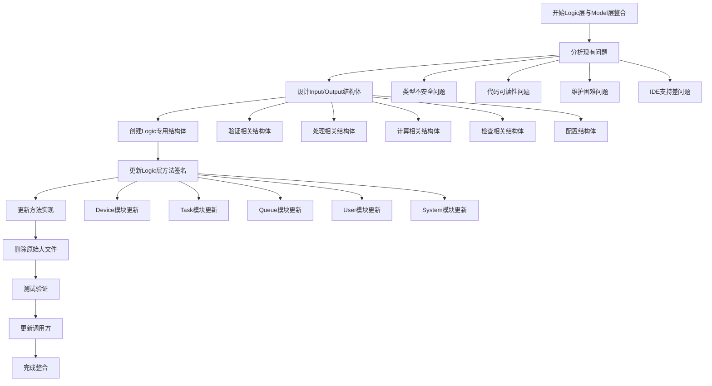
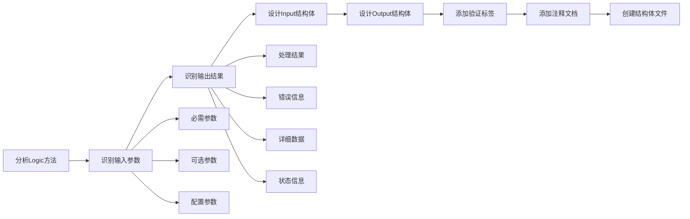
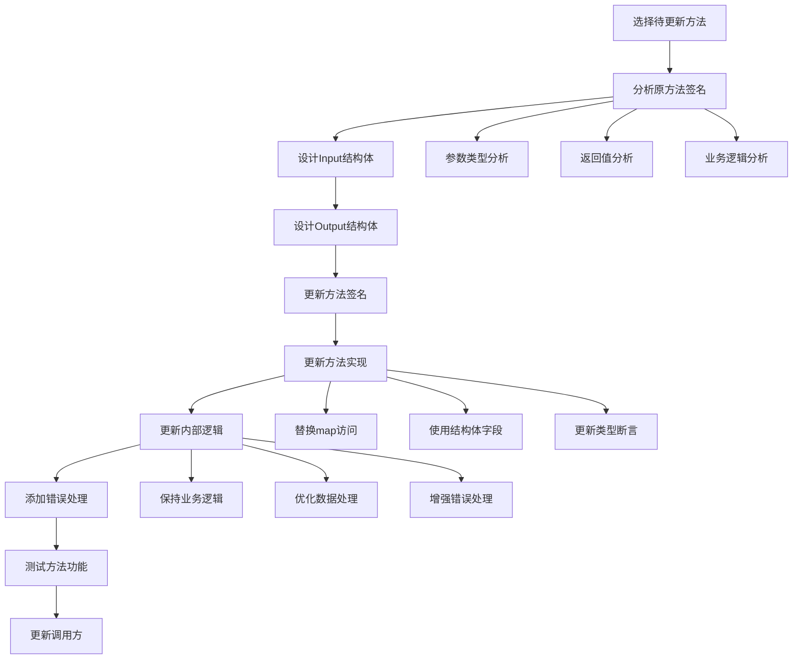
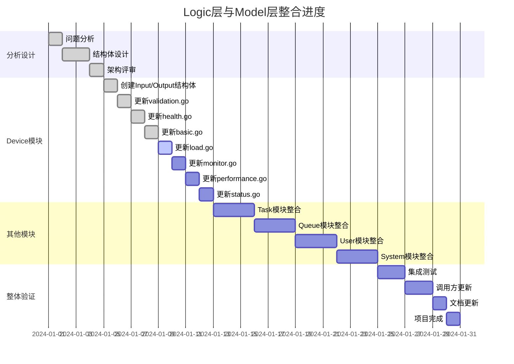
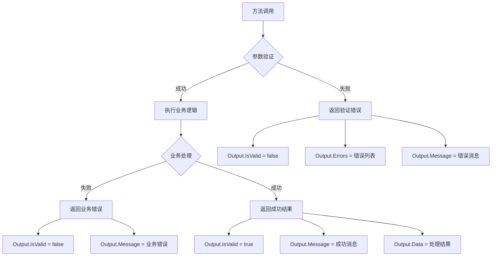
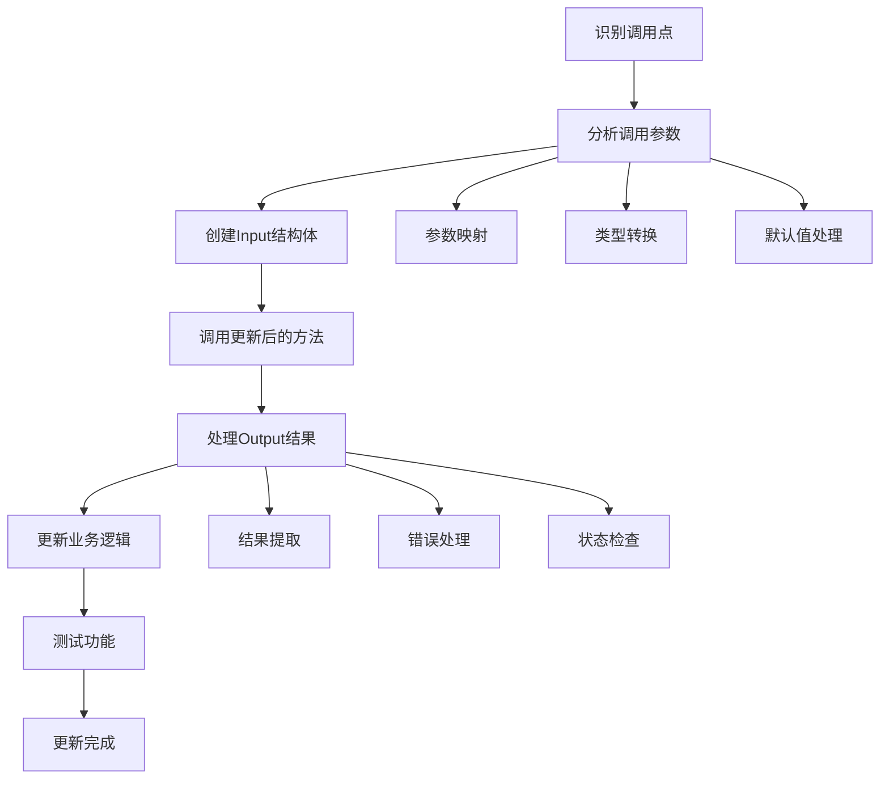
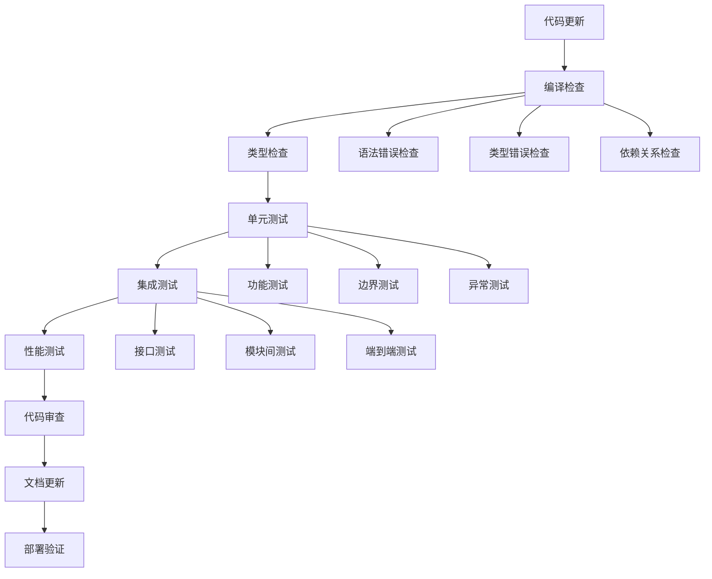

# Logic层与Model层整合流程图

## 整体整合流程



## Input/Output结构体设计流程



## 方法更新流程



## 模块更新状态



## 结构体关系图

```mermaid
classDiagram
    class ValidateDeviceRegistrationInput {
        +string Name
        +string MacAddress
        +string IPAddress
        +string DeviceType
        +string Model
        +string Protocol
        +int Port
    }
    
    class ValidateDeviceRegistrationOutput {
        +bool IsValid
        +string Message
        +[]string Errors
    }
    
    class HandleDeviceRegistrationInput {
        +map[string]interface{} DeviceData
    }
    
    class HandleDeviceRegistrationOutput {
        +string DeviceID
        +map[string]interface{} DeviceData
        +string Message
        +bool IsSuccess
    }
    
    class CalculateDeviceHealthScoreInput {
        +map[string]interface{} DeviceData
    }
    
    class CalculateDeviceHealthScoreOutput {
        +float64 HealthScore
        +map[string]interface{} Components
    }
    
    class BasicConfig {
        +string Name
        +string Description
        +[]string Tags
    }
    
    class PerformanceConfig {
        +int MaxConcurrentTasks
        +float64 CPUThreshold
        +float64 MemoryThreshold
    }
    
    class SecurityConfig {
        +AccessControl AccessControl
        +Encryption Encryption
    }
    
    ValidateDeviceRegistrationInput --> ValidateDeviceRegistrationOutput
    HandleDeviceRegistrationInput --> HandleDeviceRegistrationOutput
    CalculateDeviceHealthScoreInput --> CalculateDeviceHealthScoreOutput
    SecurityConfig --> BasicConfig
    SecurityConfig --> PerformanceConfig
```

## 更新前后对比

```mermaid
flowchart LR
    A[更新前] --> B[使用map[string]interface{}]
    B --> C[类型不安全]
    B --> D[代码可读性差]
    B --> E[维护困难]
    B --> F[IDE支持差]
    
    G[更新后] --> H[使用Input/Output结构体]
    H --> I[类型安全]
    H --> J[代码可读性好]
    H --> K[维护容易]
    H --> L[IDE支持好]
    
    M[改进效果]
    I --> M
    J --> M
    K --> M
    L --> M
```

## 错误处理流程



## 调用方更新流程



## 质量保证流程

