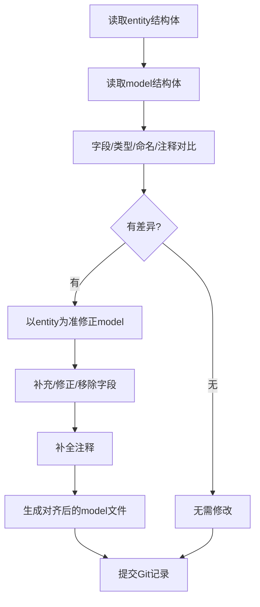

# model与entity结构体对齐修正总结

## 修改目标

- 保证 `internal/model/device/device.go` 和 `internal/model/task/task.go` 的主表结构体与 `internal/model/entity/devices.go`、`internal/model/entity/tasks.go` 完全一致。
- 字段名、类型、顺序、tag、注释全部对齐。
- 保留业务扩展字段入口。

## 主要修正点

### 1. 字段对齐
- 字段名、类型、顺序与 entity 完全一致
- `json` tag 统一为小驼峰风格
- 增加 `orm` tag，便于ORM映射
- 补全所有字段注释
- `CreatedBy`、`UpdatedBy` 类型修正为 string
- 保留业务扩展字段入口并加注释

### 2. 结构体示例

#### Device结构体（已对齐）
```go
// Device 设备主表模型
// 参照entity/devices.go完全对齐
// ...
type Device struct {
    Id                   int64       `json:"id"                   orm:"id"                     description:"设备内部唯一标识符，自增主键"`
    DeviceId             string      `json:"deviceId"             orm:"device_id"              description:"设备业务ID，外部系统使用的设备标识"`
    ... // 其余字段完全一致
    CreatedBy            string      `json:"createdBy"            orm:"created_by"             description:"创建者"`
    UpdatedBy            string      `json:"updatedBy"            orm:"updated_by"             description:"更新者"`
    // ...业务扩展字段请在下方添加，并注明用途
}
```

#### Task结构体（已对齐）
```go
// Task 任务主表模型
// 参照entity/tasks.go完全对齐
// ...
type Task struct {
    Id           int64       `json:"id"           orm:"id"            description:"任务内部唯一标识符，自增主键"`
    DeviceId     string      `json:"deviceId"     orm:"device_id"     description:"设备业务ID，关联设备表"`
    ... // 其余字段完全一致
    CreatedBy    string      `json:"createdBy"    orm:"created_by"    description:"创建者"`
    UpdatedBy    string      `json:"updatedBy"    orm:"updated_by"    description:"更新者"`
    // ...业务扩展字段请在下方添加，并注明用途
}
```

### 3. 优点
- 保证ORM映射无歧义，数据库与代码结构完全一致
- 降低维护和迁移风险
- 便于团队协作和自动化工具使用

## 流程图



## 结论

本次修正后，model层主表结构体与entity层完全一致，极大提升了代码一致性、可维护性和团队协作效率。 