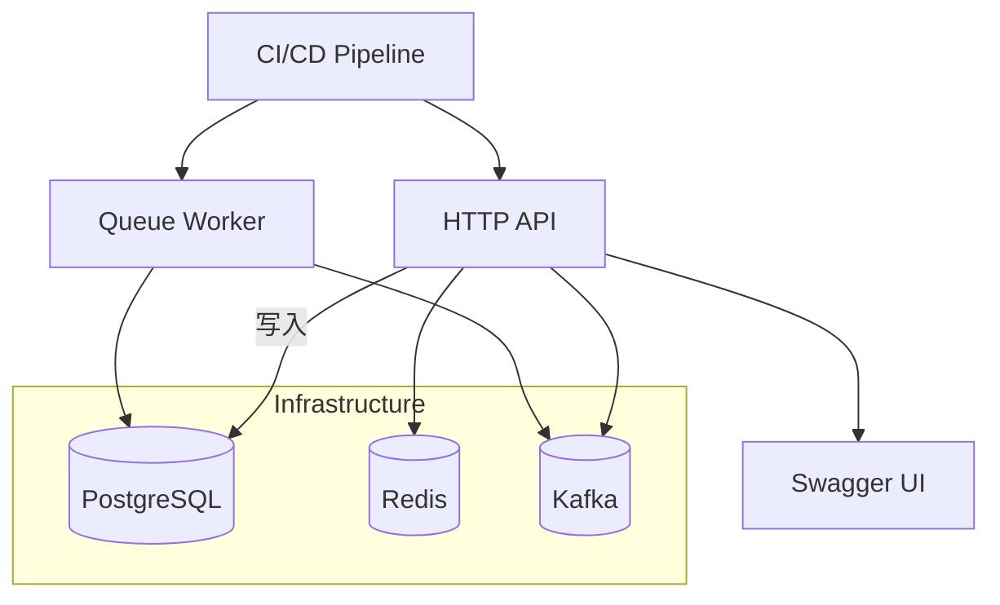

# Controller 层完工后的下一步计划

> 更新时间：{{date}}

## 1. 中间件与横切功能
1. 鉴权中间件（JWT/OAuth2）
2. 统一错误处理与响应包装
3. 请求追踪（TraceID）与链路日志
4. 速率限制与熔断

## 2. 队列持久化与调度
1. 实现 QueueRepository，落地到 DB/Redis
2. 队列执行器 Worker（并发、重试）
3. 定时器扫尾任务、过期清理

## 3. 文档与 API 描述
1. 集成 Swagger/OpenAPI 自动生成
2. docs 目录补充使用示例与 Postman 集合

## 4. 集成测试 & E2E
1. 使用 `httptest` + in-mem DB 进行集成测试
2. Docker Compose 起 Postgres/Redis/Kafka 进行 E2E

## 5. CI/CD
1. GitHub Actions：lint → test → build → image
2. 自动 run `go vet`, `staticcheck`, `golangci-lint`
3. 发布 Docker 镜像与迁移执行

## 6. 性能与监控
1. Prometheus 指标埋点（已具备 pkg/metrics）
2. Grafana Dashboard
3. 压测（vegeta/k6）

---

## 流程图

---

以上为下一阶段实施要点，可按优先级逐步推进。 