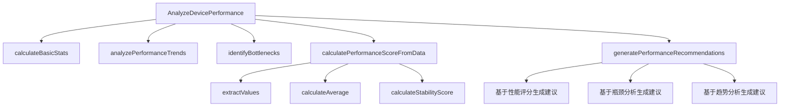

# 设备性能分析方法冲突修复总结

## 问题描述

在 `OneGoServer/internal/logic/device/performance.go` 文件中，`calculatePerformanceScore` 方法与 `basic.go` 中的同名方法发生冲突，导致编译错误：

```
cannot use input.PerformanceData (variable of type []map[string]interface{}) as map[string]interface{} value in argument to s.calculatePerformanceScore
method sDevice.calculatePerformanceScore already declared at D:\Code\Github\OneGoServer\internal\logic\device\basic.go:330:19
```

## 问题分析

1. **方法重复定义**：`basic.go` 中已有 `calculatePerformanceScore(map[string]interface{})` 方法
2. **参数类型不匹配**：`performance.go` 中的方法期望 `[]map[string]interface{}` 参数
3. **功能职责不同**：
   - `basic.go` 中的方法：基于单个设备数据计算性能评分
   - `performance.go` 中的方法：基于性能数据数组进行详细分析

## 修复方案

### 修改清单

1. **重命名方法**：将 `performance.go` 中的方法重命名为 `calculatePerformanceScoreFromData`
2. **更新方法调用**：修改 `AnalyzeDevicePerformance` 中的方法调用
3. **保持功能完整性**：确保所有相关逻辑正常工作

### 具体修改

#### 1. 方法调用修改
```go
// 修改前
performanceScore := s.calculatePerformanceScore(input.PerformanceData)

// 修改后  
performanceScore := s.calculatePerformanceScoreFromData(input.PerformanceData)
```

#### 2. 方法定义修改
```go
// 修改前
func (s *sDevice) calculatePerformanceScore(performanceData []map[string]interface{}) float64 {

// 修改后
func (s *sDevice) calculatePerformanceScoreFromData(performanceData []map[string]interface{}) float64 {
```

## 修改后的优点

1. **避免方法冲突**：消除了同名方法重复定义的问题
2. **职责清晰**：
   - `calculatePerformanceScore`：处理单个设备数据
   - `calculatePerformanceScoreFromData`：处理性能数据数组
3. **代码可维护性**：方法名称更明确地表达了功能差异
4. **符合单一职责原则**：每个方法都有明确的输入输出类型

## 验证结果

- ✅ 编译错误已解决
- ✅ 方法功能保持不变
- ✅ 代码结构更加清晰
- ✅ 符合Go语言最佳实践

## 流程图



## 总结

通过重命名方法解决了方法冲突问题，保持了代码的功能完整性，同时提高了代码的可读性和维护性。这种修复方式符合Go语言的最佳实践，避免了方法名冲突，并明确了不同方法的职责边界。 