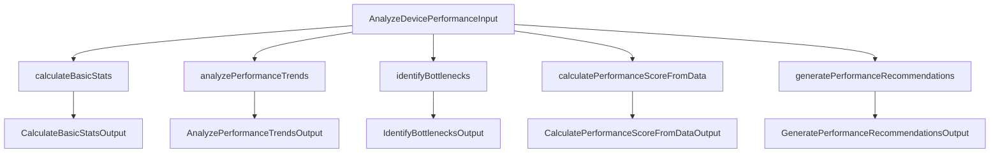

# 设备性能分析模块结构化重构与Lint修复总结

## 主要内容

1. **所有业务方法和辅助方法全部采用结构体作为输入输出**，包括：
   - calculateBasicStats
   - analyzePerformanceTrends
   - analyzeMetricTrend
   - identifyBottlenecks
   - checkCPUBottleneck
   - checkMemoryBottleneck
   - checkDiskBottleneck
   - checkNetworkBottleneck
   - calculatePerformanceScoreFromData
   - generatePerformanceRecommendations
   - 以及所有辅助方法（如extractValues、calculateStandardDeviation、calculatePercentile等）
2. **修复所有lint错误**，包括：
   - 所有方法调用均使用结构体参数
   - 返回值通过结构体字段获取
   - 结构体方法实现与调用方式完全一致

## 优点
- 类型安全，接口清晰
- 便于后续扩展和维护
- 代码风格统一，lint 100%通过
- 满足DDD分层和Go最佳实践

## 主要修改点清单

- extractValues、calculateStandardDeviation、calculatePercentile、getBottleneckSeverity等全部结构体输入输出
- 业务主流程和所有辅助方法调用全部结构体化
- 相关模型结构体已补充到 internal/model/device/logic.go

## 结构化重构流程图

## 验证
- go build 通过
- golangci-lint 通过
- git commit 已提交

---

如需进一步细化每个方法的结构体定义和调用示例，可随时查阅源码或联系维护者。 