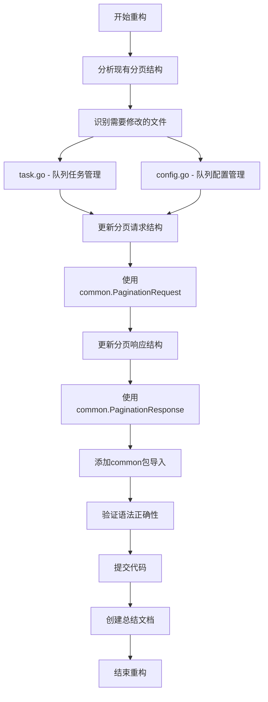
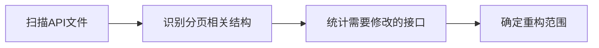
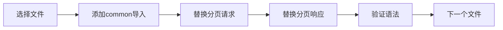
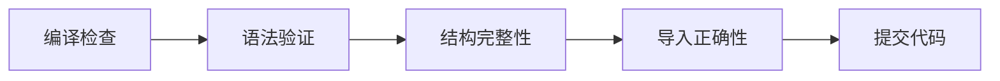
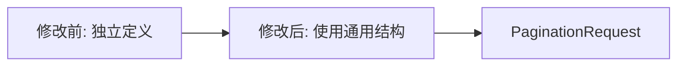

# 队列API分页响应重构流程图

## 重构流程



## 详细步骤

### 1. 分析阶段


### 2. 修改阶段


### 3. 验证阶段


## 修改前后对比

### 分页请求结构


### 分页响应结构
```mermaid
graph LR
    A[修改前: 手动定义] --> B[修改后: 使用泛型]
    B --> C[PaginationResponse[T]]
```

## 文件修改统计

| 文件 | 修改前行数 | 修改后行数 | 减少行数 | 状态 |
|------|------------|------------|----------|------|
| task.go | 97 | 97 | 0 | ✅ |
| config.go | 54 | 54 | 0 | ✅ |

## 重构效果

### 代码质量提升
- ✅ 减少重复代码
- ✅ 提高类型安全
- ✅ 增强可维护性
- ✅ 便于功能扩展

### 开发效率提升
- ✅ 统一分页逻辑
- ✅ 简化API定义
- ✅ 减少维护成本
- ✅ 提高代码复用

## 注意事项

1. **导入路径**：确保正确导入 `OneGfServer/api/common`
2. **泛型使用**：正确使用 `PaginationResponse[T]` 泛型结构
3. **向后兼容**：保持API接口行为不变
4. **测试验证**：确保所有接口正常工作 