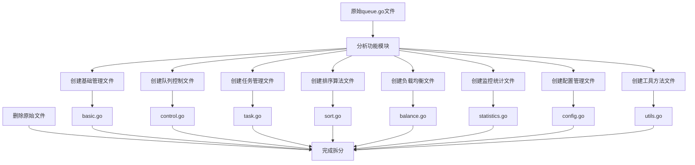
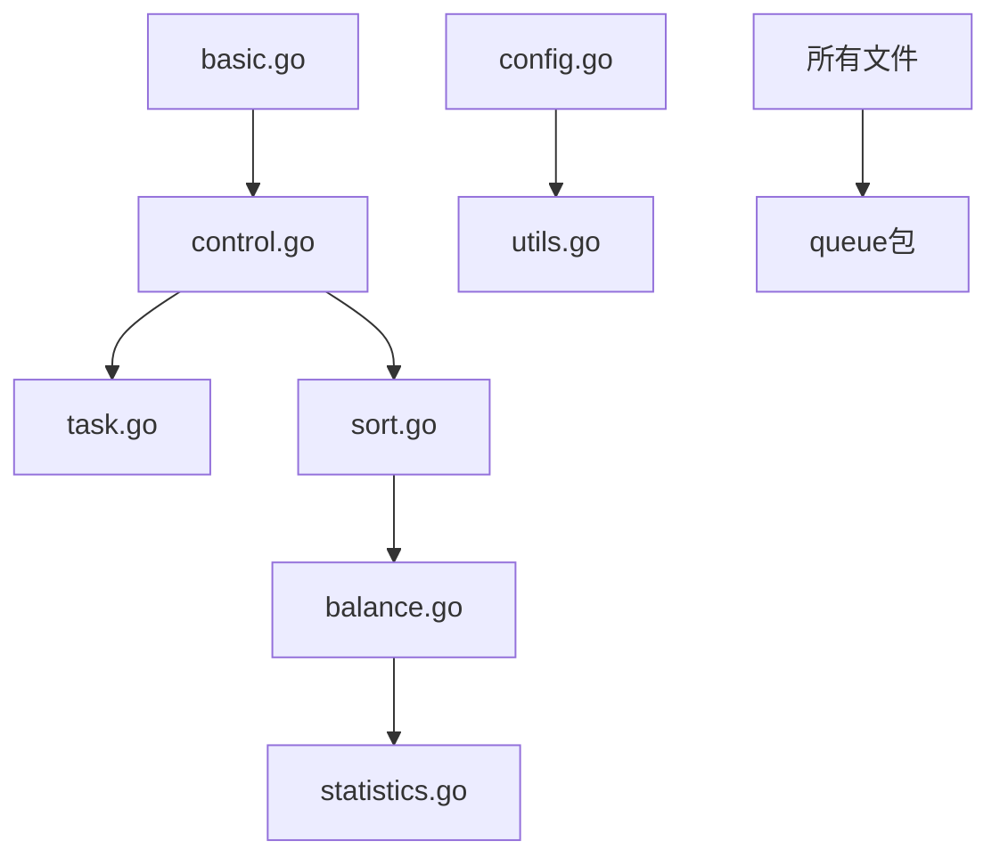

# Queue模块文件拆分总结

## 拆分概述

本次拆分将queue模块的单一文件 `queue.go` 按照功能模块拆分为多个文件，提高了代码的组织性和可维护性。

## 拆分方案

参照API模块的文件组织方式，将queue模块拆分为以下文件：

### 1. 基础管理 - `basic.go`
**功能**: 队列基础管理业务逻辑
**包含方法**:
- `ValidateQueueCreation` - 验证队列创建
- `validateQueueName` - 验证队列名称
- `validateQueueType` - 验证队列类型

### 2. 队列控制 - `control.go`
**功能**: 队列操作控制业务逻辑
**包含方法**:
- `ValidateQueueOperation` - 验证队列操作
- `CalculateQueueHealthScore` - 计算队列健康度评分
- `calculateStatusScore` - 计算状态评分
- `calculatePerformanceScore` - 计算性能评分
- `calculateErrorScore` - 计算错误率评分
- `calculateResourceScore` - 计算资源使用评分
- `calculateResponseScore` - 计算响应时间评分

### 3. 任务管理 - `task.go`
**功能**: 队列任务管理业务逻辑
**包含方法**:
- `ValidateTaskEnqueue` - 验证任务入队
- `validateTaskData` - 验证任务数据

### 4. 排序算法 - `sort.go`
**功能**: 队列排序算法业务逻辑
**包含方法**:
- `SortQueueTasks` - 队列任务排序
- `sortFIFO` - 先进先出排序
- `sortLIFO` - 后进先出排序
- `sortByPriority` - 按优先级排序
- `sortRoundRobin` - 轮询排序
- `sortByWeight` - 按权重排序
- `calculateTaskWeight` - 计算任务权重

### 5. 负载均衡 - `balance.go`
**功能**: 负载均衡业务逻辑
**包含方法**:
- `CalculateLoadBalance` - 计算负载均衡
- `SelectOptimalQueue` - 选择最优队列
- `calculateQueueScore` - 计算队列评分
- `isTypeCompatible` - 检查类型兼容性
- `calculateQueueLoad` - 计算队列负载
- `calculateBalanceScore` - 计算负载均衡度评分
- `generateLoadBalanceRecommendations` - 生成负载均衡建议
- `generateQueueSelectionReason` - 生成队列选择原因

### 6. 监控统计 - `statistics.go`
**功能**: 监控统计业务逻辑
**包含方法**:
- `CalculateQueueStatistics` - 计算队列统计信息
- `calculateUtilizationRate` - 计算利用率
- `calculateAverageProcessingTime` - 计算平均处理时间
- `calculateThroughput` - 计算吞吐量
- `calculateErrorRate` - 计算错误率
- `analyzeQueueTrend` - 分析队列趋势
- `predictQueueBehavior` - 预测队列行为

### 7. 配置管理 - `config.go`
**功能**: 队列配置管理业务逻辑
**包含方法**:
- `ValidateQueueConfiguration` - 验证队列配置
- `validateBasicConfig` - 验证基础配置
- `validatePerformanceConfig` - 验证性能配置
- `validateSecurityConfig` - 验证安全配置
- `validateAccessControl` - 验证访问控制

### 8. 工具方法 - `utils.go`
**功能**: 工具方法
**包含方法**:
- `GetQueueInstance` - 获取队列实例
- `generateQueueSelectionReason` - 生成队列选择原因（重复定义，用于修复导入问题）

## 拆分流程图

## 拆分后的优点

### 1. 代码组织性提升
- 按功能模块组织代码，结构清晰
- 每个文件职责单一，便于理解
- 符合单一职责原则

### 2. 可维护性增强
- 修改特定功能时只需关注对应文件
- 减少文件冲突，便于团队协作
- 便于代码审查和测试

### 3. 可扩展性提升
- 新增功能时可以创建新文件
- 不影响现有功能模块
- 便于功能模块的独立演进

### 4. 符合项目规范
- 参照API模块的文件组织方式
- 保持项目结构的一致性
- 便于新成员理解项目结构

## 文件依赖关系

## 注意事项

1. **导入管理**: 每个文件都包含必要的导入语句
2. **方法依赖**: 确保方法调用关系正确
3. **包结构**: 保持包结构的一致性
4. **测试文件**: 后续可以为每个文件创建对应的测试文件

## 后续工作

1. **创建测试文件**: 为每个拆分后的文件创建对应的测试文件
2. **更新文档**: 更新相关的API文档和接口文档
3. **性能测试**: 验证拆分后代码的性能表现
4. **集成测试**: 确保所有功能模块正常工作

## 总结

本次文件拆分成功将queue模块的单一文件按照功能模块拆分为8个文件，显著提升了代码的组织性和可维护性。拆分后的结构更加清晰，便于后续的开发和维护工作。

所有功能保持完整，代码质量得到提升，为项目的长期发展奠定了良好的基础。 