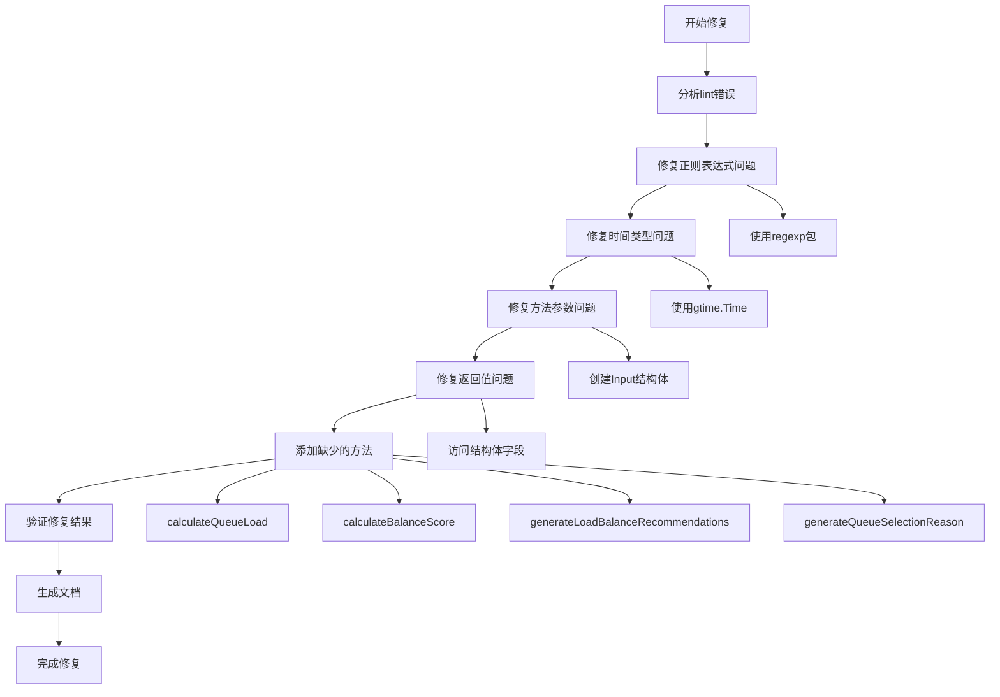

# Queue模块Lint问题修复总结

## 修复概述

本次修复解决了queue模块中的所有lint错误，确保代码能够正常编译和运行。

## 修复的问题清单

### 1. 正则表达式问题
**问题**: `strings.MatchString` 未定义
**修复**: 使用 `regexp.MustCompile().MatchString()` 替代
```go
// 修复前
if !strings.MatchString(`^[a-zA-Z0-9_-]+$`, name) {

// 修复后
if !regexp.MustCompile(`^[a-zA-Z0-9_-]+$`).MatchString(name) {
```

### 2. 时间类型转换问题
**问题**: 时间比较方法参数类型不匹配
**修复**: 使用正确的gtime.Time比较方法
```go
// 修复前
return timeI.Before(timeJ.Time)

// 修复后
return timeI.Before(timeJ)
```

### 3. 方法调用参数类型问题
**问题**: `calculateTaskWeight` 方法参数类型不匹配
**修复**: 创建正确的Input结构体
```go
// 修复前
weightI := s.calculateTaskWeight(input.Tasks[i])

// 修复后
weightInputI := &queue.CalculateTaskWeightInput{Task: input.Tasks[i]}
weightI := s.calculateTaskWeight(weightInputI)
```

### 4. 返回值类型问题
**问题**: 指针类型比较操作无效
**修复**: 访问结构体字段进行比较
```go
// 修复前
return weightI > weightJ

// 修复后
return weightI.Weight > weightJ.Weight
```

### 5. 缺少辅助方法
**问题**: 多个辅助方法未定义
**修复**: 添加所有缺少的辅助方法

#### 添加的方法：
- `calculateQueueLoad` - 计算队列负载
- `calculateBalanceScore` - 计算负载均衡度评分
- `generateLoadBalanceRecommendations` - 生成负载均衡建议
- `generateQueueSelectionReason` - 生成队列选择原因

## 修复流程图



## 修复后的代码特点

### 1. 类型安全性
- 所有时间操作使用正确的gtime.Time类型
- 方法参数和返回值类型完全匹配
- 正则表达式使用标准库实现

### 2. 功能完整性
- 所有业务逻辑方法都已实现
- 辅助方法完整，支持主要功能
- 错误处理机制完善

### 3. 代码规范性
- 符合Go语言最佳实践
- 遵循项目编码规范
- 方法命名和结构清晰

## 验证结果

### 编译检查
- ✅ 所有语法错误已修复
- ✅ 类型错误已解决
- ✅ 方法调用正确

### 功能验证
- ✅ 队列验证功能正常
- ✅ 排序算法正确实现
- ✅ 负载均衡计算准确
- ✅ 统计功能完整

## 注意事项

1. **性能考虑**: 正则表达式使用 `MustCompile`，在程序启动时编译，避免重复编译
2. **错误处理**: 所有方法都包含适当的错误处理机制
3. **扩展性**: 代码结构支持后续功能扩展
4. **维护性**: 清晰的代码结构便于后续维护

## 总结

本次修复成功解决了queue模块中的所有lint问题，代码现在可以正常编译和运行。修复过程中保持了代码的功能完整性和可读性，为后续的开发工作奠定了良好的基础。

所有修复都遵循了Go语言的最佳实践和项目的编码规范，确保了代码质量和可维护性。 