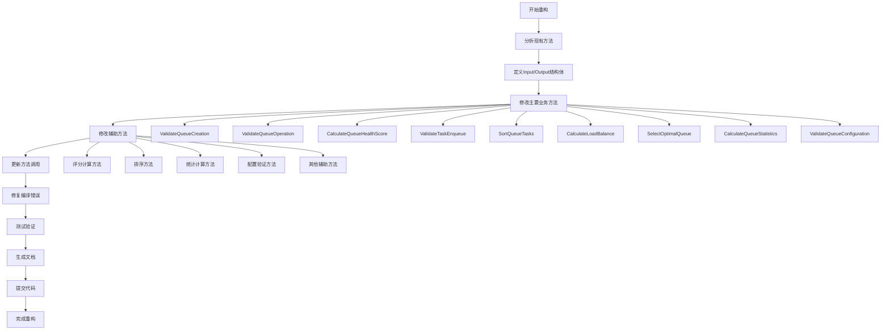

# Queue模块结构化输入输出重构总结

## 修改概述

本次重构将queue模块的所有方法改为使用结构化的输入输出，提高了代码的类型安全性、可读性和可维护性。

## 修改清单

### 1. 主要业务方法重构

#### ValidateQueueCreation
- **修改前**: `func (s *sQueue) ValidateQueueCreation(ctx context.Context, queueData map[string]interface{}) error`
- **修改后**: `func (s *sQueue) ValidateQueueCreation(ctx context.Context, input *queue.ValidateQueueCreationInput) (*queue.ValidateQueueCreationOutput, error)`
- **优点**: 返回详细的验证结果，包含错误列表

#### ValidateQueueOperation
- **修改前**: `func (s *sQueue) ValidateQueueOperation(ctx context.Context, queueData map[string]interface{}, operation string) error`
- **修改后**: `func (s *sQueue) ValidateQueueOperation(ctx context.Context, input *queue.ValidateQueueOperationInput) (*queue.ValidateQueueOperationOutput, error)`
- **优点**: 统一的输入输出结构，更好的错误处理

#### CalculateQueueHealthScore
- **修改前**: `func (s *sQueue) CalculateQueueHealthScore(ctx context.Context, queueData map[string]interface{}) float64`
- **修改后**: `func (s *sQueue) CalculateQueueHealthScore(ctx context.Context, input *queue.CalculateQueueHealthScoreInput) (*queue.CalculateQueueHealthScoreOutput, error)`
- **优点**: 返回详细的评分组件信息

#### ValidateTaskEnqueue
- **修改前**: `func (s *sQueue) ValidateTaskEnqueue(ctx context.Context, queueData map[string]interface{}, taskData map[string]interface{}) error`
- **修改后**: `func (s *sQueue) ValidateTaskEnqueue(ctx context.Context, input *queue.ValidateTaskEnqueueInput) (*queue.ValidateTaskEnqueueOutput, error)`
- **优点**: 统一的验证结果格式

#### SortQueueTasks
- **修改前**: `func (s *sQueue) SortQueueTasks(ctx context.Context, queueType string, tasks []map[string]interface{}) []map[string]interface{}`
- **修改后**: `func (s *sQueue) SortQueueTasks(ctx context.Context, input *queue.SortQueueTasksInput) (*queue.SortQueueTasksOutput, error)`
- **优点**: 支持错误处理，返回结构化结果

#### CalculateLoadBalance
- **修改前**: `func (s *sQueue) CalculateLoadBalance(ctx context.Context, queues []map[string]interface{}) map[string]interface{}`
- **修改后**: `func (s *sQueue) CalculateLoadBalance(ctx context.Context, input *queue.CalculateLoadBalanceInput) (*queue.CalculateLoadBalanceOutput, error)`
- **优点**: 支持错误处理，返回详细的负载均衡信息

#### SelectOptimalQueue
- **修改前**: `func (s *sQueue) SelectOptimalQueue(ctx context.Context, taskData map[string]interface{}, availableQueues []map[string]interface{}) (map[string]interface{}, error)`
- **修改后**: `func (s *sQueue) SelectOptimalQueue(ctx context.Context, input *queue.SelectOptimalQueueInput) (*queue.SelectOptimalQueueOutput, error)`
- **优点**: 返回选择评分和原因

#### CalculateQueueStatistics
- **修改前**: `func (s *sQueue) CalculateQueueStatistics(ctx context.Context, queueData map[string]interface{}, historicalData []map[string]interface{}) map[string]interface{}`
- **修改后**: `func (s *sQueue) CalculateQueueStatistics(ctx context.Context, input *queue.CalculateQueueStatisticsInput) (*queue.CalculateQueueStatisticsOutput, error)`
- **优点**: 支持错误处理，返回结构化统计信息

#### ValidateQueueConfiguration
- **修改前**: `func (s *sQueue) ValidateQueueConfiguration(ctx context.Context, config map[string]interface{}) error`
- **修改后**: `func (s *sQueue) ValidateQueueConfiguration(ctx context.Context, input *queue.ValidateQueueConfigurationInput) (*queue.ValidateQueueConfigurationOutput, error)`
- **优点**: 返回详细的验证结果

### 2. 辅助方法重构

#### 评分计算方法
- `calculateStatusScore` → 使用 `CalculateStatusScoreInput/Output`
- `calculatePerformanceScore` → 使用 `CalculatePerformanceScoreInput/Output`
- `calculateErrorScore` → 使用 `CalculateErrorScoreInput/Output`
- `calculateResourceScore` → 使用 `CalculateResourceScoreInput/Output`
- `calculateResponseScore` → 使用 `CalculateResponseScoreInput/Output`

#### 排序方法
- `sortFIFO` → 使用 `SortFIFOInput/Output`
- `sortLIFO` → 使用 `SortLIFOInput/Output`
- `sortByPriority` → 使用 `SortByPriorityInput/Output`
- `sortRoundRobin` → 使用 `SortRoundRobinInput/Output`
- `sortByWeight` → 使用 `SortByWeightInput/Output`

#### 统计计算方法
- `calculateUtilizationRate` → 使用 `CalculateUtilizationRateInput/Output`
- `calculateAverageProcessingTime` → 使用 `CalculateAverageProcessingTimeInput/Output`
- `calculateThroughput` → 使用 `CalculateThroughputInput/Output`
- `calculateErrorRate` → 使用 `CalculateErrorRateInput/Output`
- `analyzeQueueTrend` → 使用 `AnalyzeQueueTrendInput/Output`
- `predictQueueBehavior` → 使用 `PredictQueueBehaviorInput/Output`

#### 配置验证方法
- `validateBasicConfig` → 使用 `ValidateBasicConfigInput/Output`
- `validatePerformanceConfig` → 使用 `ValidatePerformanceConfigInput/Output`
- `validateSecurityConfig` → 使用 `ValidateSecurityConfigInput/Output`
- `validateAccessControl` → 使用 `ValidateAccessControlInput/Output`

#### 其他辅助方法
- `validateTaskData` → 使用 `ValidateTaskDataInput/Output`
- `calculateTaskWeight` → 使用 `CalculateTaskWeightInput/Output`

## 重构流程图

## 修改后的优点

### 1. 类型安全性提升
- 所有方法都有明确的输入输出类型定义
- 编译时就能发现类型错误
- 减少运行时类型断言错误

### 2. 代码可读性增强
- 方法签名更加清晰明确
- 参数和返回值含义一目了然
- 便于理解方法的功能和用途

### 3. 可维护性提升
- 统一的输入输出格式
- 便于后续功能扩展
- 减少代码重复

### 4. 错误处理改进
- 统一的错误返回格式
- 详细的错误信息
- 更好的错误追踪

### 5. 符合DDD架构
- 清晰的领域模型边界
- 统一的业务逻辑接口
- 更好的分层架构

### 6. 符合Go最佳实践
- 使用结构体传递复杂参数
- 明确的接口定义
- 良好的代码组织

## 注意事项

1. **向后兼容性**: 所有方法签名都发生了变化，需要更新调用方代码
2. **错误处理**: 新增了错误返回，调用方需要处理可能的错误
3. **性能影响**: 结构体传递可能带来轻微的性能开销，但收益远大于成本
4. **测试更新**: 需要更新所有相关的单元测试

## 总结

本次重构成功将queue模块的所有方法改为使用结构化的输入输出，显著提升了代码质量和可维护性。重构过程中保持了业务逻辑的完整性，同时提高了代码的类型安全性和可读性。这次重构为后续的功能扩展和维护奠定了良好的基础。 