# Queue.go 和 Task.go 模型检查流程图

## 检查流程概述

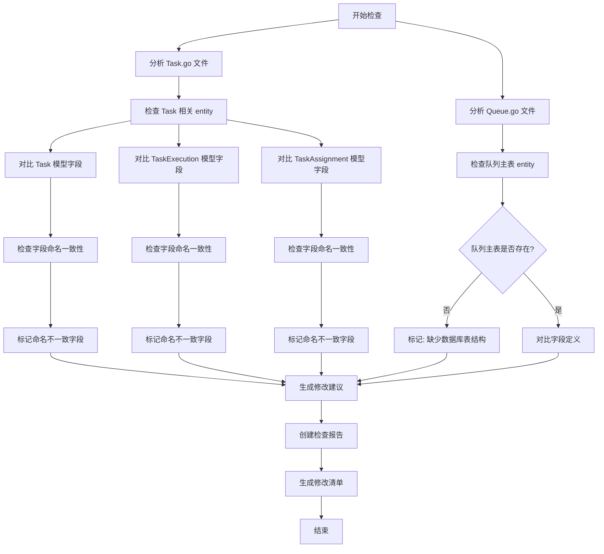

## 详细检查步骤

### 1. Queue.go 文件检查流程

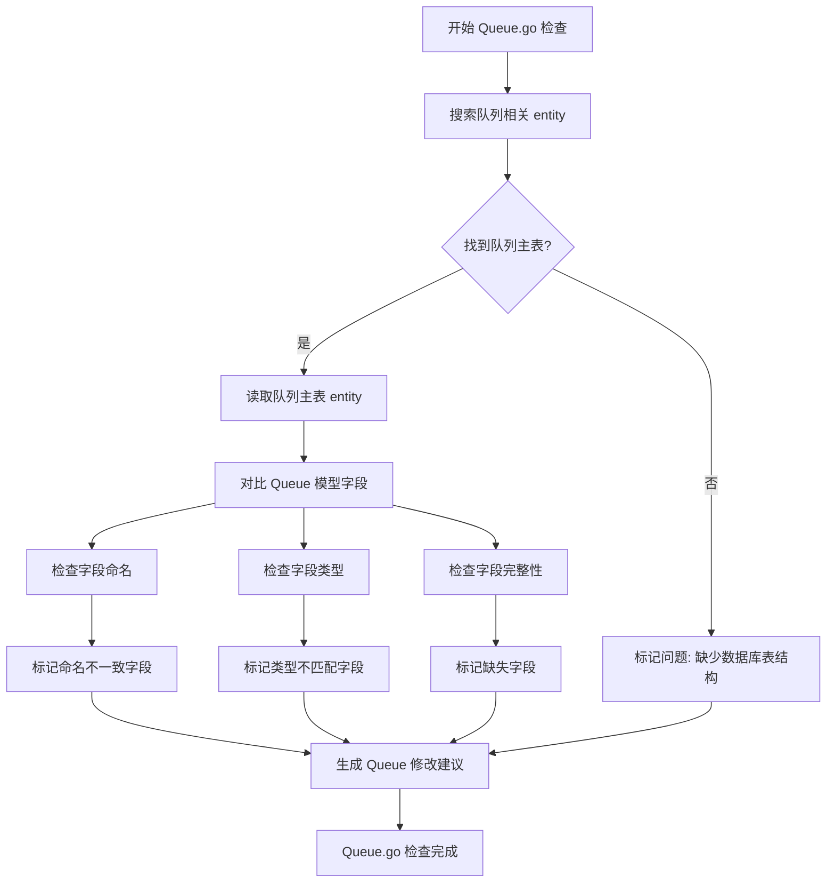

### 2. Task.go 文件检查流程

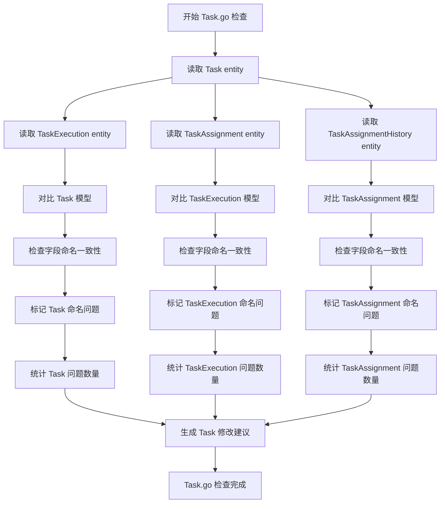

### 3. 字段命名检查流程

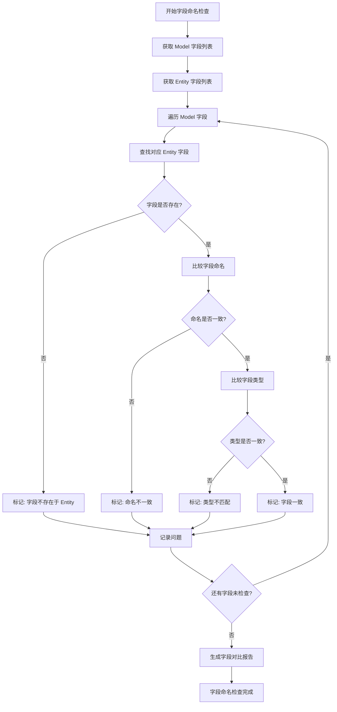

### 4. 问题分类和统计流程

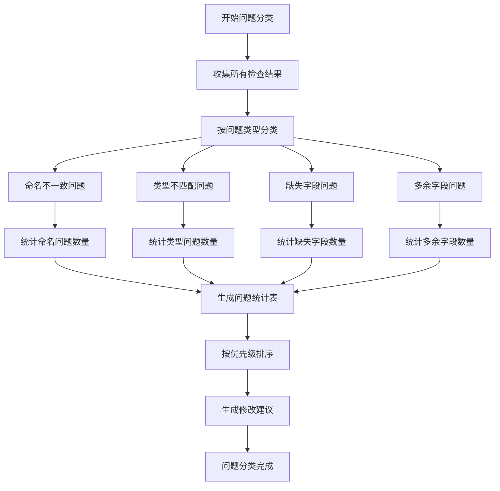

### 5. 修改建议生成流程

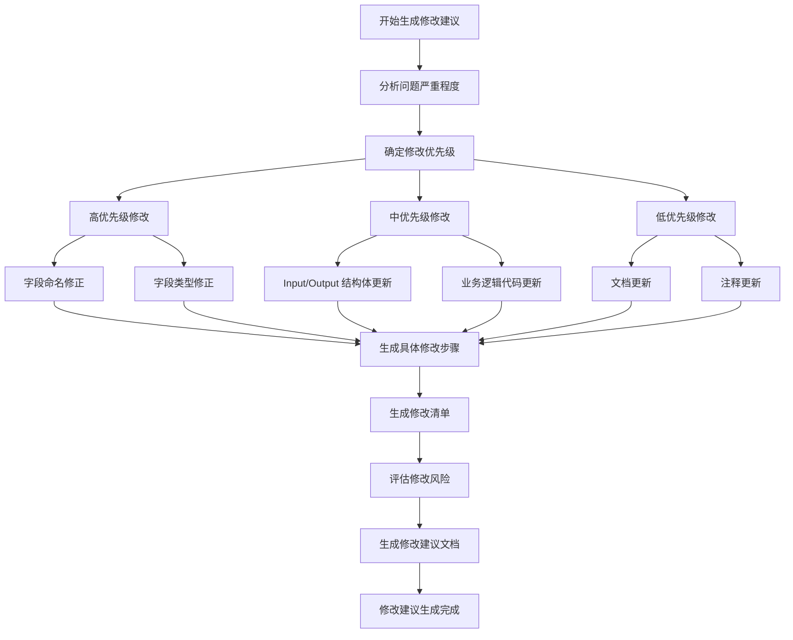

## 检查结果可视化

### 问题分布饼图

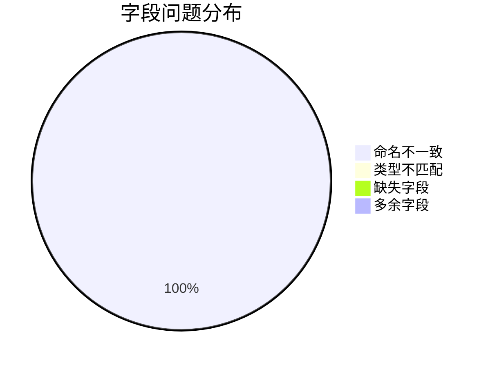

### 模型问题统计

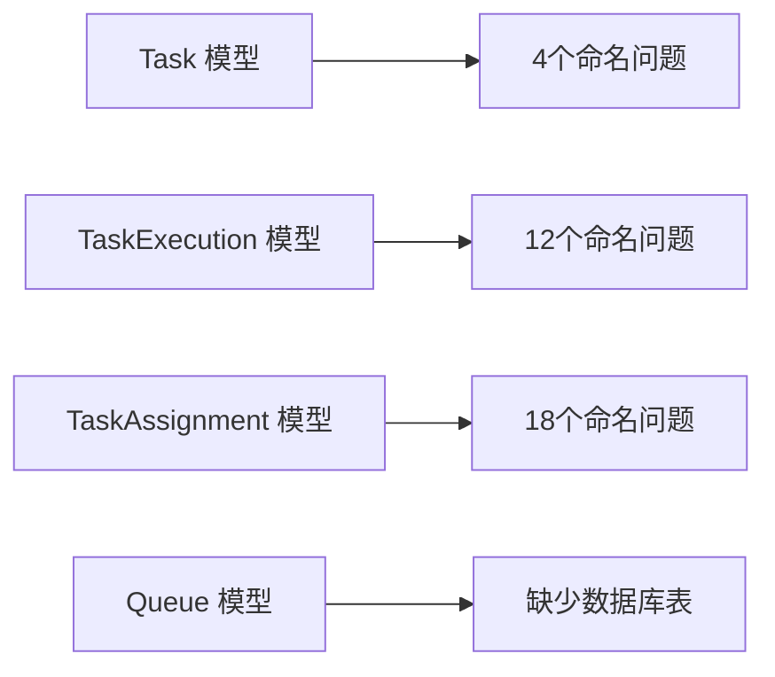

### 修改优先级矩阵

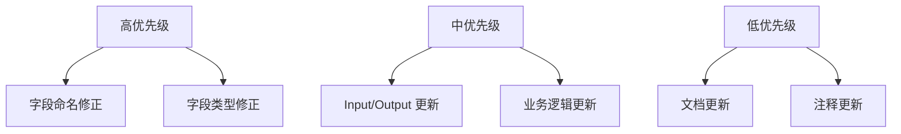

## 检查工具和脚本

### 自动化检查脚本流程

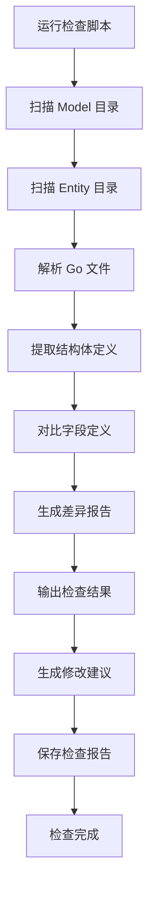

## 后续行动流程

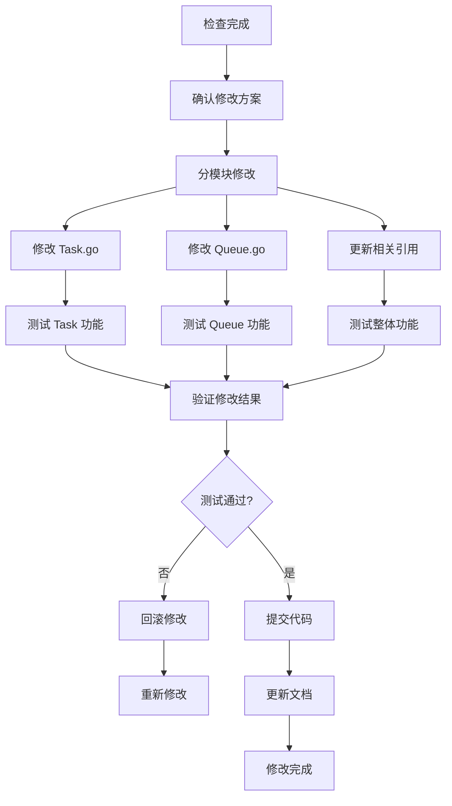

## 总结

本流程图详细展示了 Queue.go 和 Task.go 模型检查的完整过程，包括：

1. **检查流程**：从文件分析到问题识别
2. **对比流程**：字段定义的一致性检查
3. **分类流程**：问题类型统计和优先级排序
4. **建议流程**：修改方案的生成和风险评估
5. **行动流程**：后续的修改和验证步骤

通过这些流程，可以系统性地发现和解决模型层与数据库表结构不一致的问题，确保代码的质量和可维护性。 