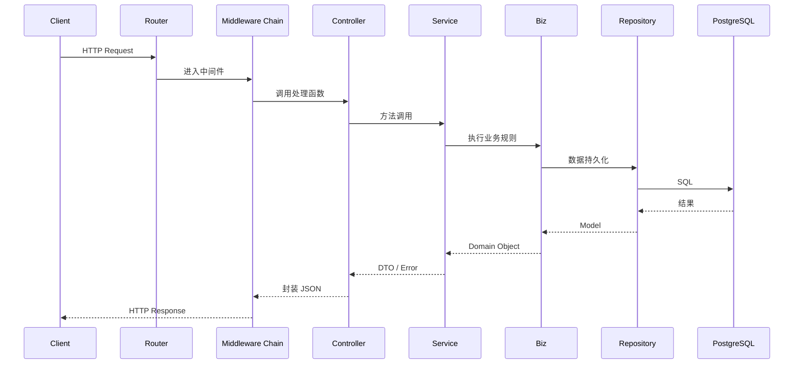

# OneGoServer 请求到响应完整流程

> 适用于已完成 Controller / Middleware / Service / Biz / Repository 重构后的最新代码。

## 1. 流程概览

1. Client 发送 HTTP 请求。  
2. Gin `Router` 根据路由规则匹配到具体 `Controller` 方法。  
3. 请求在到达 Controller 之前，依次穿过 *Trace* → *RateLimit* → *Auth* → *ErrorRecovery* 等中间件链。  
4. `Controller` 负责参数解析、校验（可选）并调用对应 `Service`。  
5. `Service` 协调业务：
   - 直接执行业务计算，或
   - 调用 `Biz` 层执行业务规则与领域模型操作。  
6. `Biz` 层根据需要调用 `Repository`（GORM）持久化到 PostgreSQL，或使用 Redis / Kafka 等外部依赖。  
7. 数据返回 `Service` → `Controller`，统一封装为标准 JSON 响应。  
8. 中间件（如 Trace）在响应时补充 Header / Log；最终由 Gin 写回给 Client。

## 2. 关键模块职责

| 层级 | 主要职责 |
| ---- | -------- |
| Middleware | 横切关注点（链路追踪、限流、鉴权、异常恢复） |
| Controller | 对应 REST API，解析请求 → 调用 Service → 封装响应 |
| Service | 业务编排、事务管理、与多 Biz/Repo 协同 |
| Biz | 核心业务规则、领域模型方法、状态机 |
| Repository | GORM 实现的 CRUD / Query，与数据库映射 |
| External | PostgreSQL、Redis、Kafka 等基础设施 |

## 3. 详细步骤

1. **客户端请求**：例如 `POST /api/v1/devices`。  
2. **Router**：`internal/router/router.go` 注册路由，匹配到 `deviceController.RegisterDevice`。  
3. **TraceMiddleware**：生成/解析 `X-Request-ID`，写入日志。  
4. **RateLimitMiddleware**：校验限流策略（如滑动窗口）。  
5. **AuthMiddleware**：验证 JWT / Token，并将用户上下文存入 `gin.Context`。  
6. **ErrorRecovery**：捕获后续 panic，返回统一错误 JSON。  
7. **Controller**：
   - 解析 JSON Body → DTO。  
   - 调用 `DeviceService.CreateDevice(ctx, dto)`。  
8. **Service**：
   - 调用 `DeviceBiz.Validate(dto)`、`DeviceBiz.CalculateHealth(dto)`。  
   - 调用 `DeviceRepository.Create(tx, model)` 写库。  
   - 返回 `DeviceVO / error`。  
9. **Controller**：形成 `Response{code, data, msg}` 并 `c.JSON` 输出。  
10. **Client**：收到响应；可以查看 `X-Request-ID` 追踪日志。

> 若流程包含任务入队：
> `TaskController.Enqueue` → `QueueService.EnqueueTask` → `QueueRepository.Create` + `Kafka.SendMessage` → 后台 `QueueWorker` 消费写 Redis → 更新任务状态。

## 4. 时序图

---

如需深入了解某层实现，可查阅对应目录源码或联系维护者。 