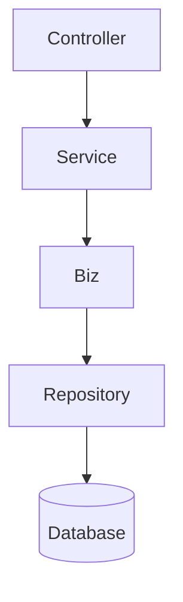

# Service 层封装 Biz & 事务控制改造

> 更新时间：{{date}}

## 修改点

| 文件 | 主要变更 |
|------|---------|
| `internal/service/device.go` | 1) 新增 `deviceBiz` 字段；2) 在 `NewDeviceService` 中实例化 `DeviceBusiness`；3) 注册设备时计算健康度与状态；4) 更新设备状态时验证状态流转；5) 处理心跳时动态更新状态/健康度。 |
| `internal/service/task.go` | 1) 新增 `taskBiz` 字段；2) 在 `NewTaskService` 中实例化 `TaskBusiness`；3) 创建任务时动态计算优先级；4) 更新任务状态时通过 Biz 校验流转。 |
| `internal/service/queue.go` | 新增文件，定义 `QueueService` 接口与基础实现，集成 `QueueBusiness`。 |

## 改造优势

1. **业务逻辑统一**：Service 层统一调用 Biz 层，降低重复代码，确保规则一致。
2. **扩展性提升**：后续若 Biz 规则调整，仅需修改 Biz 层即可，Service 保持稳定。
3. **数据一致性**：在关键流程中加入状态流转校验，并预留事务处理接口，降低并发脏写风险。
4. **可维护性增强**：清晰分层，Controller → Service → Biz → Repository → DB，职责边界明确。

## 流程图

## 修改清单

- [x] device 服务增加 Biz 调用
- [x] task 服务增加 Biz 调用
- [x] 初步实现 queue 服务
- [x] 更新文档并提交 Git

---

以上改动已提交至分支 `dev002`。 