# create_all.sql 文件检查流程图

## 检查流程概述

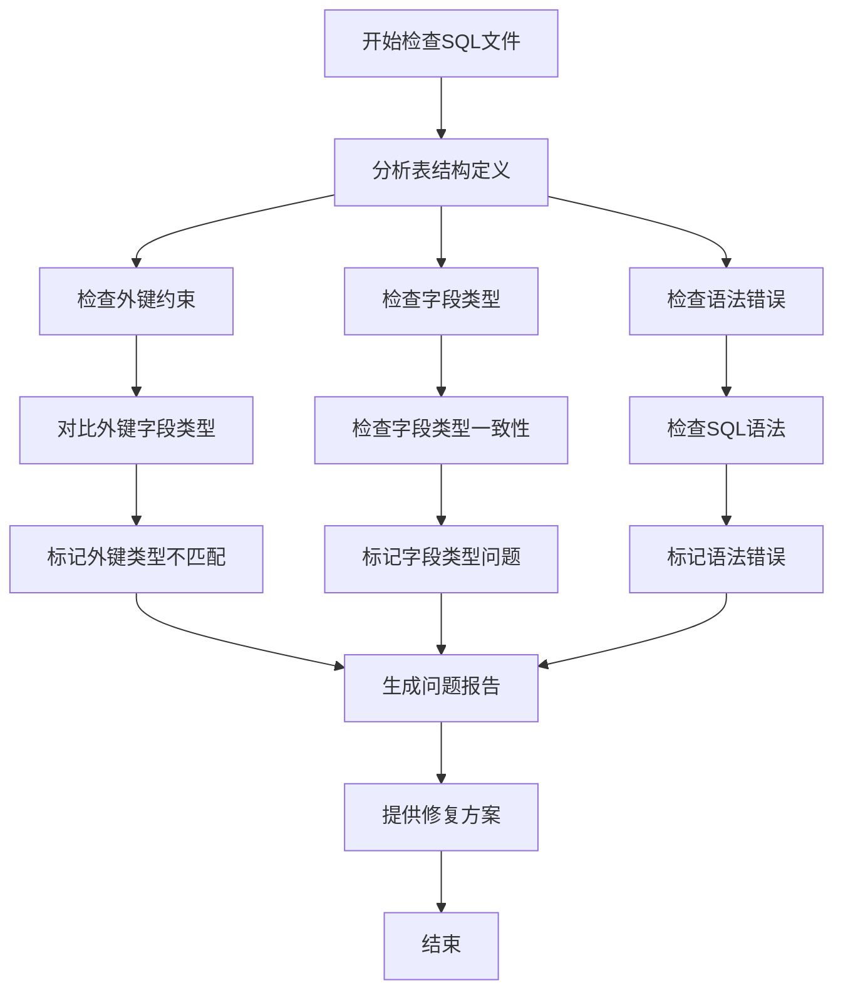

## 详细检查步骤

### 1. 外键约束检查流程

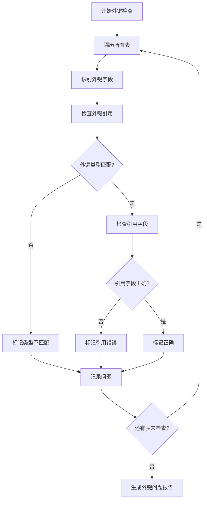

### 2. 字段类型检查流程

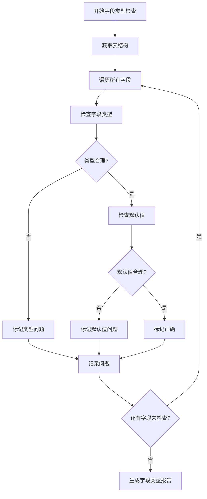

### 3. 语法检查流程

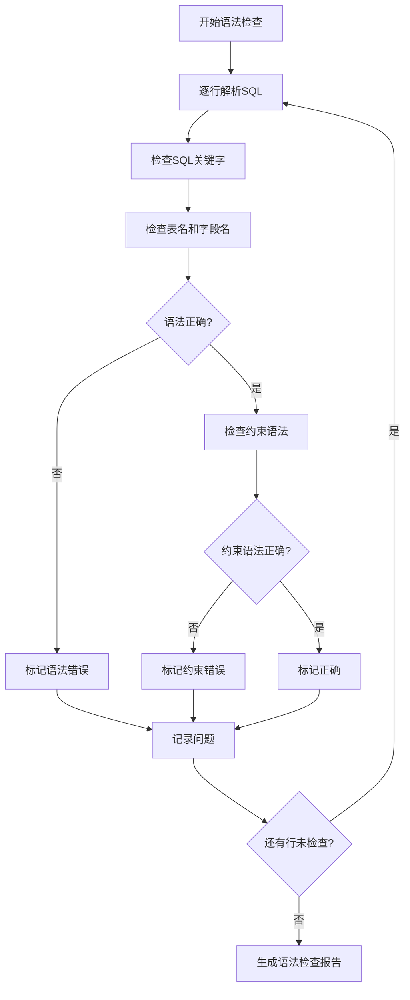

## 问题分类和统计流程

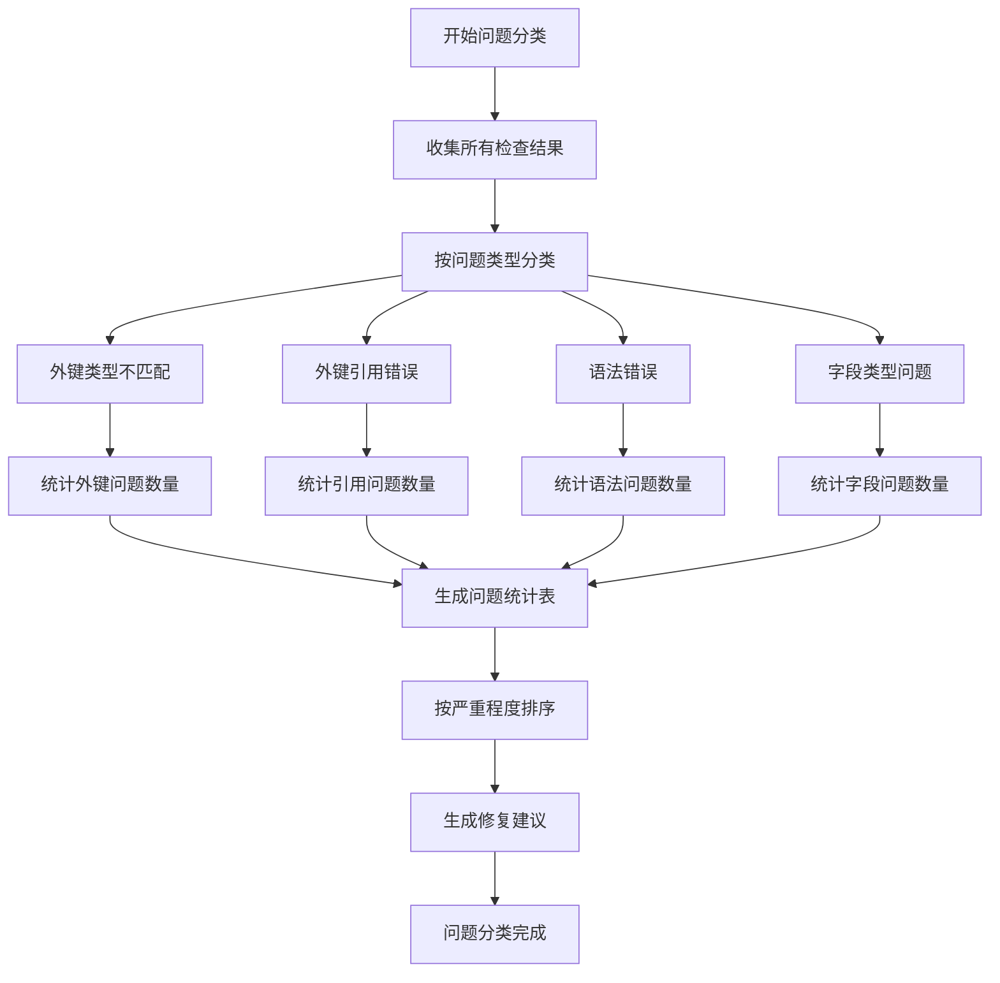

## 修复方案生成流程

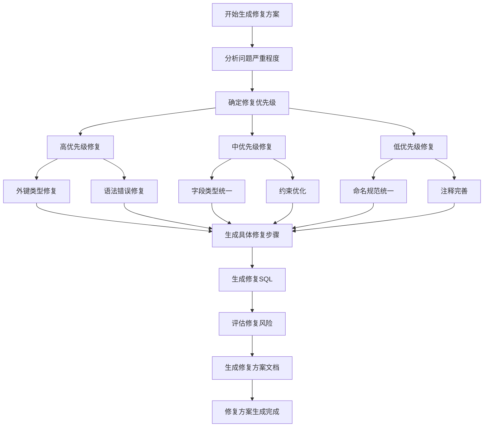

## 检查结果可视化

### 问题分布饼图

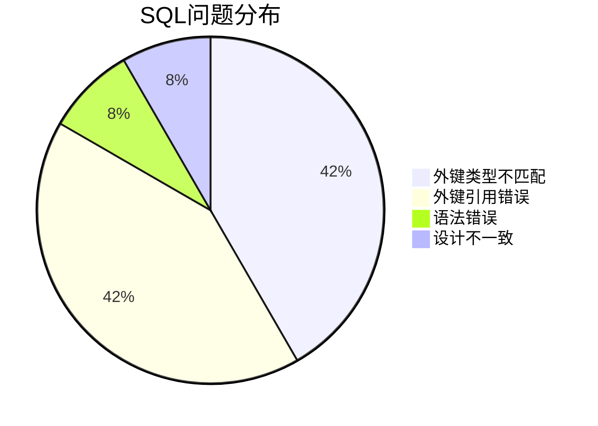

### 表问题统计

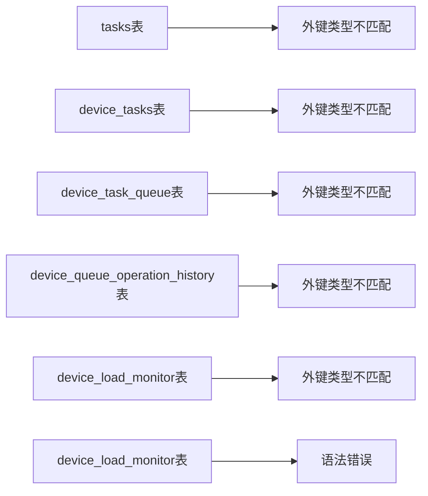

### 修复优先级矩阵

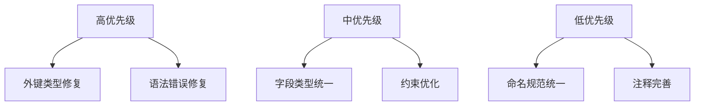

## 修复验证流程

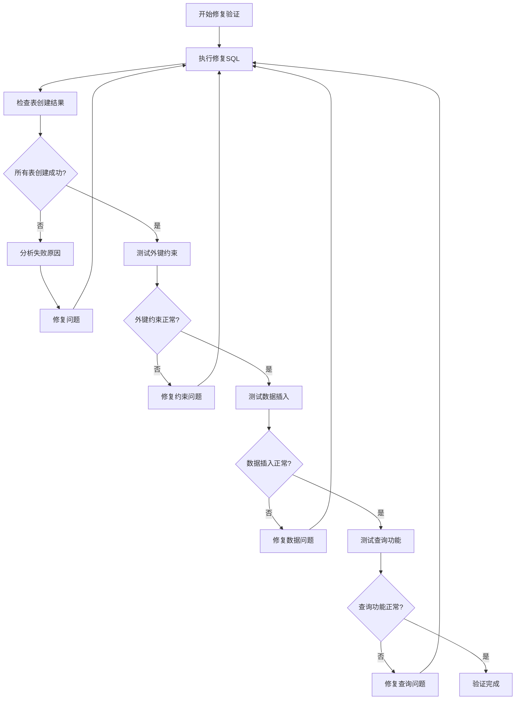

## 自动化检查工具流程

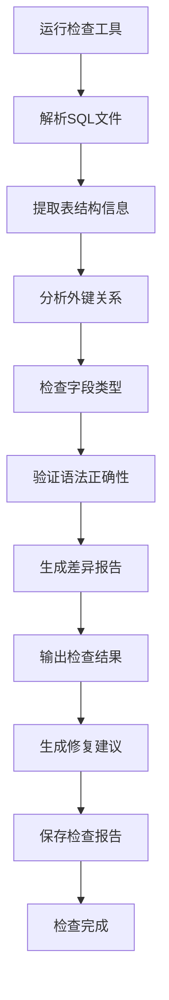

## 后续行动流程

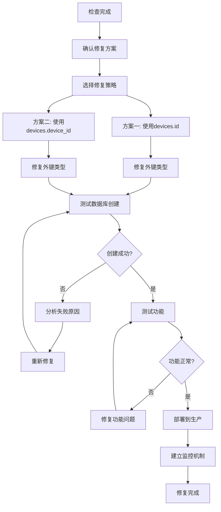

## 总结

本流程图详细展示了 create_all.sql 文件检查的完整过程，包括：

1. **检查流程**：从文件解析到问题识别
2. **分类流程**：问题类型统计和优先级排序
3. **修复流程**：修复方案的生成和验证
4. **验证流程**：修复后的测试和部署

通过这些流程，可以系统性地发现和解决 SQL 文件中的问题，确保数据库结构的正确性和一致性。 