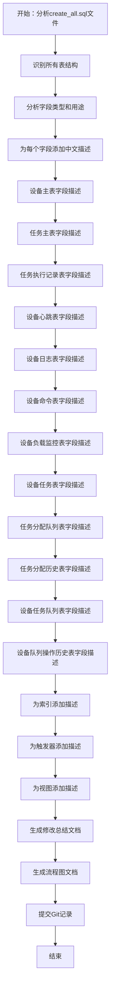
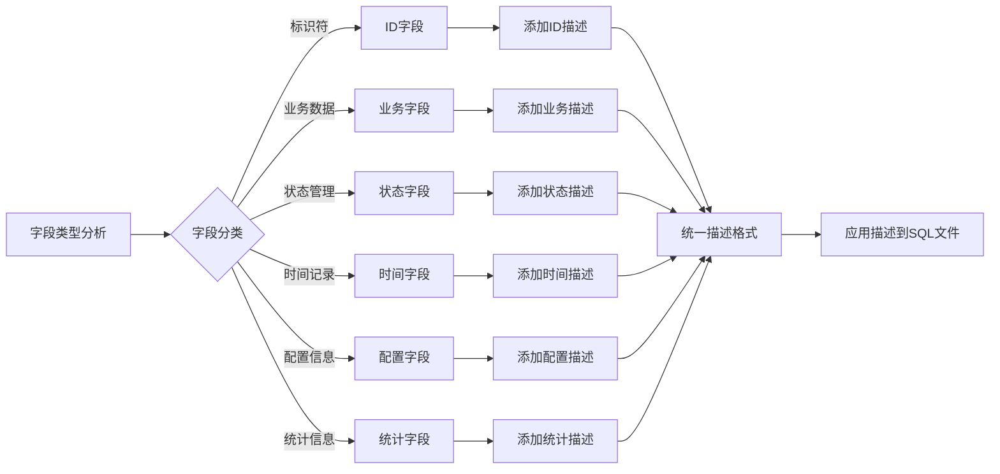
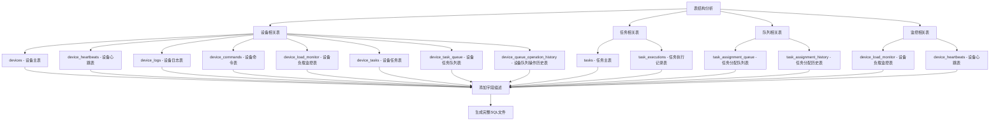
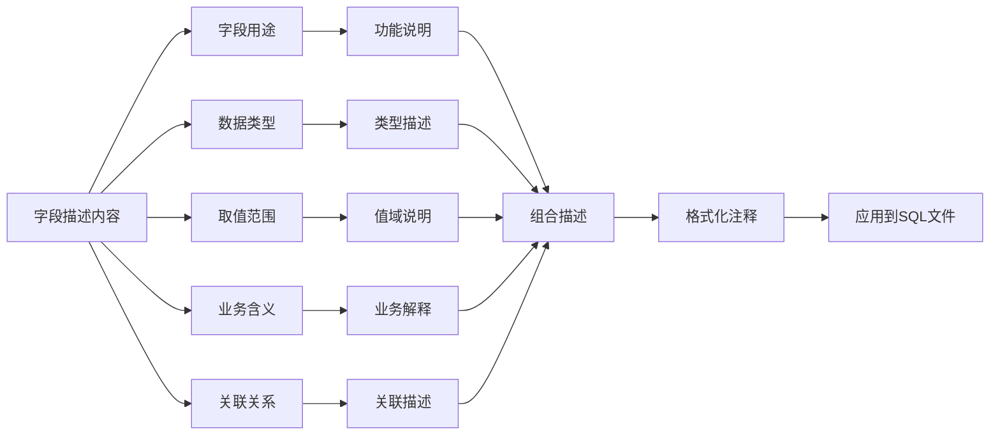
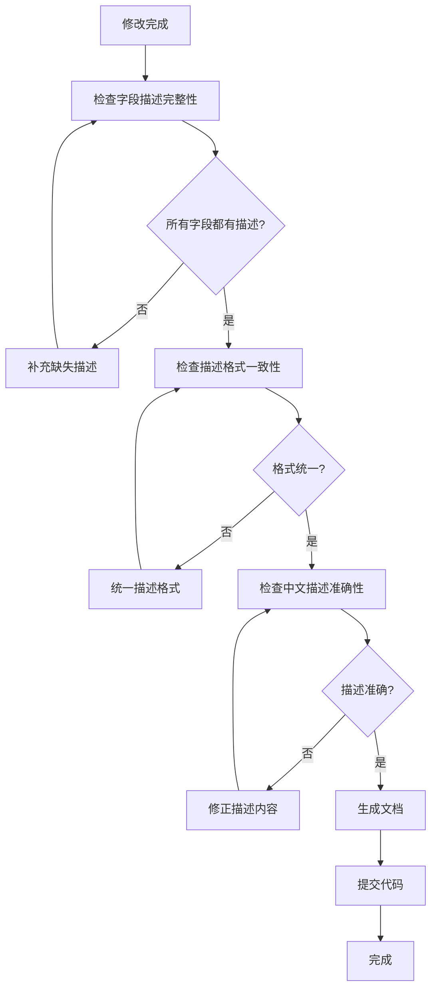

# SQL字段描述增强流程图

## 修改流程图

## 字段描述分类流程图

## 表结构描述流程图

## 描述内容流程图

## 修改验证流程图

## 关键修改点

### 1. 字段描述标准化
- 统一使用中文描述
- 包含字段用途、类型、取值范围
- 对于枚举值列出所有可能值

### 2. 表结构分类
- 设备管理相关表
- 任务管理相关表
- 队列管理相关表
- 监控统计相关表

### 3. 描述内容层次
- 基础信息：字段名、类型、约束
- 业务信息：用途、含义、关联
- 技术信息：取值范围、默认值、索引

### 4. 文档完整性
- SQL文件自文档化
- 生成总结文档
- 创建流程图说明

## 修改效果

### 1. 可读性提升
- 字段含义一目了然
- 减少理解成本
- 提高开发效率

### 2. 维护性增强
- 自文档化结构
- 降低维护难度
- 减少文档依赖

### 3. 团队协作改善
- 新成员快速上手
- 减少沟通成本
- 提高代码质量 