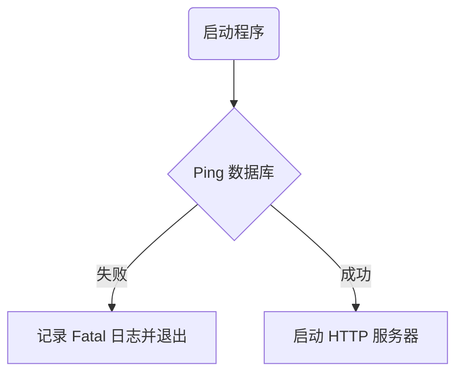

# 数据库连接初始化

## 修改点
1. `internal/cmd/cmd.go`：在 HTTP 服务器启动前增加数据库连通性检查 `g.DB().PingMaster()`，并在失败时记录 Fatal 日志并退出程序。

## 优点
- 启动阶段即保证数据库连接可用，避免运行过程中因数据库异常导致服务不可用。
- 日志中明确记录数据库连接异常，便于排查问题。
- 提升系统健壮性和稳定性。

## 修改清单
- [x] internal/cmd/cmd.go 新增数据库连接测试逻辑
- [x] docs/sql_init_connection.md 记录修改说明及流程图

## 流程图
