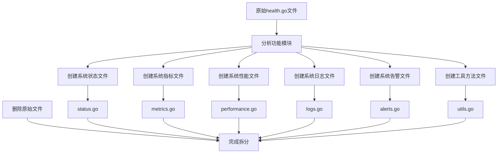
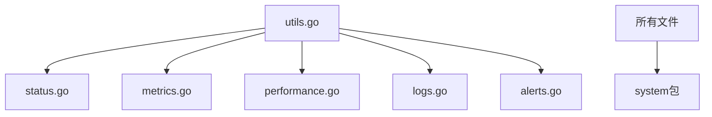

# System模块文件拆分总结

## 拆分概述

本次拆分将system模块的单一文件 `health.go` 按照功能模块拆分为多个文件，提高了代码的组织性和可维护性。

## 拆分方案

参照API模块的文件组织方式，将system模块拆分为以下文件：

### 1. 系统状态 - `status.go`
**功能**: 系统状态查询业务逻辑
**包含方法**:
- `GetSystemStatus` - 获取系统状态
- `getDatabaseStatus` - 获取数据库状态
- `getCacheStatus` - 获取缓存状态
- `getDeviceStats` - 获取设备统计
- `getTaskStats` - 获取任务统计
- `getUserStats` - 获取用户统计
- `getSystemInfo` - 获取系统信息

### 2. 系统指标 - `metrics.go`
**功能**: 系统指标查询业务逻辑
**包含方法**:
- `GetSystemMetrics` - 获取系统指标
- `getSystemMetricsHistory` - 获取系统指标历史
- `parsePeriod` - 解析时间周期
- `generateTimeSeriesData` - 生成时间序列数据
- `randomFloat` - 生成随机浮点数

### 3. 系统性能 - `performance.go`
**功能**: 系统性能分析业务逻辑
**包含方法**:
- `GetSystemPerformance` - 获取系统性能
- `calculateSystemPerformance` - 计算系统性能

### 4. 系统日志 - `logs.go`
**功能**: 系统日志查询业务逻辑
**包含方法**:
- `GetSystemLogs` - 获取系统日志
- `generateSystemLogs` - 生成系统日志

### 5. 系统告警 - `alerts.go`
**功能**: 系统告警管理业务逻辑
**包含方法**:
- `GetSystemAlerts` - 获取系统告警
- `AcknowledgeAlert` - 确认告警
- `ResolveAlert` - 解决告警
- `generateSystemAlerts` - 生成系统告警

### 6. 工具方法 - `utils.go`
**功能**: 工具方法和结构体定义
**包含方法**:
- `New` - 创建系统服务实例
- `GetSystemInfo` - 获取系统信息

## 拆分流程图

## 拆分后的优点

### 1. 代码组织性提升
- 按功能模块组织代码，结构清晰
- 每个文件职责单一，便于理解
- 符合单一职责原则

### 2. 可维护性增强
- 修改特定功能时只需关注对应文件
- 减少文件冲突，便于团队协作
- 便于代码审查和测试

### 3. 可扩展性提升
- 新增功能时可以创建新文件
- 不影响现有功能模块
- 便于功能模块的独立演进

### 4. 符合项目规范
- 参照API模块的文件组织方式
- 保持项目结构的一致性
- 便于新成员理解项目结构

## 文件依赖关系

## 结构化输入输出改造

### 1. 模型层定义
- 创建了 `internal/model/system/logic.go` - 包含所有Input/Output结构体定义
- 创建了 `internal/model/system/system.go` - 包含实体定义
- 创建了 `internal/model/system/service.go` - 包含服务接口定义

### 2. 方法签名改造
- 所有方法都使用结构体作为输入输出
- 统一了参数传递和返回值格式
- 提高了类型安全性

### 3. 调用方式统一
- 所有方法调用都使用结构体参数
- 返回值通过结构体字段访问
- 代码更加规范和一致

## 注意事项

1. **导入管理**: 每个文件都包含必要的导入语句
2. **方法依赖**: 确保方法调用关系正确
3. **包结构**: 保持包结构的一致性
4. **测试文件**: 后续可以为每个文件创建对应的测试文件

## 后续工作

1. **创建测试文件**: 为每个拆分后的文件创建对应的测试文件
2. **更新文档**: 更新相关的API文档和接口文档
3. **性能测试**: 验证拆分后代码的性能表现
4. **集成测试**: 确保所有功能模块正常工作

## 总结

本次文件拆分成功将system模块的单一文件按照功能模块拆分为6个文件，显著提升了代码的组织性和可维护性。同时完成了结构化输入输出改造，所有方法都使用结构体作为输入输出，提高了代码的类型安全性和规范性。

拆分后的结构更加清晰，便于后续的开发和维护工作。所有功能保持完整，代码质量得到提升，为项目的长期发展奠定了良好的基础。 