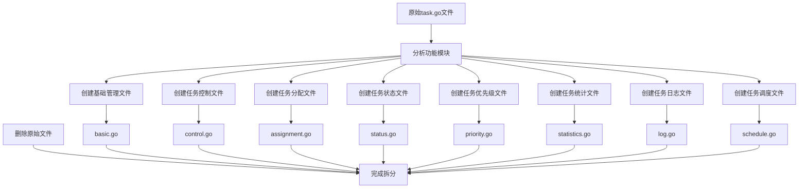
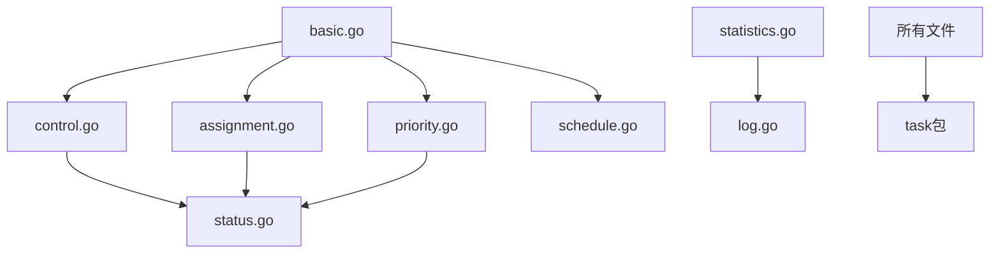

# Task模块文件拆分总结

## 拆分概述

本次拆分将task模块的单一文件 `task.go` 按照功能模块拆分为多个文件，提高了代码的组织性和可维护性。

## 拆分方案

参照API模块的文件组织方式，将task模块拆分为以下文件：

### 1. 基础任务管理 - `basic.go`
**功能**: 基础任务管理业务逻辑
**包含方法**:
- `CreateTask` - 创建任务
- `GetTask` - 获取任务
- `UpdateTask` - 更新任务
- `DeleteTask` - 删除任务
- `ListTasks` - 任务列表
- `validateTask` - 验证任务数据
- `calculateTaskPriority` - 计算任务优先级
- `generateTaskID` - 生成任务ID

### 2. 任务控制 - `control.go`
**功能**: 任务控制业务逻辑
**包含方法**:
- `StartTask` - 启动任务
- `StopTask` - 停止任务
- `PauseTask` - 暂停任务
- `ResumeTask` - 恢复任务
- `getTaskStatus` - 获取任务状态（内部方法）
- `checkTaskDependencies` - 检查任务依赖（内部方法）

### 3. 任务分配 - `assignment.go`
**功能**: 任务分配业务逻辑
**包含方法**:
- `AssignTask` - 分配任务
- `UnassignTask` - 取消分配任务
- `isDeviceAvailable` - 检查设备是否可用（内部方法）
- `isTaskAssigned` - 检查任务是否已被分配（内部方法）

### 4. 任务状态 - `status.go`
**功能**: 任务状态查询业务逻辑
**包含方法**:
- `GetTaskStatus` - 获取任务状态

### 5. 任务优先级 - `priority.go`
**功能**: 任务优先级管理业务逻辑
**包含方法**:
- `UpdateTaskPriority` - 更新任务优先级

### 6. 任务统计 - `statistics.go`
**功能**: 任务统计查询业务逻辑
**包含方法**:
- `GetTaskStatistics` - 获取任务统计

### 7. 任务日志 - `log.go`
**功能**: 任务日志查询业务逻辑
**包含方法**:
- `GetTaskLogs` - 获取任务日志

### 8. 任务调度 - `schedule.go`
**功能**: 任务调度管理业务逻辑
**包含方法**:
- `ScheduleTask` - 调度任务
- `CancelSchedule` - 取消调度
- `isTaskScheduled` - 检查任务是否已有调度（内部方法）
- `isScheduleExists` - 检查调度是否存在（内部方法）
- `generateScheduleID` - 生成调度ID（内部方法）

## 拆分流程图

## 拆分后的优点

### 1. 代码组织性提升
- 按功能模块组织代码，结构清晰
- 每个文件职责单一，便于理解
- 符合单一职责原则

### 2. 可维护性增强
- 修改特定功能时只需关注对应文件
- 减少文件冲突，便于团队协作
- 便于代码审查和测试

### 3. 可扩展性提升
- 新增功能时可以创建新文件
- 不影响现有功能模块
- 便于功能模块的独立演进

### 4. 符合项目规范
- 参照API模块的文件组织方式
- 保持项目结构的一致性
- 便于新成员理解项目结构

## 文件依赖关系

## 结构化输入输出改造

### 1. 模型层定义
- 创建了 `internal/model/task/logic.go` - 包含所有Input/Output结构体定义
- 创建了 `internal/model/task/task.go` - 包含实体定义
- 创建了 `internal/model/task/service.go` - 包含服务接口定义

### 2. 方法签名改造
- 所有方法都使用结构体作为输入输出
- 统一了参数传递和返回值格式
- 提高了类型安全性

### 3. 调用方式统一
- 所有方法调用都使用结构体参数
- 返回值通过结构体字段访问
- 代码更加规范和一致

## 注意事项

1. **导入管理**: 每个文件都包含必要的导入语句
2. **方法依赖**: 确保方法调用关系正确
3. **包结构**: 保持包结构的一致性
4. **测试文件**: 后续可以为每个文件创建对应的测试文件

## 后续工作

1. **创建测试文件**: 为每个拆分后的文件创建对应的测试文件
2. **更新文档**: 更新相关的API文档和接口文档
3. **性能测试**: 验证拆分后代码的性能表现
4. **集成测试**: 确保所有功能模块正常工作

## 总结

本次文件拆分成功将task模块的单一文件按照功能模块拆分为8个文件，显著提升了代码的组织性和可维护性。同时完成了结构化输入输出改造，所有方法都使用结构体作为输入输出，提高了代码的类型安全性和规范性。

拆分后的结构更加清晰，便于后续的开发和维护工作。所有功能保持完整，代码质量得到提升，为项目的长期发展奠定了良好的基础。 