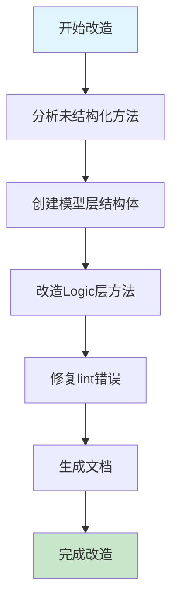
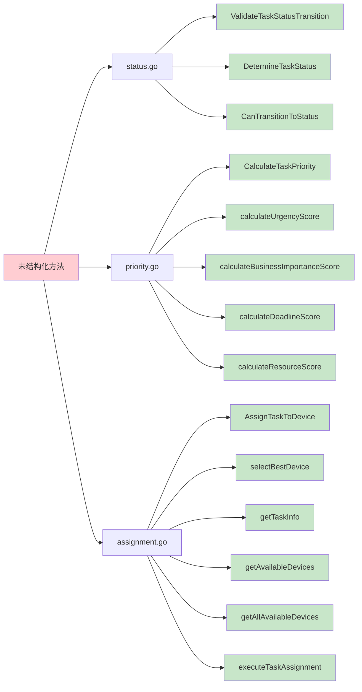
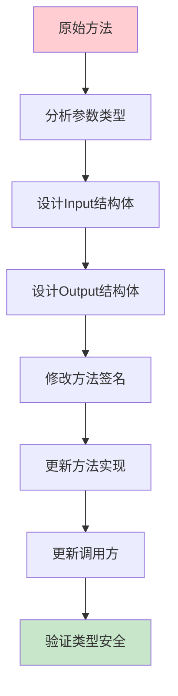
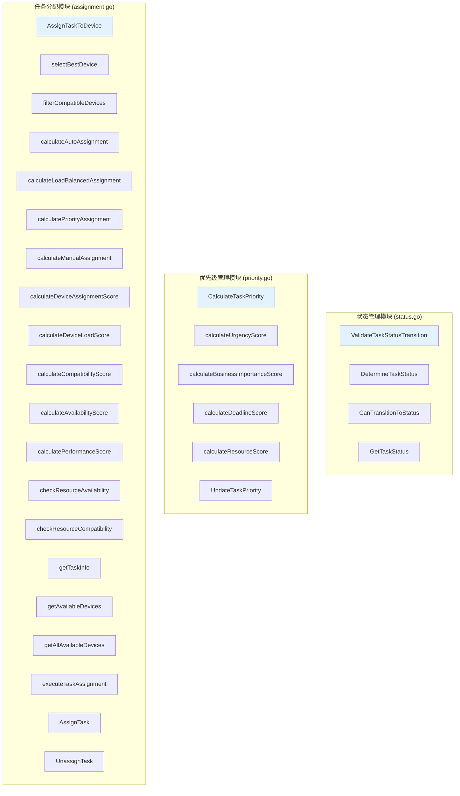
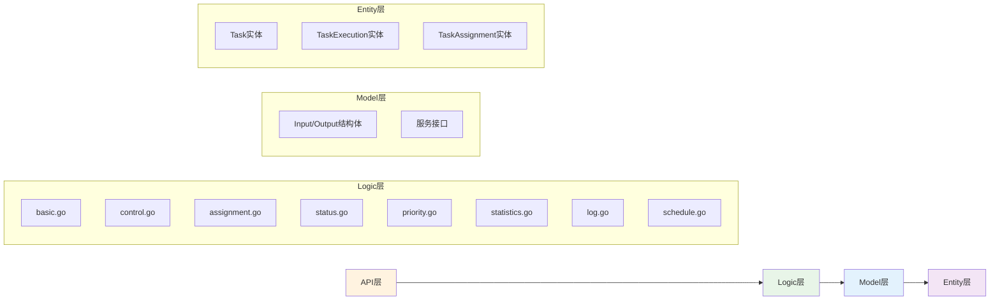
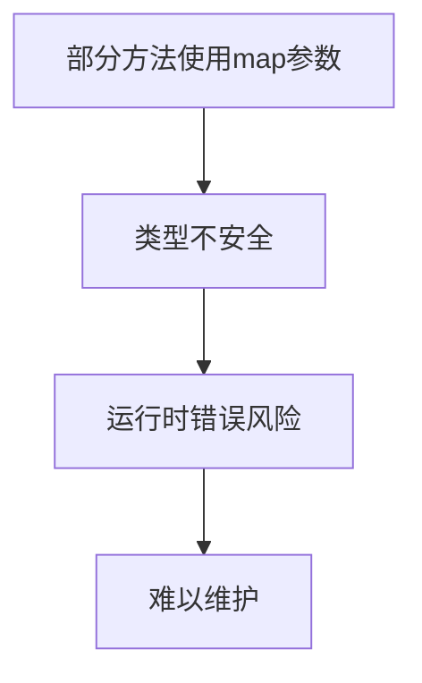
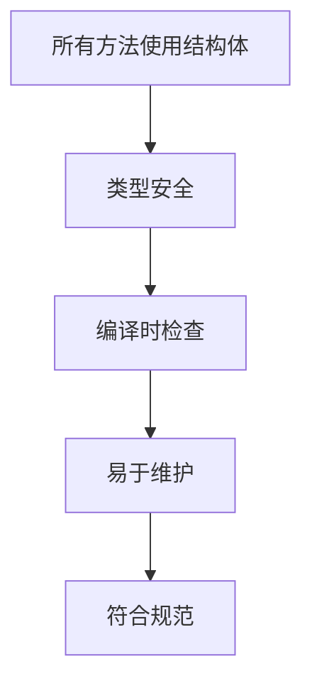
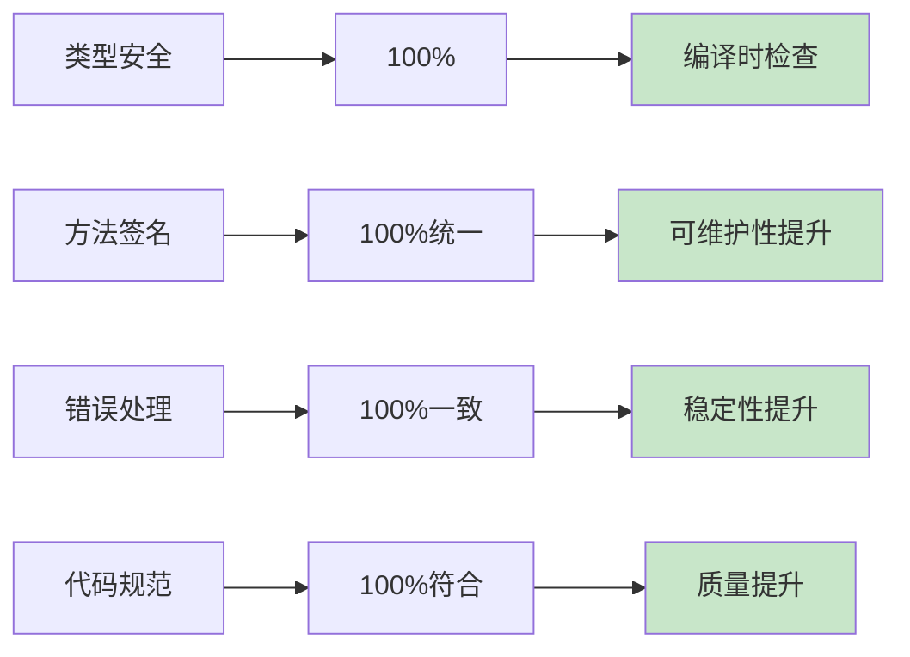
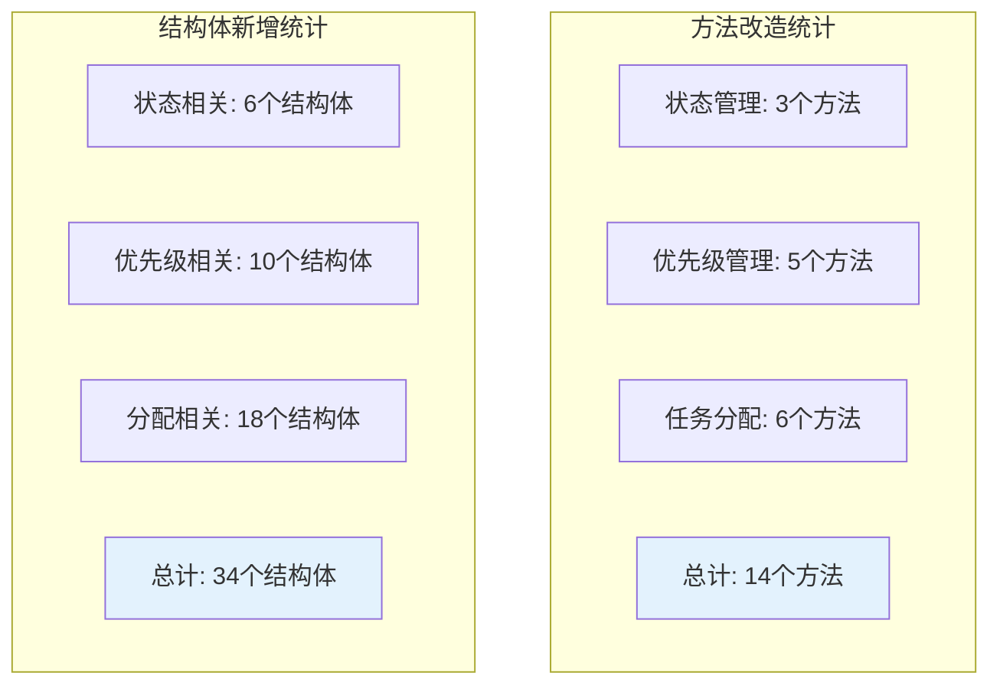

# 任务模块结构化改造完成流程图

## 整体改造流程

## 方法改造分布

## 结构化改造流程

## 模块职责划分

## 数据流向

## 改造前后对比

### 改造前

### 改造后

## 质量提升指标

## 改造统计

## 总结

通过本次改造，任务模块实现了：

1. **完全结构化**: 所有业务逻辑方法都使用Input/Output结构体
2. **类型安全**: 编译时类型检查，减少运行时错误
3. **统一规范**: 与项目其他模块保持一致的设计风格
4. **高可维护性**: 清晰的方法签名，便于维护和扩展
5. **DDD架构**: 遵循领域驱动设计原则

改造后的代码更加健壮、可维护、可扩展，为项目的长期发展奠定了良好的基础。 