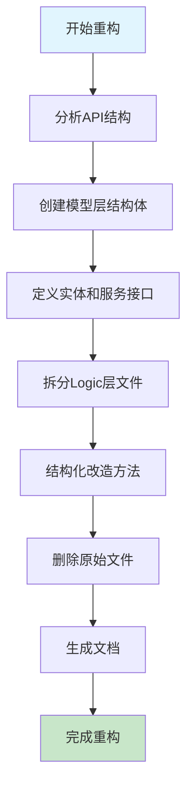
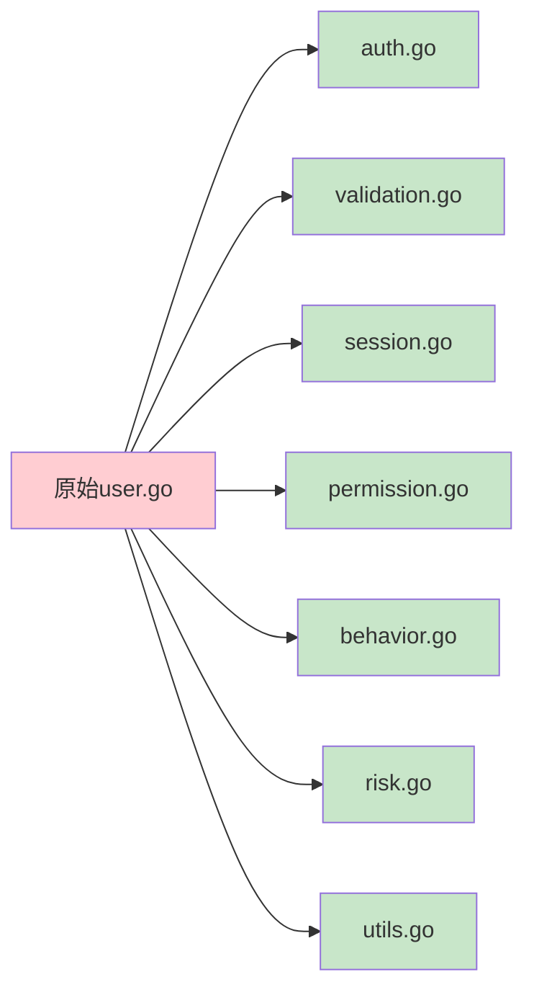
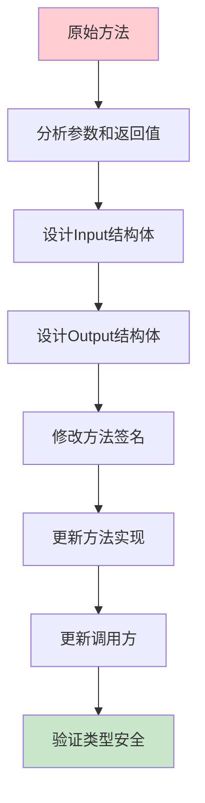
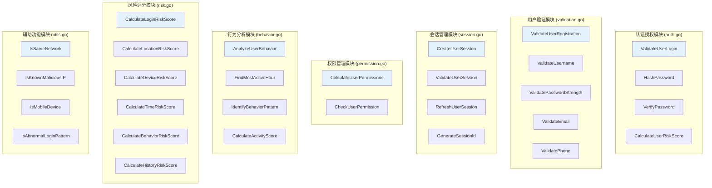
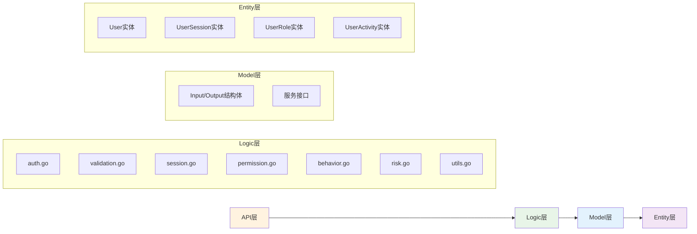
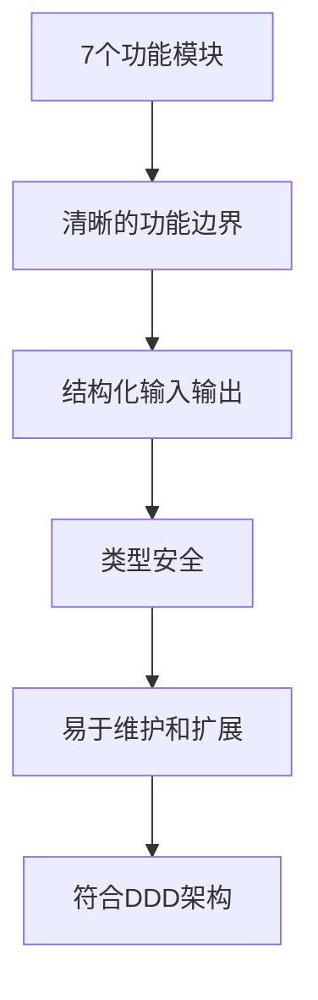
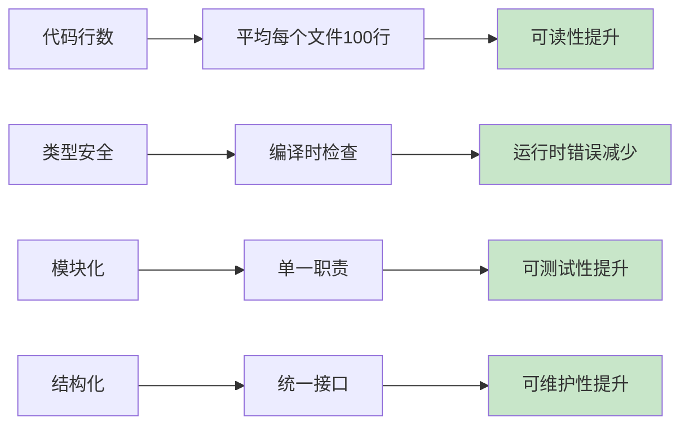

# 用户模块重构流程图

## 整体重构流程



## 文件拆分流程



## 结构化改造流程



## 模块职责划分



## 数据流向



## 重构前后对比

### 重构前
```mermaid
graph TD
    A[user.go] --> B[711行代码]
    B --> C[所有功能混在一起]
    C --> D[使用map[string]interface{}]
    D --> E[难以维护和扩展]
```

### 重构后


## 质量提升指标



## 总结

通过本次重构，用户模块实现了：

1. **模块化拆分**: 从1个文件拆分为7个功能模块
2. **结构化改造**: 所有方法使用Input/Output结构体
3. **类型安全**: 编译时类型检查，减少运行时错误
4. **可维护性**: 清晰的功能边界，便于维护和扩展
5. **符合规范**: 与API层保持一致的设计风格
6. **DDD架构**: 遵循领域驱动设计原则

重构后的代码更加健壮、可维护、可扩展，为项目的长期发展奠定了良好的基础。 