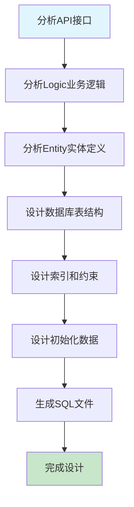
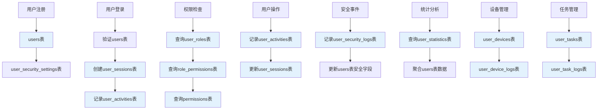
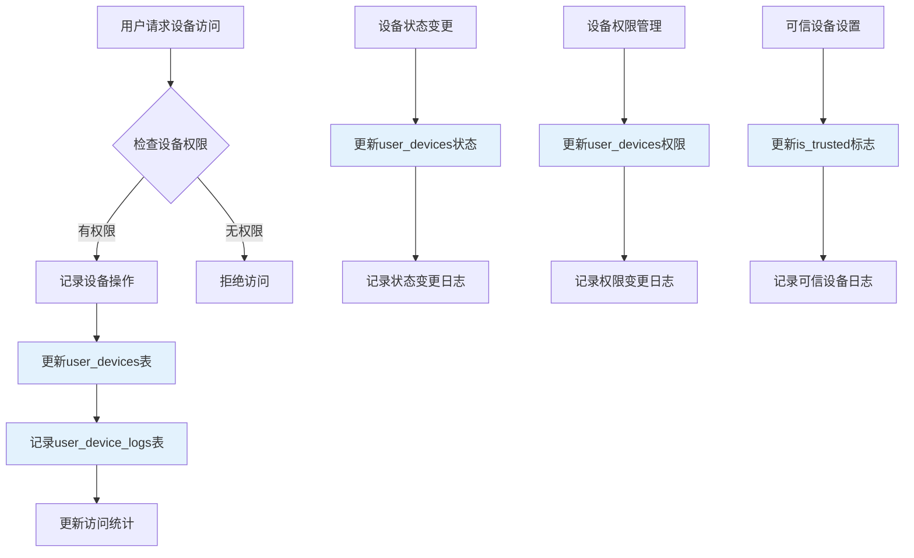
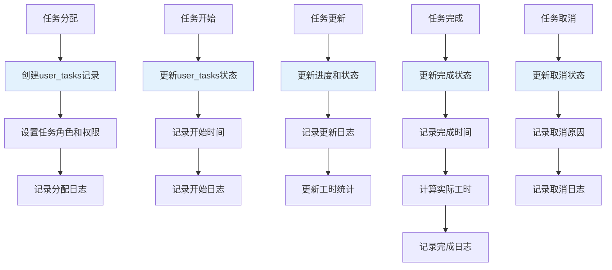
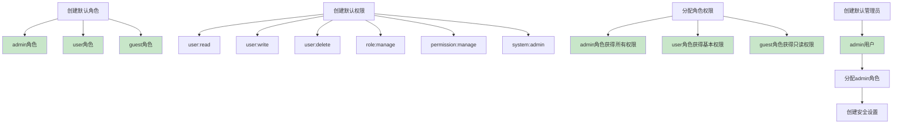
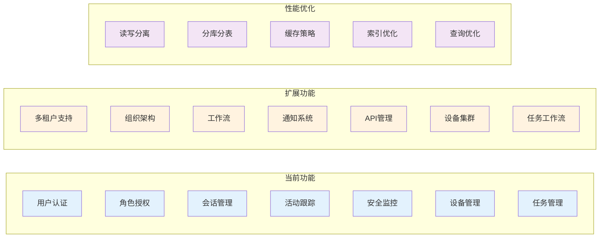

# 用户模块SQL设计流程图

## 整体设计流程



## 表结构关系图

```mermaid
erDiagram
    users ||--o{ user_roles : "has"
    users ||--o{ user_sessions : "creates"
    users ||--o{ user_activities : "performs"
    users ||--o{ user_security_logs : "generates"
    users ||--|| user_security_settings : "has"
    users ||--o{ user_devices : "manages"
    users ||--o{ user_tasks : "assigned"
    users ||--o{ user_device_logs : "operates"
    users ||--o{ user_task_logs : "tracks"
    
    roles ||--o{ user_roles : "assigned_to"
    roles ||--o{ role_permissions : "has"
    
    permissions ||--o{ role_permissions : "granted_to"
    
    users {
        varchar id PK
        varchar username UK
        varchar email UK
        varchar phone
        varchar password
        varchar status
        varchar real_name
        varchar department
        varchar position
        timestamp last_login_at
        int failed_login_attempts
        timestamp created_at
        timestamp updated_at
        timestamp deleted_at
    }
    
    roles {
        varchar id PK
        varchar role_name UK
        varchar role_desc
        varchar role_type
        boolean is_active
        timestamp created_at
        timestamp updated_at
    }
    
    permissions {
        varchar id PK
        varchar permission_name UK
        varchar resource
        json actions
        varchar scope
        varchar description
        boolean is_active
        timestamp created_at
        timestamp updated_at
    }
    
    user_roles {
        varchar id PK
        varchar user_id FK
        varchar role_id FK
        varchar assigned_by FK
        timestamp assigned_at
        timestamp expires_at
        boolean is_active
        timestamp created_at
        timestamp updated_at
    }
    
    role_permissions {
        varchar id PK
        varchar role_id FK
        varchar permission_id FK
        varchar granted_by FK
        timestamp granted_at
        timestamp expires_at
        boolean is_active
        timestamp created_at
        timestamp updated_at
    }
    
    user_sessions {
        varchar id PK
        varchar user_id FK
        varchar session_id UK
        varchar ip_address
        text user_agent
        text device_info
        varchar location
        varchar status
        timestamp created_at
        timestamp last_activity
        timestamp expires_at
    }
    
    user_activities {
        varchar id PK
        varchar user_id FK
        varchar session_id
        varchar action_type
        text action_detail
        varchar resource_type
        varchar resource_id
        varchar ip_address
        text user_agent
        float session_duration
        varchar result
        json metadata
        timestamp created_at
    }
    
    user_security_logs {
        varchar id PK
        varchar user_id FK
        varchar event_type
        text event_detail
        varchar level
        varchar ip_address
        text user_agent
        float risk_score
        varchar risk_level
        boolean handled
        varchar handled_by FK
        timestamp handled_at
        timestamp created_at
    }
    
    user_security_settings {
        varchar id PK
        varchar user_id FK UK
        boolean enable_two_factor
        boolean enable_email_notification
        boolean enable_sms_notification
        int session_timeout
        int max_concurrent_sessions
        boolean password_complexity
        boolean force_password_change
        int password_expiry_days
        boolean login_notification
        boolean suspicious_activity_alert
        timestamp created_at
        timestamp updated_at
    }
    
    user_statistics {
        varchar id PK
        date stat_date UK
        int total_users
        int active_users
        int inactive_users
        int new_users
        int login_count
        int failed_login_count
        int security_events
        json status_distribution
        json role_distribution
        json department_distribution
        timestamp created_at
        timestamp updated_at
    }
    
    user_devices {
        varchar id PK
        varchar user_id FK
        varchar device_id
        varchar device_name
        varchar device_type
        varchar access_level
        boolean is_primary
        boolean is_trusted
        timestamp last_access_at
        int access_count
        varchar status
        text notes
        timestamp created_at
        timestamp updated_at
    }
    
    user_tasks {
        varchar id PK
        varchar user_id FK
        varchar task_id
        varchar assignment_type
        varchar role
        varchar priority
        varchar status
        timestamp assigned_at
        timestamp started_at
        timestamp completed_at
        timestamp due_date
        float estimated_hours
        float actual_hours
        int progress_percentage
        text notes
        timestamp created_at
        timestamp updated_at
    }
    
    user_device_logs {
        varchar id PK
        varchar user_id FK
        varchar device_id
        varchar operation_type
        text operation_detail
        varchar result
        varchar ip_address
        text user_agent
        varchar session_id
        float duration
        text error_message
        json metadata
        timestamp created_at
    }
    
    user_task_logs {
        varchar id PK
        varchar user_id FK
        varchar task_id
        varchar operation_type
        text operation_detail
        varchar old_status
        varchar new_status
        varchar old_priority
        varchar new_priority
        int progress_change
        float time_spent
        varchar ip_address
        text user_agent
        varchar session_id
        json metadata
        timestamp created_at
    }
```

## 功能支持映射

```mermaid
graph TB
    subgraph "用户认证功能"
        A1[用户注册]
        A2[用户登录]
        A3[密码验证]
        A4[账户锁定]
        A5[密码重置]
    end
    
    subgraph "用户授权功能"
        B1[角色管理]
        B2[权限管理]
        B3[权限检查]
        B4[动态授权]
    end
    
    subgraph "会话管理功能"
        C1[会话创建]
        C2[会话验证]
        C3[会话刷新]
        C4[会话撤销]
    end
    
    subgraph "活动跟踪功能"
        D1[行为记录]
        D2[操作审计]
        D3[统计分析]
        D4[趋势分析]
    end
    
    subgraph "安全监控功能"
        E1[安全日志]
        E2[风险评分]
        E3[异常检测]
        E4[安全设置]
    end
    
    subgraph "设备管理功能"
        F1[设备关联]
        F2[权限控制]
        F3[操作日志]
        F4[状态跟踪]
        F5[可信设备]
    end
    
    subgraph "任务管理功能"
        G1[任务分配]
        G2[角色管理]
        G3[进度跟踪]
        G4[工时统计]
        G5[操作日志]
    end
    
    subgraph "数据库表"
        H1[users]
        H2[roles]
        H3[permissions]
        H4[user_roles]
        H5[role_permissions]
        H6[user_sessions]
        H7[user_activities]
        H8[user_security_logs]
        H9[user_security_settings]
        H10[user_statistics]
        H11[user_devices]
        H12[user_tasks]
        H13[user_device_logs]
        H14[user_task_logs]
    end
    
    A1 --> H1
    A2 --> H1
    A3 --> H1
    A4 --> H1
    A5 --> H1
    
    B1 --> H2
    B2 --> H3
    B3 --> H4
    B4 --> H5
    
    C1 --> H6
    C2 --> H6
    C3 --> H6
    C4 --> H6
    
    D1 --> H7
    D2 --> H7
    D3 --> H10
    D4 --> H10
    
    E1 --> H8
    E2 --> H8
    E3 --> H8
    E4 --> H9
    
    F1 --> H11
    F2 --> H11
    F3 --> H13
    F4 --> H11
    F5 --> H11
    
    G1 --> H12
    G2 --> H12
    G3 --> H12
    G4 --> H12
    G5 --> H14

    style H1 fill:#e3f2fd
    style H2 fill:#e3f2fd
    style H3 fill:#e3f2fd
    style H4 fill:#e3f2fd
    style H5 fill:#e3f2fd
    style H6 fill:#e3f2fd
    style H7 fill:#e3f2fd
    style H8 fill:#e3f2fd
    style H9 fill:#e3f2fd
    style H10 fill:#e3f2fd
    style H11 fill:#e3f2fd
    style H12 fill:#e3f2fd
    style H13 fill:#e3f2fd
    style H14 fill:#e3f2fd
```



## 索引设计图

```mermaid
graph LR
    subgraph "主键索引"
        A1[users.id]
        A2[roles.id]
        A3[permissions.id]
        A4[user_roles.id]
        A5[role_permissions.id]
        A6[user_sessions.id]
        A7[user_activities.id]
        A8[user_security_logs.id]
        A9[user_security_settings.id]
        A10[user_statistics.id]
        A11[user_devices.id]
        A12[user_tasks.id]
        A13[user_device_logs.id]
        A14[user_task_logs.id]
    end
    
    subgraph "唯一索引"
        B1[users.username]
        B2[users.email]
        B3[users.phone]
        B4[user_roles(user_id, role_id)]
        B5[role_permissions(role_id, permission_id)]
        B6[user_sessions.session_id]
        B7[user_security_settings.user_id]
        B8[user_statistics.stat_date]
        B9[user_devices(user_id, device_id)]
        B10[user_tasks(user_id, task_id)]
    end
    
    subgraph "普通索引"
        C1[users.status]
        C2[users.department]
        C3[users.created_at]
        C4[users.last_login_at]
        C5[user_sessions.user_id]
        C6[user_sessions.status]
        C7[user_sessions.expires_at]
        C8[user_activities.user_id]
        C9[user_activities.action_type]
        C10[user_activities.created_at]
        C11[user_devices.user_id]
        C12[user_devices.device_id]
        C13[user_devices.device_type]
        C14[user_devices.access_level]
        C15[user_devices.status]
        C16[user_tasks.user_id]
        C17[user_tasks.task_id]
        C18[user_tasks.status]
        C19[user_tasks.priority]
        C20[user_tasks.due_date]
    end

    style A1 fill:#c8e6c9
    style B1 fill:#fff3e0
    style C1 fill:#e1f5fe
```

## 数据流向图



## 设备管理流程图



## 任务管理流程图



## 初始化数据流程



## 扩展性设计



## 总结

该SQL设计提供了：

1. **完整的功能支持** - 覆盖用户管理的所有核心功能，包括新增的设备管理和任务管理
2. **良好的性能** - 合理的索引设计和查询优化
3. **数据完整性** - 外键约束和数据验证
4. **扩展性** - 支持未来功能扩展
5. **安全性** - 密码加密、权限控制、审计日志
6. **设备管理** - 用户设备关联、权限控制、操作日志
7. **任务管理** - 任务分配、进度跟踪、工时统计

该设计为OneGoServer项目的用户管理功能提供了坚实的数据基础，支持完整的用户生命周期管理。 