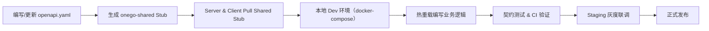

要做到 Server 与 Client 的并行开发、调试和测试，核心思路是基于 “契约优先 + 本地一键联调” 的流程，具体可以分为以下几个实践步骤：

---

## 1. 定义并共享 API 契约（Contract）

1. **采用 OpenAPI/Swagger**

   * 在 `onego-server` 仓库中，维护一份 `openapi.yaml`（或 `swagger.json`），完整描述所有 `/api/v1/...` 路径的请求／响应模型、参数约束、状态码等。
   * 将这份契约文件放到 `public/` 或 `docs/` 目录下，并纳入版本管理。

2. **自动生成类型和 Stub**

   * 利用 `go-swagger`、`oapi-codegen` 等工具：

     * 从 `openapi.yaml` 生成 Server 的 Handler 接口模版（空实现）。
     * 从同一个契约生成 Client 的请求函数（带类型安全的 Go 函数）。
   * 生成的代码放在：

     ```
     onego-shared/
     ├── api/          # 生成的请求/响应结构体
     └── client/       # 生成的 HTTP Client Stub
     ```
   * Server 和 Client 均通过 Go module 依赖 `onego-shared`。

3. **契约测试（Contract Test）**

   * 在 CI 中，对每次契约变更，自动：

     1. 验证 `openapi.yaml` 与 Server Handler 的注释、参数签名一致。
     2. 用 Pact、Dredd 等工具，模拟 Client 调用，确保 Server 实现符合契约。

---

## 2. 本地一键联调环境

1. **Docker-Compose 编排**
   在项目根目录（或一个独立的 `dev-environment/`）维护一个 `docker-compose.yml`，包含：

   * `onego-server` 容器（挂载本地代码目录 `:/go/src/onego-server`，开 debug 模式）
   * `onego-client` 容器（同上，挂载 `:/go/src/onego-client`）
   * PostgreSQL、Redis、Kafka、Prometheus、ELK 等依赖
   * 可选：一个 Mock Server，用来在 Client 开发早期模拟部分未完成的接口

2. **共享网络 & 环境变量**

   * Compose 文件内，所有服务加入同一网络：`onego-net`。
   * Server 和 Client 的 `configs/*.toml` 中，默认将彼此的地址指向服务名，如 `server:8080`、`client:9090`。

3. **代码热重载**

   * 在各自容器里使用 `reflex`、`fresh` 等 Go hot-reload 工具，保存后自动重编译、重启，实时看到改动效果。

4. **统一入口脚本**
   在项目根或 `scripts/` 下写一个 `dev.sh`：

   ```bash
   #!/usr/bin/env bash
   docker-compose up -d
   # 生成契约 stub
   cd onego-shared && make gen
   # 启动 Server 与 Client 代码热重载
   docker exec -d onego-server-dev reflex -c /go/src/onego-server/reflex.conf
   docker exec -d onego-client-dev reflex -c /go/src/onego-client/reflex.conf
   ```

   团队成员只需 `scripts/dev.sh`，就能一键拉起全栈开发环境。

---

## 3. Mock 与灰度测试

1. **接口 Mock 服务**

   * 在早期或某个接口尚未完成时，用 `onego-shared/client/` 生成的 Stub 结合 `httptest.Server`，快速在本地启动 Mock 端点——Client 可以先对接、验证逻辑。
   * Mock 数据可放在 `onego-client/test/fixtures/`，也可用 JSON Server、WireMock 等独立容器提供。

2. **灰度部署 & 对接**

   * 在 K8s 环境中，通过 Service 发现或 Sidecar Proxy，如 Envoy，做 Canary 发布，让 Client 指向某个灰度版本的 Server 接口，实现线上联调验证。

---

## 4. 自动化验证与 CI 集成

1. **CI Pipeline**

   * **Stage 1**：代码风格、静态检查、契约校验（OpenAPI Lint）
   * **Stage 2**：Unit Test（Server / Client 各自）
   * **Stage 3**：Contract Test —— 启动 Server，执行 Client Stub 调用，验证响应一致性
   * **Stage 4**：Integration Test —— 在 Docker-Compose 环境中，执行对端到端场景脚本

2. **报告与告警**

   * 如果 Contract Test 有任何差异（接口参数、返回结构），CI 立即告警，并阻止合并。

---

## 5. 版本管理与兼容

1. **语义化版本**

   * Server、Client、onego-shared 均用 SemVer（v1.2.3）管理。
   * 任何对 `openapi.yaml` 的向后不兼容更改，都要升级 Major 版本，并在 README 中说明破坏性变更。

2. **多版本共存**

   * 在 Kubernetes 中，可同时部署 `/api/v1`、`/api/v2` 路由，兼顾老 Client，平滑迁移。

---

### 整体流程图



---

通过上述“契约驱动 + 本地一键联调 + Mock 灰度 + CI 强验证”体系，Server 与 Client 团队可以在同一个定义（`openapi.yaml`）下并行开发，随时通过本地 Compose 一键联调，确保接口一致性、快速定位问题、提高开发效率。
